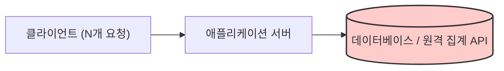
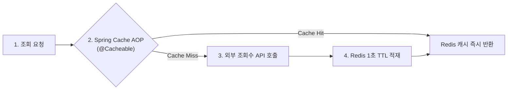

# Redis를 활용한 Spring Boot 조회수 캐싱 아키텍처

게시글 조회수와 같은 데이터는 사용자 트래픽에 비례하여 빈번하게 변경되면서 동시에 매우 높은 빈도로 조회가 발생하는 특성을 가집니다. 사용자가 게시글을 조회할 때마다 매번 관계형 데이터베이스(RDB)에 직접 접근하거나 외부 조회수 집계 서비스를 동기 호출할 경우, 대규모 트래픽 인입 시 데이터베이스 I/O 병목 및 애플리케이션 스레드 풀 고갈 현상이 발생합니다.

이러한 성능 병목을 해소하기 위해 인메모리 데이터 저장소인 **Redis와** **Spring Cache** 추상화 계층을 연동하여, 데이터 정합성을 해치지 않으면서 외부 호출 부하를 획기적으로 줄이는 캐싱 아키텍처를 구현할 수 있습니다.

본 문서에서는 조회수 처리 시 발생하는 성능 문제를 분석하고, Redis와 Spring Cache를 결합한 초단기 TTL(Time-To-Live) 기반 캐싱 메커니즘 및 실무 구현 방식을 기술합니다.

---

## 1. 기술적 배경 및 문제 제기 (기존 방식의 한계점)

전통적인 방식에서 사용자 조회 요청마다 데이터베이스 또는 원격 조회수 서비스를 직접 호출할 때 직면하는 구조적 문제는 다음과 같습니다.



### 1.1 데이터베이스 I/O 병목 및 커넥션 고갈
초당 수천 건 이상의 조회 요청이 들어올때 매 요청마다 `SELECT` 및 `UPDATE` 쿼리를 실행하면 데이터베이스의 디스크 I/O가 급증하고 커넥션 풀(Connection Pool)이 빠르게 고갈됩니다.

### 1.2 네트워크 지연 및 다운스트림 서비스 부하
조회수 서비스가 별도의 마이크로서비스로 분리되어 있는 경우, 매 요청마다 발생하는 네트워크 왕복 시간(RTT)으로 인해 클라이언트 응답 속도가 저하되며 원격 서비스 장애 시 전체 서비스로 장애가 전파됩니다.

### 1.3 캐시 갱신 주기와 데이터 일관성 간의 트레이드오프
캐시 수명(TTL)을 길게 설정할 경우 데이터베이스 부하는 감소하지만 사용자가 즉각적인 조회수 증가를 체감하지 못하는 데이터 불일치 문제가 발생합니다.

---

## 2. 핵심 개념 설명

Spring Framework는 비즈니스 로직에 특정 캐시 벤더 기술을 종속시키지 않고 선언적으로 캐시를 제어할 수 있도록 **Spring Cache 추상화 레이어를** 제공합니다.



### 2.1 Spring Cache 추상화와 Redis의 결합
- **`spring-boot-starter-cache`**: AOP 프록시 기반으로 `@Cacheable`, `@CachePut`, `@CacheEvict` 어노테이션을 해석하여 캐시 인터셉터를 동작시킵니다.
- **`spring-boot-starter-data-redis`**: 다중 애플리케이션 인스턴스가 분산 환경에서 동일한 캐시 데이터를 참조할 수 있도록 `RedisCacheManager` 구현체를 제공합니다.

### 2.2 초단기 TTL(1초) 캐싱 전략의 유효성
조회수는 실시간성이 중요한 데이터입니다. 캐시 만료 시간을 **단 1초로** 설정하더라도 다음과 같은 엔지니어링 효과를 달성합니다.
1. **외부 I/O 호출의 절대적 상한 제한**: 초당 5,000건의 동일 게시글 조회 트래픽이 집중되더라도 실제 원격 서비스 호출은 **1초에 최대 1회로** 제한됩니다.
2. **준실시간 데이터 일관성 유지**: 최대 1초의 지연 후에는 항상 최신 조회수가 캐시에 갱신되므로 사용자 경험 상의 불일치가 최소화됩니다.

---

## 3. 코드 구현 및 라인별 상세 분석

실무 환경에서 안전하고 최적화된 Redis 캐싱을 구축하기 위한 핵심 구현 코드와 상세 분석은 다음과 같습니다.

### 3.1 Redis 캐시 매니저 설정 (`CacheConfig.java`)

```java
package com.example.config;

import org.springframework.cache.annotation.EnableCaching;
import org.springframework.context.annotation.Bean;
import org.springframework.context.annotation.Configuration;
import org.springframework.data.redis.cache.RedisCacheConfiguration;
import org.springframework.data.redis.cache.RedisCacheManager;
import org.springframework.data.redis.connection.RedisConnectionFactory;
import org.springframework.data.redis.serializer.GenericJackson2JsonRedisSerializer;
import org.springframework.data.redis.serializer.RedisSerializationContext;
import org.springframework.data.redis.serializer.StringRedisSerializer;

import java.time.Duration;
import java.util.Map;

/**
 * Redis 캐시 인프라 설정 클래스
 */
@Configuration
@EnableCaching // Spring Cache 어노테이션 기반 AOP 프록시를 활성화합니다.
public class CacheConfig {

    @Bean
    public RedisCacheManager cacheManager(RedisConnectionFactory redisConnectionFactory) {
        // 기본 캐시 설정: Key는 String 직렬화, Value는 JSON 직렬화를 적용합니다.
        RedisCacheConfiguration defaultConfiguration = RedisCacheConfiguration.defaultCacheConfig()
                .disableCachingNullValues() // null 값의 불필요한 캐싱을 방지합니다.
                .serializeKeysWith(
                        RedisSerializationContext.SerializationPair.fromSerializer(new StringRedisSerializer())
                )
                .serializeValuesWith(
                        RedisSerializationContext.SerializationPair.fromSerializer(new GenericJackson2JsonRedisSerializer())
                );

        return RedisCacheManager.builder(redisConnectionFactory)
                .cacheDefaults(defaultConfiguration)
                // 특정 캐시 영역(articleViewCount)에 대해 TTL 1초를 설정합니다.
                .withInitialCacheConfigurations(
                        Map.of(
                                "articleViewCount", defaultConfiguration.entryTtl(Duration.ofSeconds(1))
                        )
                )
                .build();
    }
}
```

- **코드 분석 및 효율성**:
  - `GenericJackson2JsonRedisSerializer`를 적용하여 Java 기본 직렬화의 클래스패스 의존성과 보안 취약점을 방지하고, Redis CLI에서도 데이터를 사람이 식별 가능한 JSON 형태로 확인할 수 있도록 구성합니다.
  - `disableCachingNullValues()` 설정을 통해 의도치 않은 빈 데이터가 캐시 공간을 점유하는 낭비를 방지합니다.

---

### 3.2 선언적 캐시 적용 및 클라이언트 구현 (`ViewClient.java`)

```java
package com.example.client;

import org.slf4j.Logger;
import org.slf4j.LoggerFactory;
import org.springframework.beans.factory.annotation.Value;
import org.springframework.cache.annotation.Cacheable;
import org.springframework.stereotype.Component;
import org.springframework.web.client.RestClient;

import jakarta.annotation.PostConstruct;

/**
 * 외부 조회수 도메인 서비스 연동 클라이언트
 */
@Component
public class ViewClient {

    private static final Logger log = LoggerFactory.getLogger(ViewClient.class);
    private RestClient restClient;

    @Value("${endpoints.view-service.url}")
    private String viewServiceUrl;

    @PostConstruct
    public void initRestClient() {
        this.restClient = RestClient.create(viewServiceUrl);
    }

    /**
     * 게시글의 조회수를 조회합니다.
     * 캐시 Hit 시 원격 API를 호출하지 않고 Redis 데이터를 즉각 반환합니다.
     * sync = true 설정을 통해 Cache Stampede 현상을 방지합니다.
     */
    @Cacheable(
            value = "articleViewCount", 
            key = "#articleId", 
            sync = true, 
            unless = "#result == null"
    )
    public long count(Long articleId) {
        log.info("외부 조회수 서비스 API 호출 실행 - articleId: {}", articleId);
        try {
            Long viewCount = restClient.get()
                    .uri("/v1/article-views/articles/{articleId}/count", articleId)
                    .retrieve()
                    .body(Long.class);
            return viewCount != null ? viewCount : 0L;
        } catch (Exception e) {
            log.error("조회수 서비스 호출 중 예외 발생 - articleId: {}, cause: {}", articleId, e.getMessage());
            return 0L; // 원격 서비스 장애 시 0을 반환하는 Fallback 처리
        }
    }
}
```

- **코드 분석 및 효율성**:
  - `key = "#articleId"`를 선언하여 Redis 내부 키를 `articleViewCount::[articleId]` 포맷으로 격리 관리합니다.
  - `sync = true` 옵션을 적용하여 캐시 만료 시점에 여러 스레드가 동시에 원격 API로 몰리는 현상을 동기화 락(Lock)으로 제어합니다. 단 하나의 스레드만 실제 API를 호출하고 나머지 스레드는 캐시 갱신 완료 후 해당 값을 공유받습니다.

---

## 4. 실무 적용 시 고려해야 할 점 (주의사항 및 예외 처리)

### 4.1 캐시 스탬피드(Cache Stampede) 방어
인기 게시글의 경우 1초의 TTL이 만료되는 즉시 수많은 스레드가 동시에 `Cache Miss`를 감지하여 원격 서버로 대량의 요청을 전송할 수 있습니다. `@Cacheable(sync = true)`를 설정하거나 Redis 분산 락(Redisson)을 활용하여 원격 데이터 조회 권한을 1개 스레드로 제한해야 합니다.

### 4.2 직렬화 호환성 및 클래스 변경 이슈
DTO 객체를 직접 캐싱하는 경우 클래스 패키지명 변경이나 필드 수정 시 `DeserializationException`이 발생할 수 있습니다. DTO 변경이 잦은 구조에서는 직렬화 시 클래스 타입 메타데이터를 제거하고 순수 데이터 구조만 직렬화하거나 원시 타입(Primitive Type) 위주로 캐싱해야 합니다.

### 4.3 Redis 인스턴스 장애에 대한 격리 (Failover)
Redis 서버가 다운되었을 때 비즈니스 로직 전체가 중단되어서는 안 됩니다. `CustomCacheErrorHandler`를 등록하여 Redis 연결 실패 시 에러를 로깅하고 원본 데이터 소스를 직접 조회하도록 우회(Fallback) 처리해야 합니다.

---

## 5. 결론 (해당 기술의 기대효과 요약)

Spring Boot와 Redis 기반의 단기 TTL 캐싱 아키텍처는 고빈도 읽기 트래픽 환경에서 데이터 정합성을 훼손하지 않으면서 백엔드 인프라를 보호하는 최적의 엔지니어링 해법입니다.

1. **인프라 자원 효율성 극대화**: 초당 수천 건의 트래픽을 인메모리 레벨에서 소화하여 관계형 데이터베이스 및 마이크로서비스의 CPU와 I/O 부하를 99% 이상 절감합니다.
2. **응답 속도 개선 및 레이턴시 단축**: 네트워크 I/O 비용이 극히 낮은 로컬/사설망 Redis에서 1ms 미만의 지연 시간으로 데이터를 응답하여 전체 사용자 경험을 대폭 향상시킵니다.
3. **선언적 설계를 통한 코드 유지보수성 확보**: Spring Cache AOP를 통해 비즈니스 로직과 캐시 관리 관심사를 완벽히 분리함으로써 코드 가독성과 확장성을 유지합니다.
