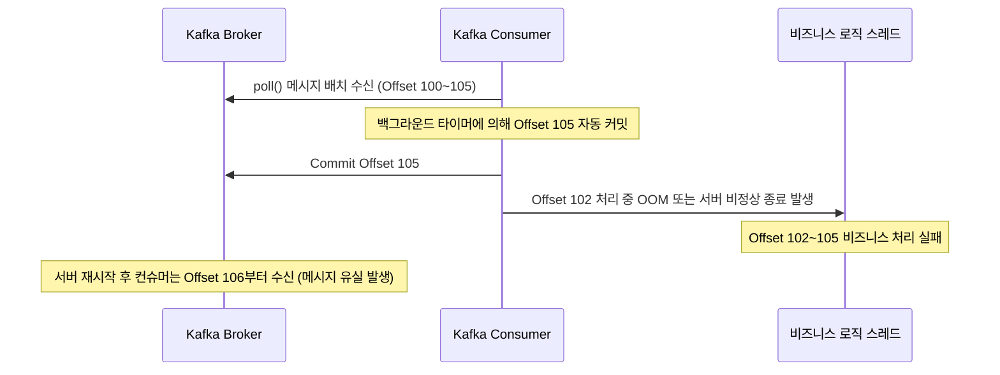
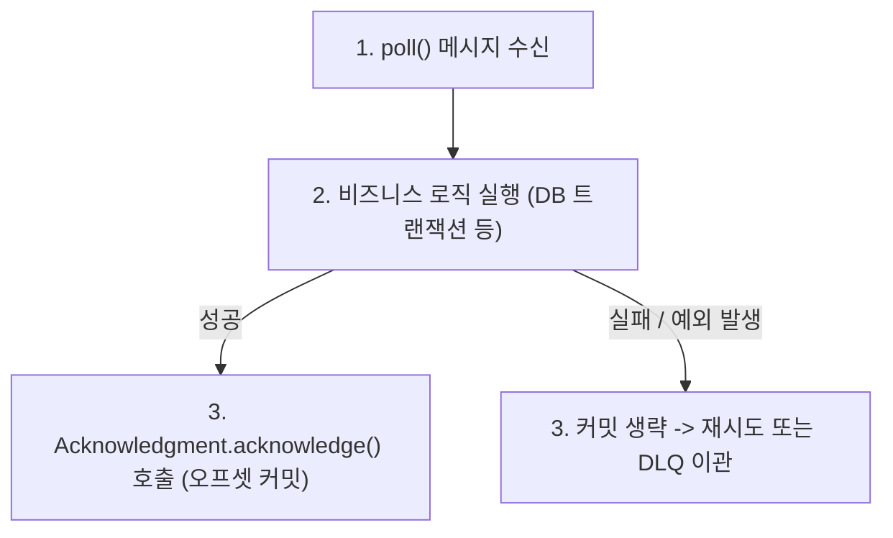

# Spring Boot와 Kafka의 Auto Commit 비활성화 및 수동 커밋 아키텍처

분산 시스템 및 이벤트 기반 아키텍처(EDA) 환경에서 **Apache Kafka는** 서비스 간 비동기 메시지 전달을 담당하는 핵심 인프라입니다. 카프카를 활용한 이벤트 스트리밍 시스템에서 가장 중요한 설계 요소는 비즈니스 로직 처리와 메시지 소비 상태 간의 **데이터 신뢰성(Reliability)을** 확보하는 것입니다.

카프카 컨슈머는 파티션 내에서 자신이 어디까지 메시지를 소비했는지를 나타내는 **오프셋(Offset)을** 브로커에 커밋하여 상태를 관리합니다. 카프카의 기본 동작 방식인 **자동 커밋(Auto Commit)은** 구현이 간단하지만, 예기치 않은 시스템 장애 발생 시 메시지 유실(Message Loss)을 초래하는 구조적 결함을 내포하고 있습니다.

본 문서에서는 Auto Commit의 기술적 한계를 분석하고, Spring Boot 환경에서 자동 커밋을 비활성화한 뒤 **수동 커밋(Manual Commit)과** `AckMode`를 적용하여 At-Least-Once(최소 한 번) 전달 신뢰성을 보장하는 구현 방식을 기술합니다.

---

## 1. 기술적 배경 및 문제 제기 (기존 방식의 한계점)

카프카 컨슈머의 기본 설정(`enable.auto.commit = true`)은 일정 주기(`auto.commit.interval.ms`, 기본값 5초)마다 백그라운드 스레드가 최근 `poll()`로 수신한 최신 오프셋을 자동 커밋합니다.



### 1.1 비동기 타이밍 불일치로 인한 메시지 유실 (Message Loss)
컨슈머가 `poll()`을 통해 다수의 메시지를 가져온 후 실제 데이터베이스 저장이나 외부 API 연동과 같은 비즈니스 로직을 수행하는 도중에 백그라운드 타이머에 의해 오프셋이 먼저 커밋될 수 있습니다. 이 상태에서 컨슈머 프로세스가 강제 종료되면 브로커에는 해당 메시지가 처리 완료된 것으로 기록되어, 재기동 후 미처리된 메시지가 영구히 유실됩니다.

### 1.2 리밸런싱 과정에서의 메시지 중복 처리 (Duplicate Processing)
메시지 처리는 완료되었으나 다음 자동 커밋 주기가 도래하기 전에 파티션 리밸런싱(Rebalancing)이 발생하면, 새롭게 할당된 컨슈머가 이미 처리된 오프셋부터 다시 메시지를 읽어와 중복 처리를 유발합니다.

---

## 2. 핵심 개념 설명

메시지 유실을 완벽히 차단하고 At-Least-Once 전달을 보장하기 위해서는 비즈니스 로직이 완전히 성공적으로 종료된 시점에만 개발자가 명시적으로 오프셋을 커밋하는 **수동 커밋(Manual Commit)** 체계가 필수적입니다.



### 2.1 Spring Kafka의 `AckMode` 추상화
Spring Kafka는 카프카의 저수준(Java Native) 컨슈머 API를 추상화하여 메시지 리스너 컨테이너(`ConcurrentMessageListenerContainer`)를 통해 오프셋 커밋 타이밍을 세밀하게 제어할 수 있는 `AckMode`를 제공합니다.

| AckMode 설정값 | 커밋 동작 메커니즘 |
| :--- | :--- |
| **`RECORD`** | 메시지 리스너가 레코드 단건 처리를 완료할 때마다 즉시 오프셋을 커밋합니다. |
| **`BATCH`** | 단일 `poll()`로 가져온 전체 메시지 배치가 성공적으로 처리되었을 때 일괄 커밋합니다. (Spring Kafka 기본값) |
| **`MANUAL`** | 리스너 코드에서 `Acknowledgment.acknowledge()`를 호출하면 큐에 적재한 후, 다음 `poll()` 실행 시점에 비동기 일괄 커밋합니다. |
| **`MANUAL_IMMEDIATE`** | 리스너 코드에서 `Acknowledgment.acknowledge()`를 호출하는 즉시 브로커에 동기 커밋을 요청합니다. |

---

## 3. 코드 구현 및 라인별 상세 분석

수동 커밋을 적용하기 위한 설정 및 컨슈머 구현 코드는 다음과 같습니다.

### 3.1 YAML 및 리스너 컨테이너 팩토리 구성

```yaml
# application.yml
spring:
  kafka:
    bootstrap-servers: localhost:9092
    consumer:
      group-id: payment-event-consumer-group
      key-deserializer: org.apache.kafka.common.serialization.StringDeserializer
      value-deserializer: org.apache.kafka.common.serialization.StringDeserializer
      enable-auto-commit: false # Native Kafka Consumer의 자동 커밋을 비활성화합니다.
```

```java
package com.example.config;

import org.apache.kafka.clients.consumer.ConsumerConfig;
import org.springframework.context.annotation.Bean;
import org.springframework.context.annotation.Configuration;
import org.springframework.kafka.annotation.EnableKafka;
import org.springframework.kafka.config.ConcurrentKafkaListenerContainerFactory;
import org.springframework.kafka.core.ConsumerFactory;
import org.springframework.kafka.listener.ContainerProperties;

/**
 * Kafka 컨슈머 인프라 설정 클래스
 */
@Configuration
@EnableKafka
public class KafkaConfig {

    @Bean
    public ConcurrentKafkaListenerContainerFactory<String, String> kafkaListenerContainerFactory(
            ConsumerFactory<String, String> consumerFactory
    ) {
        ConcurrentKafkaListenerContainerFactory<String, String> factory = 
                new ConcurrentKafkaListenerContainerFactory<>();
        factory.setConsumerFactory(consumerFactory);

        // 오프셋 커밋 시점을 비즈니스 코드에서 수동 제어하도록 MANUAL 모드로 설정합니다.
        factory.getContainerProperties().setAckMode(ContainerProperties.AckMode.MANUAL);
        
        // 멀티스레드 동시 처리 컨슈머 스레드 수를 설정합니다.
        factory.setConcurrency(3);

        return factory;
    }
}
```

- **코드 분석 및 효율성**:
  - `setAckMode(ContainerProperties.AckMode.MANUAL)`를 지정하여 비즈니스 로직이 완전히 종료된 후 명시적으로 호출된 오프셋만 브로커에 전달되도록 강제합니다.
  - `setConcurrency(3)` 설정을 통해 파티션 수에 맞추어 3개의 워커 스레드가 병렬로 메시지를 소비하여 처리량을 극대화합니다.

---

### 3.2 수동 커밋 리스너 구현 (`PaymentEventConsumer.java`)

```java
package com.example.consumer;

import com.example.service.PaymentProcessingService;
import org.slf4j.Logger;
import org.slf4j.LoggerFactory;
import org.springframework.kafka.annotation.KafkaListener;
import org.springframework.kafka.support.Acknowledgment;
import org.springframework.stereotype.Component;

/**
 * 결제 이벤트 수신 및 수동 커밋 처리 컨슈머
 */
@Component
public class PaymentEventConsumer {

    private static final Logger log = LoggerFactory.getLogger(PaymentEventConsumer.class);
    private final PaymentProcessingService paymentProcessingService;

    public PaymentEventConsumer(PaymentProcessingService paymentProcessingService) {
        this.paymentProcessingService = paymentProcessingService;
    }

    @KafkaListener(
            topics = "payment-completed-topic",
            groupId = "payment-event-consumer-group",
            containerFactory = "kafkaListenerContainerFactory"
    )
    public void consumePaymentEvent(String payload, Acknowledgment ack) {
        log.info("결제 완료 이벤트 수신 - payload: {}", payload);

        try {
            // 1. 비즈니스 로직 실행 (DB 저장 및 외부 연동)
            paymentProcessingService.process(payload);

            // 2. 비즈니스 처리가 완벽히 성공한 경우에만 명시적으로 오프셋을 커밋합니다.
            if (ack != null) {
                ack.acknowledge();
                log.info("오프셋 수동 커밋 완료");
            }
        } catch (Exception e) {
            log.error("이벤트 처리 중 오류 발생 - 오프셋 커밋을 중단하고 재시도를 대기합니다. cause: {}", e.getMessage(), e);
            // ack.acknowledge()를 호출하지 않으므로 오프셋이 커밋되지 않아 재기동 시 해당 메시지부터 다시 소비합니다.
            throw new RuntimeException("이벤트 처리 실패로 인한 메시지 롤백", e);
        }
    }
}
```

- **코드 분석 및 효율성**:
  - `Acknowledgment` 파라미터를 메서드 시그니처에 선언하여 Spring Kafka가 주입하도록 유도합니다.
  - 예외 발생 시 `ack.acknowledge()` 호출을 건너뛰어 브로커의 오프셋이 전진하지 못하도록 차단함으로써 메시지 유실을 완벽히 방어합니다.

---

## 4. 실무 적용 시 고려해야 할 점 (주의사항 및 예외 처리)

### 4.1 멱등성(Idempotency) 보장 설계
수동 커밋을 통해 메시지 유실을 방지하더라도 네트워크 순단이나 리밸런싱 상황에서는 동일 메시지가 중복 전달될 수 있습니다.
- 데이터베이스의 Unique 제약조건 활용
- Redis를 활용한 이벤트 처리 이력(Event UUID) 중복 검사
- 데이터베이스 상태 변경 시 원자적 Upsert 연산 적용

### 4.2 무한 루프 방지 및 Dead Letter Queue(DLQ) 구성
비즈니스 로직에 수정 불가능한 포맷 오류(Non-retryable Error)가 존재할 경우, 오프셋이 커밋되지 않아 컨슈머가 동일 메시지를 무한 반복 소비하는 현상이 발생합니다. `DefaultErrorHandler`와 `DeadLetterPublishingRecoverer`를 설정하여 최대 재시도(예: 3회) 실패 시 메시지를 DLQ 토픽으로 격리하고 오프셋을 커밋해야 합니다.

---

## 5. 결론 (해당 기술의 기대효과 요약)

카프카 컨슈머의 Auto Commit 비활성화와 Spring Kafka의 수동 커밋(`AckMode.MANUAL`) 도입은 엔터프라이즈 이벤트 스트리밍 시스템에서 데이터 유실을 방지하기 위한 핵심 전략입니다.

1. **메시지 무손실 보장**: 비즈니스 처리 완료 시점에만 오프셋을 갱신하여 시스템 장애 상황에서도 데이터 유실을 완벽히 차단합니다.
2. **트랜잭션 일관성 제어**: 데이터베이스 커밋과 메시지 소비 완료 시점을 정밀하게 동기화할 수 있습니다.
3. **견고한 장애 복구 체계**: 멱등성 설계 및 DLQ 연동을 통해 장애 발생 시에도 서비스 연속성을 유지하며 안전한 재시도 처리를 지원합니다.
