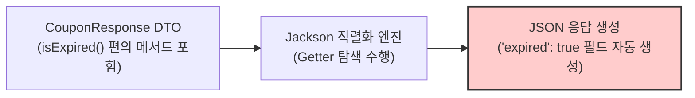
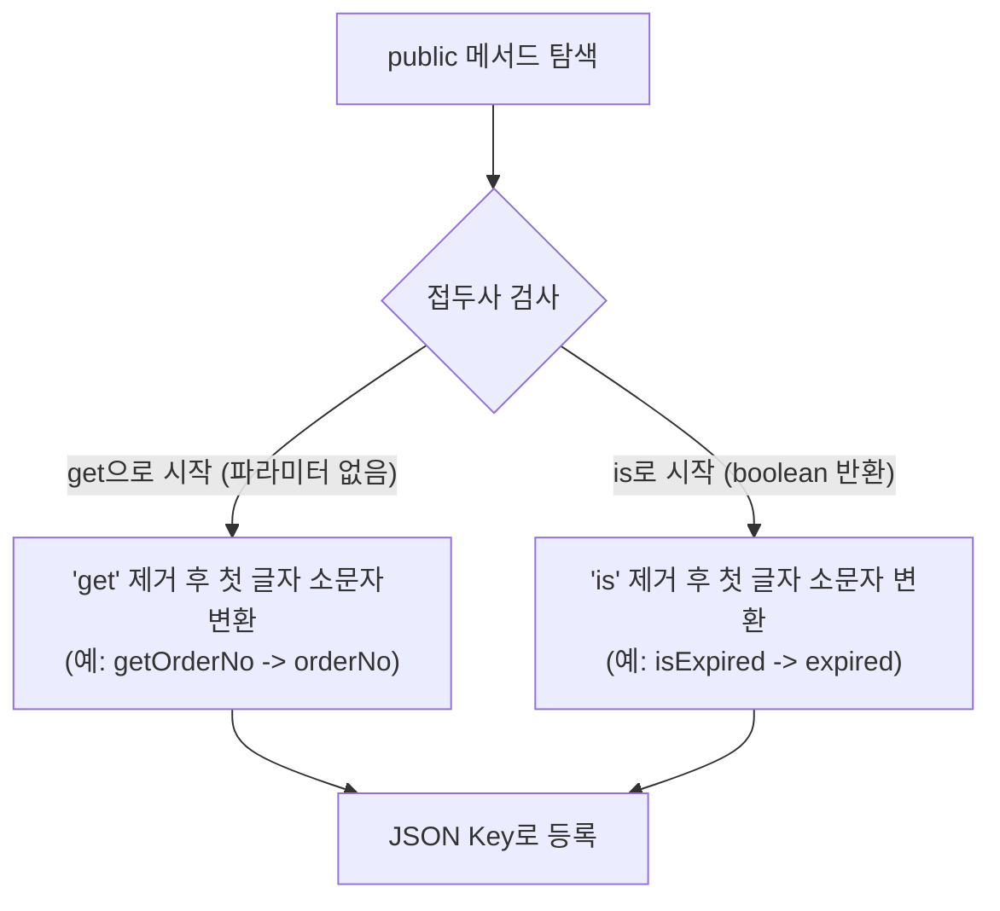

# Jackson의 프로퍼티 탐색 규칙과 @JsonIgnore를 활용한 직렬화 데이터 보호

Spring Boot 기반 백엔드 애플리케이션에서 HTTP 요청 및 응답 데이터를 처리할 때 기본 JSON 직렬화/역직렬화 엔진으로 **Jackson(ObjectMapper)** 라이브러리가 널리 활용됩니다.

Java 객체를 JSON 문자열로 변환하는 직렬화(Serialization) 과정에서 Jackson은 단순히 멤버 변수(Field)만을 직렬화 대상으로 삼지 않고, 자바빈즈(JavaBeans) 규약에 따른 공용 Getter 메서드를 탐색하여 JSON 프로퍼티를 동적으로 생성합니다. 이 과정에서 도메인 상태 검증용 비즈니스 메서드가 의도치 않게 JSON 응답 필드로 노출되는 부작용이 발생할 수 있습니다.

본 문서에서는 Jackson 라이브러리의 프로퍼티 탐색 메커니즘을 분석하고, `@JsonIgnore` 어노테이션을 활용하여 API 응답 스펙의 무결성을 유지하는 실무 구현 방식을 기술합니다.

---

## 1. 기술적 배경 및 문제 제기 (기존 방식의 한계점)

개발자가 DTO(Data Transfer Object) 클래스 내부에 비즈니스 편의 메서드를 추가했을 때 발생하는 전형적인 직렬화 오류 시나리오는 다음과 같습니다.



### 1.1 암묵적 프로퍼티 생성으로 인한 API 스펙 오염
DTO 객체 내부에서 만료 여부를 판별하기 위해 `public boolean isExpired()`와 같은 도메인 로직 메서드를 추가할 경우, Jackson 직렬화 엔진은 이를 데이터 접근자(Getter)로 인식하여 원본 데이터베이스나 API 명세에 존재하지 않던 `expired` 필드를 JSON 결과에 강제로 추가합니다.

### 1.2 민감 정보 및 내부 계산 로직의 불필요한 노출
엔티티나 DTO에 내부 연산용 메서드가 `get` 또는 `is` 접두사로 선언되어 있으면 클라이언트에게 노출되어서는 안 되는 내부 비즈니스 상태나 계산식 결과가 외부로 유출되는 보안 취약점이 발생할 수 있습니다.

---

## 2. 핵심 개념 설명

Jackson의 `ObjectMapper`는 리플렉션(Reflection)을 기반으로 객체의 메타데이터를 수집하며 다음과 같은 프로퍼티 탐색 규칙을 가집니다.



### 2.1 Jackson 기본 프로퍼티 탐색 규칙
1. **`get*` 메서드**: 매개변수가 없는 `public` 메서드 중 `get`으로 시작하는 경우, 접두사를 제거하고 카멜케이스(CamelCase) 규칙에 따라 첫 글자를 소문자로 변환한 문자열을 JSON Key로 간주합니다.
2. **`is*` 메서드**: 반환 타입이 `boolean` 또는 `Boolean`이고 매개변수가 없는 `public` 메서드는 `is`를 제거한 후 프로퍼티로 인식합니다.

### 2.2 `@JsonIgnore`의 동작 원리
`@JsonIgnore`는 해당 필드 또는 메서드를 Jackson의 인트로스펙션(Introspection) 과정에서 완전히 배제하도록 지정하는 메타 어노테이션입니다. 직렬화(Serialization)뿐만 아니라 역직렬화(Deserialization) 시점에도 해당 타깃을 무시합니다.

---

## 3. 코드 구현 및 라인별 상세 분석

Jackson 직렬화 부작용을 방지하기 위한 DTO 구현 코드는 다음과 같습니다.

### 3.1 문제 DTO와 `@JsonIgnore` 적용 코드 비교

```java
package com.example.dto;

import com.fasterxml.jackson.annotation.JsonIgnore;
import com.fasterxml.jackson.annotation.JsonProperty;
import java.time.LocalDateTime;

/**
 * 쿠폰 응답 DTO 클래스
 */
public class CouponResponse {

    @JsonProperty("couponId") // JSON 출력 시 필드명을 명시적으로 제어합니다.
    private final Long id;

    private final String couponName;
    private final LocalDateTime expiredAt;

    public CouponResponse(Long id, String couponName, LocalDateTime expiredAt) {
        this.id = id;
        this.couponName = couponName;
        this.expiredAt = expiredAt;
    }

    public Long getId() {
        return id;
    }

    public String getCouponName() {
        return couponName;
    }

    public LocalDateTime getExpiredAt() {
        return expiredAt;
    }

    /**
     * 비즈니스 로직용 편의 메서드
     * @JsonIgnore를 선언하지 않으면 JSON 출력 시 "expired": true 필드가 강제로 포함됩니다.
     */
    @JsonIgnore // 직렬화 대상에서 완전히 배제합니다.
    public boolean isExpired() {
        return expiredAt != null && expiredAt.isBefore(LocalDateTime.now());
    }
}
```

- **코드 분석 및 효율성**:
  - `@JsonIgnore`를 `isExpired()` 메서드에 부여함으로써 Jackson이 리플렉션 단계에서 해당 메서드를 프로퍼티로 변환하지 않고 건너뜁니다.
  - `@JsonProperty("couponId")`를 선언하여 Java 필드명(`id`)과 외부 API 응답 스펙(`couponId`)의 결합도를 낮추고 명시성을 강화합니다.

---

## 4. 실무 적용 시 고려해야 할 점 (주의사항 및 예외 처리)

### 4.1 도메인 엔티티의 직접 노출 금지
JPA Entity를 직접 Controller 응답으로 반환할 경우, 지연 로딩(Lazy Loading) 프록시 객체 탐색 중 `LazyInitializationException`이 발생하거나 무한 순환 참조(Circular Reference)가 유발될 수 있습니다. 반드시 순수 응답 전용 DTO로 매핑하여 반환해야 합니다.

### 4.2 `@JsonAutoDetect`를 활용한 전역 접근 제어
모든 메서드에 `@JsonIgnore`를 수동으로 부착하는 대신, 클래스 레벨에서 필드 직접 접근만을 허용하도록 가시성을 재정의할 수 있습니다.

```java
@JsonAutoDetect(
    fieldVisibility = JsonAutoDetect.Visibility.ANY,      // 필드는 직접 직렬화 대상에 포함
    getterVisibility = JsonAutoDetect.Visibility.NONE,    // Getter 메서드는 직렬화 대상에서 제외
    isGetterVisibility = JsonAutoDetect.Visibility.NONE   // isGetter 메서드는 직렬화 대상에서 제외
)
public class StrictResponseDto {
    private String data;
}
```

---

## 5. 결론 (해당 기술의 기대효과 요약)

Jackson의 Getter 탐색 규칙과 `@JsonIgnore`의 올바른 활용은 안정적인 API 스펙 관리의 기본 원칙입니다.

1. **API 스펙의 무결성 확보**: 불필요한 유령 필드 생성을 원천 차단하여 프론트엔드와 백엔드 간 통신 계약(Contract)을 명확하게 유지합니다.
2. **보안성 강화**: 객체 내부 상태나 검증 로직 결과가 외부로 의도치 않게 노출되는 정보 유출 사고를 방지합니다.
3. **유지보수성 향상**: 도메인 로직용 메서드와 직렬화 대상 프로퍼티의 경계를 명확히 분리하여 코드 변경에 유연하게 대응할 수 있습니다.
