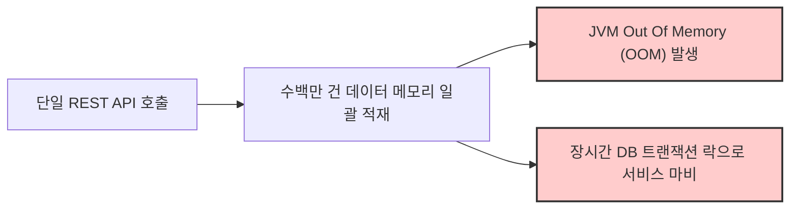
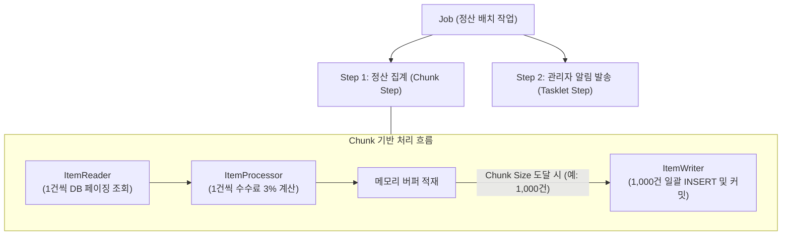

# Spring Batch 아키텍처와 Chunk 기반 대용량 정산 시스템 구축 가이드

엔터프라이즈 환경에서 매일 발생하는 수백만 건의 주문, 결제, 정산 데이터를 집계하고 처리하는 작업은 일반적인 웹 애플리케이션(Spring MVC)의 동기식 API 호출 방식으로 수행하기 어렵습니다. 대용량 데이터를 단일 트랜잭션으로 처리할 경우 JVM의 Out Of Memory(OOM) 에러가 발생하거나 웹 서버의 CPU 및 메모리 자원을 독점하여 서비스 장애로 이어집니다.

**Spring Batch는** 대용량 데이터를 안전하고 효율적으로 일괄 처리하기 위해 로깅, 트랜잭션 관리, 작업 재시작(Restart), 건너뛰기(Skip), 리소스 관리 기능을 표준화된 프레임워크 수준에서 제공합니다.

본 문서에서는 대규모 정산 시스템을 모델로 삼아 Spring Batch의 핵심 아키텍처인 **Chunk 지향 처리(Chunk-Oriented Processing)** 메커니즘을 분석하고, 실무 수준의 배치 파이프라인 구현 방식을 기술합니다.

---

## 1. 기술적 배경 및 문제 제기 (기존 방식의 한계점)

대량의 데이터를 일반 웹 서버 로직에서 처리할 때 마주치는 기술적 한계점은 다음과 같습니다.



### 1.1 메모리 자원 고갈 (Out Of Memory)
수백만 건의 레코드를 한 번에 메모리에 로드하여 가공할 경우 힙 메모리 임계치를 초과하여 JVM 프로세스가 비정상 종료됩니다.

### 1.2 트랜잭션 롤백 및 실패 복구 불가능
단일 트랜잭션으로 수십만 건을 처리하다가 99% 시점에 단 1건의 데이터 결함으로 예외가 발생하면 전체 작업이 롤백되며, 실패한 지점부터 재시작할 수 있는 메타데이터가 존재하지 않아 처음부터 다시 실행해야 합니다.

### 1.3 멱등성(Idempotency) 부재로 인한 중복 실행 위험
동일한 날짜의 정산 작업이 중복 호출되었을 때 이미 정산된 계좌로 대금이 이중 지급되는 금융 사고를 방어하기 어렵습니다.

---

## 2. 핵심 개념 설명

Spring Batch는 대용량 처리를 견고하게 통제하기 위해 **Job -> Step -> ItemReader / ItemProcessor / ItemWriter** 계층 구조를 갖습니다.



### 2.1 Chunk 지향 처리 (Chunk-Oriented Processing)
Chunk 단위(예: 1,000건)로 트랜잭션을 분할하여 처리하는 메커니즘입니다.
1. **반복 읽기 및 가공**: `ItemReader`와 `ItemProcessor`가 데이터를 1건씩 읽어 가공한 후 메모리 버퍼에 적재합니다.
2. **일괄 쓰기 및 커밋**: 버퍼에 쌓인 데이터 수가 지정된 `Chunk Size`에 도달하면 `ItemWriter`에게 리스트 통째로 넘겨 단 1회의 데이터베이스 일괄 쓰기(Bulk Write)를 수행하고 트랜잭션을 커밋합니다.

### 2.2 메타데이터 테이블 기반 상태 관리
Spring Batch는 `BATCH_JOB_INSTANCE`, `BATCH_JOB_EXECUTION`, `BATCH_STEP_EXECUTION` 테이블에 작업 파라미터와 성공/실패 여부, 처리 건수를 기록합니다. 이를 통해 이미 성공한 파라미터의 중복 실행을 차단하고, 실패 시 실패한 지점의 오프셋부터 재시작(Restart)할 수 있습니다.

---

## 3. 코드 구현 및 라인별 상세 분석

Spring Boot 3 및 Spring Batch 5 환경을 기준으로 구현한 가맹점 정산 배치 설정 코드는 다음과 같습니다.

### 3.1 정산 배치 Job 및 Step 구성 (`SettlementJobConfig.java`)

```java
package com.example.batch.job;

import com.example.batch.domain.Orders;
import com.example.batch.domain.Settlement;
import jakarta.persistence.EntityManagerFactory;
import org.slf4j.Logger;
import org.slf4j.LoggerFactory;
import org.springframework.batch.core.Job;
import org.springframework.batch.core.Step;
import org.springframework.batch.core.configuration.annotation.StepScope;
import org.springframework.batch.core.job.builder.JobBuilder;
import org.springframework.batch.core.repository.JobRepository;
import org.springframework.batch.core.step.builder.StepBuilder;
import org.springframework.batch.item.ItemProcessor;
import org.springframework.batch.item.database.JpaItemWriter;
import org.springframework.batch.item.database.JpaPagingItemReader;
import org.springframework.batch.item.database.builder.JpaItemWriterBuilder;
import org.springframework.batch.item.database.builder.JpaPagingItemReaderBuilder;
import org.springframework.beans.factory.annotation.Value;
import org.springframework.context.annotation.Bean;
import org.springframework.context.annotation.Configuration;
import org.springframework.transaction.PlatformTransactionManager;

import java.time.LocalDate;
import java.util.Collections;

/**
 * 일별 가맹점 정산 배치 Job 설정 클래스
 */
@Configuration
public class SettlementJobConfig {

    private static final Logger log = LoggerFactory.getLogger(SettlementJobConfig.class);
    private static final int CHUNK_SIZE = 1000;

    private final JobRepository jobRepository;
    private final PlatformTransactionManager transactionManager;
    private final EntityManagerFactory entityManagerFactory;

    public SettlementJobConfig(
            JobRepository jobRepository,
            PlatformTransactionManager transactionManager,
            EntityManagerFactory entityManagerFactory
    ) {
        this.jobRepository = jobRepository;
        this.transactionManager = transactionManager;
        this.entityManagerFactory = entityManagerFactory;
    }

    @Bean
    public Job settlementJob(Step settlementStep) {
        return new JobBuilder("settlementJob", jobRepository)
                .start(settlementStep)
                .build();
    }

    @Bean
    public Step settlementStep(
            JpaPagingItemReader<Orders> ordersReader,
            ItemProcessor<Orders, Settlement> settlementProcessor,
            JpaItemWriter<Settlement> settlementWriter
    ) {
        return new StepBuilder("settlementStep", jobRepository)
                .<Orders, Settlement>chunk(CHUNK_SIZE, transactionManager) // Chunk Size 및 트랜잭션 매니저 지정
                .reader(ordersReader)
                .processor(settlementProcessor)
                .writer(settlementWriter)
                .build();
    }

    /**
     * JPA 기반 페이징 데이터 리더
     * @StepScope: JobParameter 지연 바인딩 및 스레드 격리 보장
     */
    @Bean
    @StepScope
    public JpaPagingItemReader<Orders> ordersReader(
            @Value("#{jobParameters['targetDate']}") String targetDate
    ) {
        log.info("정산 집계 대상 일자 바인딩 - targetDate: {}", targetDate);

        return new JpaPagingItemReaderBuilder<Orders>()
                .name("ordersReader")
                .entityManagerFactory(entityManagerFactory)
                .pageSize(CHUNK_SIZE) // Page Size와 Chunk Size를 일치시켜 불필요한 추가 쿼리 방지
                .queryString("SELECT o FROM Orders o WHERE o.orderDate = :targetDate ORDER BY o.id ASC")
                .parameterValues(Collections.singletonMap("targetDate", LocalDate.parse(targetDate)))
                .build();
    }

    /**
     * 플랫폼 수수료 3% 차감 연산 프로세서
     */
    @Bean
    public ItemProcessor<Orders, Settlement> settlementProcessor() {
        return order -> {
            int fee = (int) (order.getAmount() * 0.03); // 3% 플랫폼 이용 수수료 연산
            int settlementAmount = order.getAmount() - fee; // 최종 정산 지급액 산출

            return new Settlement(
                    order.getId(),
                    order.getStoreName(),
                    settlementAmount,
                    LocalDate.now()
            );
        };
    }

    /**
     * JPA 기반 일괄 데이터 저장 라이터
     */
    @Bean
    public JpaItemWriter<Settlement> settlementWriter() {
        return new JpaItemWriterBuilder<Settlement>()
                .entityManagerFactory(entityManagerFactory)
                .build();
    }
}
```

- **코드 분석 및 효율성**:
  - `pageSize`와 `chunk` 크기를 모두 `1000`으로 동일하게 설정하여, 한 번의 Paging 쿼리로 가져온 데이터를 버퍼에 완전히 소진할 때까지 추가적인 불필요한 DB 조회가 발생하지 않도록 쿼리 효율성을 최적화합니다.
  - `@StepScope`를 선언하여 애플리케이션 시작 시점이 아닌 실제 `settlementStep` 실행 시점에 `JobParameters`를 지연 바인딩(Late Binding)하고 인스턴스를 격리합니다.

---

## 4. 실무 적용 시 고려해야 할 점 (주의사항 및 예외 처리)

### 4.1 페이징 오프셋 트랩(Paging Offset Trap) 방어
배치 프로세스 내부에서 조회 대상 데이터의 상태값을 변경(`UPDATE status = 'PROCESSED'`)하는 경우, `JpaPagingItemReader`의 `OFFSET` 계산으로 인해 다음 페이지 조회 시 미처리 데이터가 건너뛰어지는 심각한 버그가 발생합니다.
- 조회 쿼리 조건에 `WHERE o.orderDate = :targetDate`와 같이 상태 변경에 영향을 받지 않는 **불변 조건을** 사용하거나, `Paging` 대신 Cursor 기반 리더(`JpaCursorItemReader`)를 도입해야 합니다.

### 4.2 대용량 일괄 INSERT 시 JDBC 배치 최적화
JPA의 기본 `persist` 방식은 `GenerationType.IDENTITY` 전략 사용 시 JDBC Batch Insert가 비활성화되어 단건 `INSERT`가 반복됩니다. 대규모 쓰기 성능을 확보하기 위해서는 Sequence 전략을 사용하거나 `JdbcBatchItemWriter`를 활용하여 원시 JDBC 레벨의 `rewriteBatchedStatements=true` 옵션을 적용해야 합니다.

---

## 5. 결론 (해당 기술의 기대효과 요약)

Spring Batch와 Chunk 기반 아키텍처는 엔터프라이즈 환경에서 데이터 무결성을 보장하며 대규모 데이터를 안정적으로 소화할 수 있는 강력한 인프라입니다.

1. **메모리 자원의 안정적 보호**: 데이터를 일정 단위(Chunk)로 분할 처리하여 고정된 힙 메모리 사용량을 유지함으로써 OOM을 근본적으로 방지합니다.
2. **트랜잭션 세분화 및 장애 복구 탄력성**: 실패 시 전체 롤백 없이 성공한 청크는 보존되며, 메타데이터 기록을 기반으로 중단 지점부터 안전하게 작업을 재시작할 수 있습니다.
3. **배치 표준화 및 멱등성 확보**: 검증된 프레임워크 기반으로 중복 실행을 차단하고 신뢰성 높은 금융/정산 파이프라인을 운영할 수 있습니다.