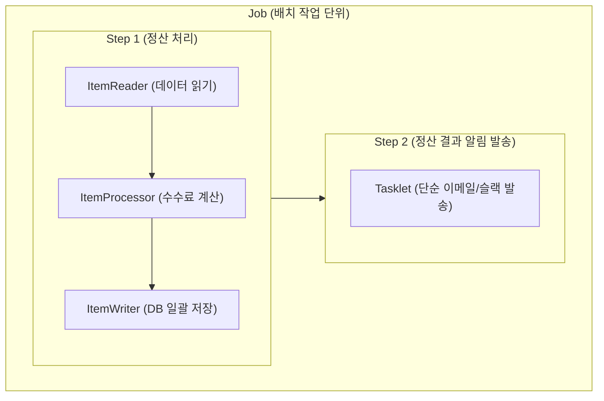
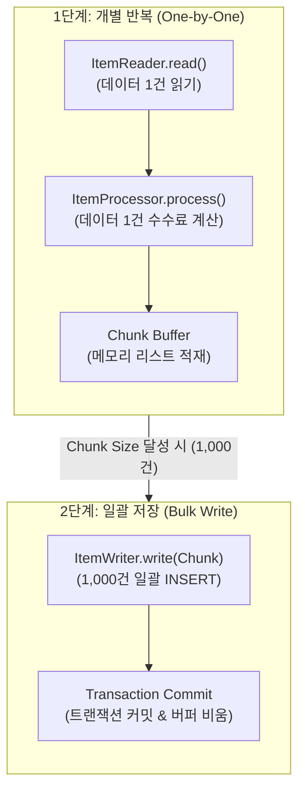

# [Spring Batch] 정산 시스템 구축으로 배우는 스프링 배치

> **시작하며**  
> 서비스가 성장하면서 매일 발생하는 수백만 건의 결제/주문 데이터를 집계하고 정산해야 하는 순간이 발생합니다. 단순히 웹 서버(Spring MVC)에서 API를 호출해 이를 처리하려고 하면 서버가 다운되거나 중복 정산이 일어나는 대참사가 발생할 수 있습니다.  
> 이번 글에서는 **'일별 가맹점 정산 배치 시스템'** 코드를 바탕으로, **Spring Batch의 개념부터 Chunk 지향 처리, 실무 코드 구현 방법까지 정리**해 보겠습니다.

---

## 0. 깃허브 Repository

[전체 프로젝트](https://github.com/yeondububub/spring-batch-in-action)

---

## 1. 왜 스프링 배치(Spring Batch)인가?

은행 마감이나 가맹점 정산처럼 **사용자와의 상호작용 없이 정해진 시점에 대용량 데이터를 일괄 처리**하는 시스템을 배치(Batch) 애플리케이션이라고 부릅니다.

단순 API 호출 방식과 대비되는 스프링 배치의 핵심 강점 4가지는 다음과 같습니다.

1. **서버 자원 보호**: 웹 서버의 CPU/Memory를 독점하지 않고 독립적으로 대용량 처리
2. **트랜잭션 단위 분할 (Chunk)**: 수백만 건을 한 번에 올리지 않고 쪼개어 메모리 낭비(OOM) 방지
3. **실패 복구 (Fault Tolerance)**: 중간에 실패하더라도 메타 테이블 기록을 바탕으로 실패한 지점부터 재시도(Restart) 가능
4. **멱등성(Idempotency) 보장**: 동일한 파라미터로는 이미 성공(COMPLETED)한 작업을 두 번 실행하지 못하도록 방어

---

## 1.5. Spring Batch 핵심 구성 요소

Spring Batch는 대용량 처리를 안전하게 관리하기 위해 **Job -> Step -> Reader/Processor/Writer** 형태의 명확한 계층 구조를 가집니다.



### 1) Job과 Step: 작업 단위와 계층 구조
- **Job(작업)**: 배치 애플리케이션의 최상위 실행 단위입니다. 하나의 Job은 실행 워크플로우에 따라 여러 개의 Step을 가질 수 있습니다.
- **Step(단계)**: 실제로 배치 처리가 이루어지는 독립적인 단계를 의미합니다. 각 Step은 독립된 트랜잭션 범위와 상태 관리(성공/실패) 정보를 가집니다.

### 2) Step을 구성하는 2가지 방식
Step은 처리할 작업의 성격에 따라 두 가지 방식으로 작성할 수 있습니다.
- **Chunk 기반 Step**: 데이터를 일정 단위(Chunk)로 쪼개어 **ItemReader -> ItemProcessor -> ItemWriter** 흐름으로 반복 처리합니다. (대용량 DB/파일 처리에 적합)
- **Tasklet 기반 Step**: 단순 DB 쿼리 실행, 파일 삭제, 알림 전송처럼 **단발성 일괄 작업**을 처리할 때 사용합니다.

### 3) Chunk Step의 3대 핵심 요소
- **ItemReader**: DB, CSV 파일, REST API 등 다양한 소스로부터 데이터를 **1건씩 읽어오는 역할**을 합니다.
- **ItemProcessor**: Reader가 읽어온 데이터 1건을 **가공, 변환, 필터링**합니다. (불필요한 데이터는 `null`을 반환하여 Writer 전달을 건너띌 수 있습니다)
- **ItemWriter**: Processor를 거쳐 메모리 버퍼에 쌓인 Chunk 단위 데이터 묶음을 **한 번에 DB에 저장하거나 외부에 전송**합니다.

---

## 2. 비즈니스 시나리오: 일별 가맹점 정산 배치

우리가 구현할 실무 비즈니스 로직은 다음과 같습니다.


- **주문 데이터 조회 (Reader)**: 매일 새벽 4시에 실행되어, 정확히 **7일 전**에 발생한 주문 데이터를 1,000건 단위로 조회합니다.
- **정산 금액 계산 (Processor)**: 플랫폼 이용 수수료 **3%를** 차감한 최종 정산 금액을 계산합니다.
  - `정산 금액 = 주문 금액 - (주문 금액 * 0.03)`
- **정산 데이터 저장 (Writer)**: 계산된 정산 데이터를 `settlement` 테이블에 일괄 저장합니다.

---

## 3. 핵심 아키텍처: Chunk 지향 처리 (Chunk-Oriented Processing)

Spring Batch의 꽃은 **Chunk 지향 처리**입니다.  
`ItemReader`와 `ItemProcessor`는 데이터를 **단건(1건)씩** 처리하고 메모리 버퍼에 모아둔 뒤, 설정한 **Chunk Size(예: 1,000개)가** 채워지면 `ItemWriter`에게 리스트 통째로 넘겨 **단 1번의 DB 트랜잭션으로 일괄 커밋(Bulk Write)을** 합니다.



---

## 4. 코드 분석 (`SettlementJobConfig.java`)


아래는 Spring Boot 3+ / Spring Batch 5+ 으로 작성된 [SettlementJobConfig](https://github.com/yeondububub/spring-batch-in-action/blob/main/src/main/java/com/example/springbatchinaction/job/SettlementJobConfig.java) 코드입니다.

```java

@Slf4j
@RequiredArgsConstructor
@Configuration
public class SettlementJobConfig {

    private final JobRepository jobRepository;
    private final PlatformTransactionManager transactionManager;
    private final EntityManagerFactory entityManagerFactory;
    private final JavaMailSender mailSender;

    // 1. Job 생성
    @Bean
    public Job settlementJob(Step settlementStep, Step sendMailStep) {
        return new JobBuilder("settlementJob", jobRepository)
                .start(settlementStep)
                .next(sendMailStep)
                .build();
    }

    // 2. Step 생성 (Chunk Size = 1000)
    @Bean
    public Step settlementStep(JpaPagingItemReader<Orders> ordersReader) {
        return new StepBuilder("settlementStep", jobRepository)
                .<Orders, Settlement>chunk(1000, transactionManager)
                .reader(ordersReader)
                .processor(settlementProcessor())
                .writer(settlementWriter())
                .build();
    }

    // 3. ItemReader (페이징 기반 DB 조회 & JobParameter 지연 바인딩)
    @Bean
    @StepScope
    public JpaPagingItemReader<Orders> ordersReader(@Value("#{jobParameters['targetDate']}") String targetDate) {
        log.info("[Reader] 정산 집계 대상 날짜: {}", targetDate);

        return new JpaPagingItemReaderBuilder<Orders>()
                .name("ordersReader")
                .entityManagerFactory(entityManagerFactory)
                .pageSize(1000) // Page Size와 Chunk Size를 1000으로 일치시킴
                .queryString("SELECT o FROM Orders o WHERE o.orderDate = :targetDate ORDER BY o.id")
                .parameterValues(Collections.singletonMap("targetDate", LocalDate.parse(targetDate)))
                .build();
    }

    // 4. ItemProcessor (가공: 3% 수수료 차감 비즈니스 로직)
    @Bean
    public ItemProcessor<Orders, Settlement> settlementProcessor() {
        log.info("[Processor] 정산 금액 계산");

        return item -> {
            int fee = (int) (item.getAmount() * 0.03); // 3% 수수료
            int settlementAmount = item.getAmount() - fee; // 최종 정산금액

            return new Settlement(item.getId(), item.getStoreName(), settlementAmount, LocalDate.now());
        };
    }

    // 5. ItemWriter (JPA 기반 일괄 DB 저장)
    @Bean
    public JpaItemWriter<Settlement> settlementWriter() {
        log.info("[Writer] 정산 데이터 DB 일괄 저장");

        return new JpaItemWriterBuilder<Settlement>()
                .entityManagerFactory(entityManagerFactory)
                .build();
    }

    // 6. Tasklet 기반 메일 발송 Step
    @Bean
    public Step sendMailStep() {
        return new StepBuilder("sendMailStep", jobRepository)
                .tasklet((contribution, chunkContext) -> {
                    log.info("[Tasklet] 정산 완료 메일 발송 시작");

                    SimpleMailMessage message = new SimpleMailMessage();
                    message.setTo("admin@example.com");
                    message.setSubject("[정산 완료] 일별 가맹점 정산 배치가 성공적으로 처리되었습니다.");
                    message.setText("오늘자 가맹점 정산 데이터 집계 및 저장 작업이 정상 완료되었습니다.");

                    mailSender.send(message);
                    log.info("[Tasklet] 메일 발송 완료");

                    return RepeatStatus.FINISHED;
                }, transactionManager)
                .build();
    }
}
```

---

## 5. 핵심 포인트 디테일 분석

### 포인트 1: `@StepScope`와 JobParameter 지연 바인딩 (Late Binding)
`ordersReader` 메서드를 보면 `@StepScope` 어노테이션이 붙어 있습니다.
```java
@Bean
@StepScope
public JpaPagingItemReader<Orders> ordersReader(@Value("#{jobParameters['targetDate']}") String targetDate)
```
- **왜 필요할까?**: 기본 Spring Bean은 애플리케이션 시작(Context 로딩) 시점에 생성됩니다. 하지만 배치 실행 시 전달받는 외부 인자(`targetDate`)를 읽으려면 **Bean 생성 시점을 해당 Step이 실제 실행되는 시점으로 지연(Late Binding)을** 시켜야 합니다.
- **Thread Safety**: 병렬 처리 시 각 Step 스레드별로 독립된 Reader 인스턴스가 생성되어 안전합니다.

### 포인트 2: Page Size와 Chunk Size의 일치
- `ordersReader`의 `.pageSize(1000)`과 `settlementStep`의 `.<Orders, Settlement>chunk(1000)`를 동일하게 **1000**으로 맞추었습니다.
- 두 크기가 다르면 한 번 Paging 쿼리로 가져온 데이터를 다 처리하기도 전에 불필요한 추가 SELECT 쿼리가 발생하는 성능 비효율이 생깁니다.

### 포인트 3: Page Offset Trap 방지 (조회 조건의 불변성)
- 만약 배치를 돌리면서 조회한 주문 데이터의 `status` 컬럼을 `COMPLETED`로 UPDATE한다면, `OFFSET` 쿼리 특성으로 인해 **다음 페이지 데이터 일부가 건너뛰어지는(Skipped) 치명적인 페이징 버그**가 생깁니다.
- 코드에서는 `WHERE o.orderDate = :targetDate`처럼 배치가 수행되어도 변하지 않는 **불변(Immutable) 조건**으로 조회하여 이 문제를 사전에 완벽히 방지했습니다.

---

## 6. 실행 방법 및 명령어

Spring Boot 배치 실행 시 특정 Job과 파라미터를 지정하여 실행하려면 아래 커맨드를 이용합니다.

```bash
# Terminal 실행 예시
java -jar build/libs/spring-batch-in-action-0.0.1-SNAPSHOT.jar \
  --spring.batch.job.enabled=true \
  --spring.batch.job.name=settlementJob \
  targetDate=2026-08-06
```

- `--spring.batch.job.enabled=true`: 배치 실행 러너 스위치를 켭니다.
- `--spring.batch.job.name=settlementJob`: 여러 Job 중 `settlementJob`만 지정해서 실행시킵니다.
- `targetDate=2026-08-06`: `JobParameter`로 전달되어 `@StepScope`를 통해 Reader로 주입됩니다.

---

## 7. 마치며

이번 글에서는 코드를 기반으로 **Spring Batch의 동작 메커니즘, Chunk 지향 처리, JpaPagingItemReader, @StepScope 활용법**을 살펴보았습니다.

스프링 배치를 활용하면 대용량 데이터 처리 과정에서 발생할 수 있는 메모리 이슈, 트랜잭션 관리, 예외 복구(Restart) 등의 복잡한 프레임워크 수준의 문제들을 깔끔하게 해결할 수 있습니다. 