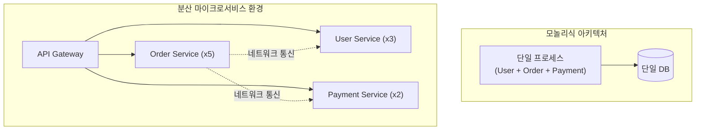
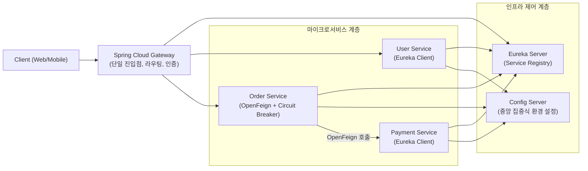

# Spring Cloud 개요 및 분산 시스템 아키텍처

단일 애플리케이션(Monolithic Architecture) 구조에서는 모든 비즈니스 도메인이 단일 프로세스 내에서 동작하며, 구성 요소 간의 상호작용은 인메모리 메서드 호출(In-Memory Method Call)을 통해 즉각적으로 이루어집니다. 그러나 비즈니스의 복잡도가 증가하고 트래픽 규모가 확장됨에 따라 독립적인 배포 주기 확보, 장애 격리, 도메인별 수평 확장(Scale-out)을 달성하기 위해 마이크로서비스 아키텍처(Microservice Architecture, 이하 MSA)로의 전환이 요구됩니다.

단일 프로세스가 수십 개 이상의 독립된 분산 서비스로 분할되면 모든 통신이 네트워크 I/O 기반으로 전환됩니다. 이로 인해 단일 애플리케이션 환경에서는 존재하지 않던 분산 인프라 제어 문제가 발생합니다. **Spring Cloud는** 분산 시스템 환경에서 발생하는 공통적인 엔지니어링 문제들을 해결하고, 검증된 분산 디자인 패턴을 표준화된 방식으로 제공하는 프레임워크 생태계입니다.

본 문서에서는 Spring Cloud의 도입 배경과 분산 시스템에서의 존재 이유를 살펴보고, 아키텍처를 구성하는 핵심 컴포넌트의 동작 메커니즘과 실무 구현 방식을 상세히 분석합니다.

---

## 1. 기술적 배경 및 문제 제기 (기존 방식의 한계점)

모놀리식 아키텍처에서 마이크로서비스 환경으로 전환할 때 엔지니어링 관점에서 직면하는 핵심 한계점은 다음과 같습니다.



### 1.1 동적 인스턴스 위치 추적의 한계
클라우드 및 컨테이너 환경에서는 오토스케일링과 롤링 배포로 인해 각 서비스 인스턴스의 IP 주소와 포트 번호가 동적으로 변경됩니다. 호출 대상 서버의 IP를 정적으로 설정 파일에 기록하는 기존 방식은 인스턴스 증감이나 비정상 종료 상황에 유연하게 대응할 수 없습니다.

### 1.2 단일 진입점 부재 및 클라이언트 의존성 심화
클라이언트 애플리케이션이 수십 개의 개별 마이크로서비스 엔드포인트와 직접 통신하면 CORS 이슈가 발생하고 보안 인증 로직이 각 서비스마다 중복 구현됩니다. 또한 내부 서비스 엔드포인트 변경 시 클라이언트 코드까지 수정해야 하는 강한 결합이 발생합니다.

### 1.3 분산 환경의 설정 관리 파편화
각 서비스 인스턴스마다 로컬 `application.yml` 파일을 개별 유지하는 방식은 데이터베이스 연결 정보나 공통 환경 변수 변경 시 전체 인스턴스를 재빌드 및 재배포해야 하는 비효율을 초래합니다.

### 1.4 네트워크 지연 및 연쇄 장애 전파
서비스 간 통신이 네트워크를 통해 이루어지므로 하위 종속 서비스의 응답 지연이 상위 서비스의 톰캣(Tomcat) 워커 스레드 점유로 이어집니다. 이는 최종적으로 전체 시스템이 마비되는 연쇄 장애(Cascading Failure)를 유발합니다.

### 1.5 통신 클라이언트 코드의 보일러플레이트 증가
서비스 간 REST API 호출 시 매번 `RestTemplate`이나 `HttpClient`를 생성하고 URL을 조합하며 역직렬화 예외를 처리하는 코드는 유지보수성을 심각하게 저하시킵니다.

---

## 2. 핵심 개념 설명

Spring Cloud는 Spring Boot를 기반으로 분산 시스템의 필수 아키텍처 패턴을 모듈화하여 제공하는 오픈소스 도구 모음입니다. 

Spring Boot가 **단일 애플리케이션을 신속하게 빌드하고 실행하는 단위 도구라면**, Spring Cloud는 **독립된 서비스 인스턴스들을 하나의 유기적인 분산 시스템으로 연결하고 제어하는 오케스트레이션 계층** 역할을 수행합니다.



### 아키텍처 상호작용 메커니즘
1. **설정 중앙화**: 마이크로서비스는 기동 시점에 **Spring Cloud Config Server에** 접속하여 실행 환경(`dev`, `prod`)에 맞는 설정 정보를 주입받습니다.
2. **서비스 레지스트리 등록**: 각 서비스 인스턴스는 활성화 즉시 **Eureka Server에** 자신의 서비스 논리 이름과 IP, 포트 정보를 등록하고 30초 주기로 하트비트(Heartbeat)를 전송하여 생존 상태를 유지합니다.
3. **단일 진입점 라우팅**: 외부 요청은 **Spring Cloud Gateway로** 인입되며, Gateway는 Eureka의 레지스트리 정보를 조회하여 가용한 인스턴스로 부하를 분산(Load Balancing)합니다.
4. **선언적 통신 및 장애 차단**: 서비스 간 통신 시 **Spring Cloud OpenFeign을** 통해 인터페이스 기반으로 호출하며, 대상 서비스 장애 발생 시 **Resilience4j Circuit Breaker가** 동작하여 즉각 대체 응답(Fallback)을 반환하고 호출을 차단합니다.

---

## 3. 코드 구현 및 라인별 상세 분석

Spring Cloud를 실무 시스템에 적용하기 위한 핵심 컴포넌트별 구현 코드와 상세 분석은 다음과 같습니다.

### 3.1 Spring Cloud Config (중앙 설정 관리 및 동적 갱신)

마이크로서비스 클라이언트가 Config Server로부터 설정을 가져오고, 애플리케이션 재시작 없이 설정을 실시간 갱신하는 구조입니다.

```yaml
# order-service의 application.yml 설정
spring:
  application:
    name: order-service # Config Server 저장소에서 탐색할 설정 파일명
  config:
    import: "configserver:http://config-server:8888" # 중앙 Config Server 엔드포인트
management:
  endpoints:
    web:
      exposure:
        include: refresh, health # 동적 설정을 갱신할 /actuator/refresh 엔드포인트 활성화
```

```java
package com.example.orderservice.config;

import org.springframework.beans.factory.annotation.Value;
import org.springframework.cloud.context.config.annotation.RefreshScope;
import org.springframework.stereotype.Component;

/**
 * 동적 설정 프로퍼티 관리 컴포넌트
 */
@Component
@RefreshScope // Actuator /refresh 요청 시 빈을 재생성하여 최신 설정값을 바인딩합니다.
public class OrderProperties {

    // Config Server에서 관리 중인 프로퍼티 값을 주입받습니다.
    @Value("${order.discount.rate:0.0}")
    private double discountRate;

    public double getDiscountRate() {
        return discountRate;
    }
}
```

- **코드 분석 및 효율성**:
  - `@RefreshScope`를 적용하면 프록시 객체가 실제 대상 빈의 참조를 관리하며, `/actuator/refresh` 호출 시 해당 빈의 인스턴스만 파괴 후 재생성합니다.
  - 이를 통해 JVM 전체를 재시작하지 않고도 운영 중인 애플리케이션의 비즈니스 정책이나 타임아웃 설정을 무중단으로 실시간 반영할 수 있습니다.

---

### 3.2 Spring Cloud Netflix Eureka (서비스 레지스트리 서버 구축)

모든 마이크로서비스의 위치 정보를 실시간으로 관리하는 레지스트리 서버의 구현입니다.

```java
package com.example.discoveryservice;

import org.springframework.boot.SpringApplication;
import org.springframework.boot.autoconfigure.SpringBootApplication;
import org.springframework.cloud.netflix.eureka.server.EnableEurekaServer;

/**
 * 서비스 디스커버리 레지스트리 서버
 */
@SpringBootApplication
@EnableEurekaServer // Eureka Registry 서버 기능을 활성화합니다.
public class DiscoveryServiceApplication {
    public static void main(String[] args) {
        SpringApplication.run(DiscoveryServiceApplication.class, args);
    }
}
```

```yaml
# Eureka Server application.yml 설정
server:
  port: 8761

eureka:
  client:
    register-with-eureka: false # 서버 자신이 레지스트리에 클라이언트로 등록되지 않도록 방지합니다.
    fetch-registry: false       # 서버 자신이 레지스트리 정보를 조회해 올 필요가 없으므로 비활성화합니다.
  server:
    enable-self-preservation: true # 일시적 네트워크 단절 시 인스턴스를 즉각 제거하지 않는 자기보호 모드를 유지합니다.
```

- **코드 분석 및 효율성**:
  - `enable-self-preservation: true` 설정을 통해 순간적인 네트워크 단절로 인해 하트비트가 수신되지 않더라도 모든 인스턴스가 레지스트리에서 일괄 삭제되는 대규모 장애 현상을 방지합니다.

---

### 3.3 Spring Cloud Gateway (비동기 라우팅 및 필터링)

Netty 기반의 리액티브 환경에서 클라이언트 요청을 분석하여 백엔드 서비스로 전달하는 라우팅 설정입니다.

```yaml
# Spring Cloud Gateway application.yml
server:
  port: 8080

spring:
  application:
    name: api-gateway
  cloud:
    gateway:
      routes:
        - id: order-service-route
          uri: lb://ORDER-SERVICE # Eureka에 등록된 논리적 서비스명으로 클라이언트 사이드 부하 분산 적용
          predicates:
            - Path=/api/orders/** # 클라이언트 요청 경로 매칭 조건
          filters:
            # 다운스트림 마이크로서비스로 전달할 트래픽 식별 헤더를 추가합니다.
            - AddRequestHeader=X-Gateway-Tracking-Id, 550e8400-e29b-41d4-a716-446655440000
            # 서킷 브레이커 필터를 적용하여 장애 발생 시 우회 엔드포인트로 포워딩합니다.
            - name: CircuitBreaker
              args:
                name: gatewayCircuitBreaker
                fallbackUri: forward:/fallback/orders
```

- **코드 분석 및 효율성**:
  - `lb://ORDER-SERVICE` 스키마를 사용하여 Gateway 내부의 `Spring Cloud LoadBalancer`가 Eureka의 가용 인스턴스 목록 중 라운드로빈 방식으로 트래픽을 분산합니다.
  - 블로킹 I/O 방식인 전통적인 서블릿 기반 프록시(Spring MVC) 대비 적은 스레드로 대규모 동시 접속 요청을 효율적으로 처리합니다.

---

### 3.4 Spring Cloud OpenFeign (선언적 HTTP 통신 인터페이스)

보일러플레이트 코드 없이 인터페이스 선언만으로 분산 서비스 간 HTTP 통신을 구현합니다.

```java
package com.example.orderservice.client;

import org.springframework.cloud.openfeign.FeignClient;
import org.springframework.web.bind.annotation.GetMapping;
import org.springframework.web.bind.annotation.PathVariable;

/**
 * 결제 서비스 호출을 위한 선언적 REST 클라이언트 인터페이스
 */
@FeignClient(
    name = "PAYMENT-SERVICE",         // Eureka에 등록된 대상 서비스 이름
    path = "/api/payments",           // 기본 URI 경로
    fallback = PaymentClientFallback.class // 장애 발생 시 대체 로직을 담당할 빈 클래스 지정
)
public interface PaymentClient {

    /**
     * 주문 ID 기준 결제 상태 조회 API 호출
     */
    @GetMapping("/{orderId}/status")
    PaymentResponse getPaymentStatus(@PathVariable("orderId") String orderId);
}
```

- **코드 분석 및 효율성**:
  - 개발자가 직접 HTTP 요청 생성, 연결 풀 관리, 헤더 설정, 응답 파싱 코드를 작성하지 않아도 프레임워크가 런타임에 동적 프록시를 생성합니다.
  - 코드 가독성이 대폭 향상되며 서비스 인터페이스 변경 시 유지보수 비용을 최소화합니다.

---

### 3.5 Resilience4j Circuit Breaker (결함 감내 및 장애 격리)

서비스 지연 및 실패율 임계치 도달 시 호출을 차단하고 Fallback을 실행하는 서킷 브레이커 구현입니다.

```java
package com.example.orderservice.service;

import com.example.orderservice.client.PaymentClient;
import com.example.orderservice.client.PaymentResponse;
import io.github.resilience4j.circuitbreaker.annotation.CircuitBreaker;
import org.slf4j.Logger;
import org.slf4j.LoggerFactory;
import org.springframework.stereotype.Service;

/**
 * 주문 처리 및 결제 연동 비즈니스 서비스
 */
@Service
public class OrderService {

    private static final Logger log = LoggerFactory.getLogger(OrderService.class);
    private final PaymentClient paymentClient;

    public OrderService(PaymentClient paymentClient) {
        this.paymentClient = paymentClient;
    }

    /**
     * 결제 상태를 검증하고 주문을 처리합니다.
     * 장애율이 임계치를 초과하면 Circuit이 OPEN되어 즉각 fallbackProcessOrderPayment가 실행됩니다.
     */
    @CircuitBreaker(name = "paymentServiceBreaker", fallbackMethod = "fallbackProcessOrderPayment")
    public String processOrderPayment(String orderId) {
        log.info("결제 서비스 원격 호출 시작 - orderId: {}", orderId);
        PaymentResponse response = paymentClient.getPaymentStatus(orderId);
        return response.getStatus();
    }

    /**
     * 원격 결제 서비스 장애 발생 시 실행되는 대체 메서드
     * 원본 메서드와 동일한 반환 타입 및 파라미터 구조를 가져야 하며 Throwable 인자를 추가 수신합니다.
     */
    public String fallbackProcessOrderPayment(String orderId, Throwable throwable) {
        log.warn("결제 서비스 호출 실패 및 서킷 차단 감지 - orderId: {}, cause: {}", orderId, throwable.getMessage());
        // 결제 상태를 대기 상태로 유지하고 비동기 배치 또는 메시지 큐 처리를 위한 상태값을 반환합니다.
        return "PAYMENT_PENDING_FALLBACK";
    }
}
```

- **코드 분석 및 효율성**:
  - 서킷 브레이커가 CLOSED 상태에서 에러율(예: 50% 이상) 또는 느린 호출 비율이 설정값을 초과하면 즉시 OPEN 상태로 전이됩니다.
  - OPEN 상태에서는 원격 서비스로 네트워크 I/O 요청을 전송하지 않고 즉각 `fallbackProcessOrderPayment`를 호출하므로, 불필요한 스레드 대기 시간을 없애고 주문 서비스의 스레드 고갈을 사전에 차단합니다.

---

## 4. 실무 적용 시 고려해야 할 점 (주의사항 및 예외 처리)

Spring Cloud 컴포넌트를 운영 환경에 도입할 때 반드시 검토해야 하는 아키텍처적 주의사항은 다음과 같습니다.

### 4.1 분산 트랜잭션 및 데이터 일관성 한계
마이크로서비스 환경에서는 데이터베이스가 물리적으로 분리되므로 단일 로컬 트랜잭션(`@Transactional`)으로 다중 서비스의 상태를 일괄 커밋할 수 없습니다. 2PC(Two-Phase Commit) 방식은 분산 락으로 인한 성능 저하를 유발하므로, Saga 패턴(Choreography 또는 Orchestration) 및 Outbox 패턴을 도입하여 최종 일관성(Eventual Consistency)을 보장하는 구조를 설계해야 합니다.

### 4.2 분산 추적(Distributed Tracing) 인프라 구축
단일 요청이 Gateway를 거쳐 다수의 마이크로서비스로 분기될 때 로그가 분산되어 장애 발생 지점 파악이 어렵습니다. `Micrometer Tracing`과 `Zipkin`을 연동하여 모든 요청에 유일한 TraceId와 SpanId를 부여하고, 이를 공통 로깅 포맷에 바인딩하여 분산 호출 경로를 시각화해야 합니다.

### 4.3 네트워크 레이턴시 및 연결 풀(Connection Pool) 최적화
모놀리식 환경 대비 서비스 간 네트워크 홉(Network Hop)이 증가하므로 HTTP 클라이언트의 Connection Timeout 및 Read Timeout을 명확히 설정해야 합니다. Feign 클라이언트 사용 시 기본 HTTP URLConnection 대신 `Apache HttpClient` 또는 `OkHttp` 커넥션 풀 라이브러리를 연동하여 TCP 핸드셰이크 오버헤드를 줄여야 합니다.

### 4.4 컨테이너 오케스트레이션(Kubernetes) 환경과의 기술 중복
Kubernetes 플랫폼 위에서 애플리케이션을 운영하는 경우, Kubernetes의 자체 기능(K8s Service, Ingress Controller, ConfigMap/Secret)과 Spring Cloud의 컴포넌트(Eureka, Gateway, Config Server)가 기능적으로 중복됩니다.
- 서비스 디스커버리는 Kubernetes의 CoreDNS 및 K8s Service로 위임하고, 비즈니스 라우팅 및 보안 제어 영역에만 Spring Cloud Gateway를 사용하는 등 인프라 아키텍처에 맞춘 취사선택이 필요합니다.

---

## 5. 결론 (해당 기술의 기대효과 요약)

Spring Cloud는 마이크로서비스 아키텍처 도입 시 발생하는 분산 환경의 기술적 장벽을 체계적으로 해소하는 검증된 프레임워크 생태계입니다.

1. **개발 생산성 및 비즈니스 집중도 향상**: 복잡한 네트워크 통신, 서비스 위치 탐색, 부하 분산 로직을 선언적 어노테이션 기반으로 추상화하여 비즈니스 로직 구현에 집중할 수 있습니다.
2. **시스템 가용성 및 장애 내구성 확보**: API Gateway 단일 진입점 통제와 Circuit Breaker 결함 감내 패턴을 통해 특정 마이크로서비스의 장애가 전체 시스템으로 전파되는 구조적 위험을 방지합니다.
3. **운영 자동화 및 유연한 인프라 관리**: 중앙 집중식 동적 설정 관리와 서비스 레지스트리 기반의 자동 확장을 통해 대규모 분산 트래픽 환경에서도 안정적인 서비스 운영이 가능합니다.

분산 시스템으로의 성공적인 전환을 달성하기 위해서는 시스템의 도메인 복잡도와 운영 팀의 역량을 종합적으로 고려하여 Spring Cloud의 필수 컴포넌트를 단계별로 도입해야 합니다.
