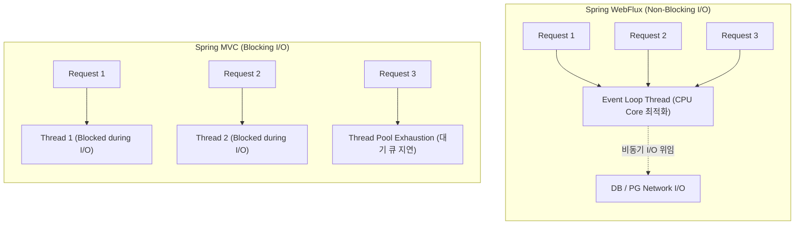

# Spring WebFlux 입문 및 결제 서비스 기반 리액티브 프로그래밍 아키텍처

대규모 트래픽과 높은 동시성 처리가 요구되는 분산 환경에서 Spring MVC의 전통적인 Thread-per-request 모델은 스레드 풀 고갈 및 리소스 경합 문제에 직면할 수 있습니다. 특히 외부 PG사 연동이나 분산 I/O 대기가 빈번한 결제 도메인에서는 I/O 대기로 인한 스레드 점유 비용이 시스템 전체의 성능 병목으로 작용합니다.

**Spring WebFlux는** Netty 기반의 논블로킹(Non-blocking) I/O와 Reactive Streams 사양을 구현한 **Project Reactor를** 바탕으로, 소수의 이벤트 루프 스레드만으로 대량의 동시 연결을 효율적으로 수용할 수 있는 리액티브 웹 프레임워크입니다.

본 문서에서는 Spring MVC와 WebFlux의 아키텍처적 차이를 분석하고, 실제 결제 승인 시스템(WebFlux, R2DBC, Sinks, Schedulers)을 기반으로 리액티브 파이프라인의 설계 및 구현 방식을 상세히 기술합니다.

---

## 1. 기술적 배경 및 문제 제기 (기존 방식의 한계점)

전통적인 Spring MVC 기반 블로킹 I/O 모델과 WebFlux의 논블로킹 I/O 모델을 비교 분석한 내용은 다음과 같습니다.



### 1.1 Thread-per-request 모델의 스레드 고갈
Spring MVC는 요청마다 톰캣(Tomcat) 스레드 풀에서 작업 스레드를 1개씩 할당합니다. 외부 PG사 응답 지연이나 DB 쿼리 대기 시간 동안 해당 스레드는 아무런 작업을 하지 못하고 블로킹(Blocked) 상태로 대기하므로, 동시 요청이 증가하면 스레드 풀이 고갈되고 컨텍스트 스위칭(Context Switching) 오버헤드가 급증합니다.

### 1.2 시스템 메모리 낭비
JVM 스레드는 각각 독립된 스택 메모리(기본 1MB)를 점유합니다. 동시 접속자 수백~수천 명을 처리하기 위해 수백 개의 스레드를 유지하는 것은 상당한 메모리 낭비를 유발합니다.

### 1.3 데이터베이스 커넥션 병목 (JDBC의 한계)
전통적인 JDBC는 블로킹 방식으로 동작하므로, 애플리케이션 계층이 비동기로 동작하더라도 데이터베이스 계층에서 스레드가 블로킹되어 전체 파이프라인의 논블로킹 이점이 상쇄됩니다.

---

## 2. 핵심 개념 설명

Spring WebFlux와 Project Reactor의 핵심 아키텍처 구성 요소는 다음과 같습니다.

### 2.1 Publisher 핵심 타입: Mono와 Flux
Reactive Streams 사양의 핵심은 데이터를 비동기적으로 발행하는 `Publisher<T>` 인터페이스입니다. Project Reactor는 이를 `Mono`와 `Flux` 두 가지 타입으로 구체화합니다.

| 구분 | `Mono<T>` | `Flux<T>` |
| :--- | :--- | :--- |
| **발행 데이터 수** | 0 또는 1개 (`0..1`) | 0부터 N개 (`0..N`) |
| **대응 개념** | `Optional<T>`, `CompletableFuture<T>` | `List<T>`, `Stream<T>` |
| **주요 용도** | 단건 데이터 조회, CUD 처리 결과, HTTP 단건 응답 | 다건 데이터 스트리밍, 실시간 이벤트 피드, SSE |

### 2.2 Cold Stream과 Hot Stream의 메커니즘
- **Cold Stream (기본 동작)**: 구독(Subscribe)이 발생하는 시점에 데이터 생성이 시작되며, 구독자마다 독립된 데이터 스트림을 수신합니다.
- **Hot Stream (`Sinks`)**: 구독 여부와 무관하게 데이터가 실시간으로 발행되며, 여러 구독자가 동일한 데이터 스트림을 공유(Broadcast)합니다.

### 2.3 R2DBC (Reactive Relational Database Connectivity)
관계형 데이터베이스에 대해 완전한 논블로킹 I/O 드라이버를 제공하여, DB 조회부터 웹 응답까지 전 구간 Non-blocking 파이프라인을 구축할 수 있도록 지원합니다.

---

## 3. 코드 구현 및 라인별 상세 분석

실제 결제 승인 시스템의 Controller, UseCase, R2DBC Repository 및 Sinks 연동 코드는 다음과 같습니다.

### 3.1 WebFlux Controller 계층 (`PaymentConfirmController.kt`)

```kotlin
package com.example.payment.adapter.`in`.web

import com.example.payment.adapter.`in`.web.request.TossPaymentConfirmRequest
import com.example.payment.adapter.`in`.web.response.ApiResponse
import com.example.payment.application.port.`in`.PaymentConfirmCommand
import com.example.payment.application.port.`in`.PaymentConfirmUseCase
import com.example.payment.domain.PaymentConfirmationResult
import org.springframework.http.HttpStatus
import org.springframework.http.ResponseEntity
import org.springframework.web.bind.annotation.PostMapping
import org.springframework.web.bind.annotation.RequestBody
import org.springframework.web.bind.annotation.RestController
import reactor.core.publisher.Mono

/**
 * 논블로킹 결제 승인 API 엔드포인트 컨트롤러
 */
@RestController
class PaymentConfirmController(
    private val paymentConfirmUseCase: PaymentConfirmUseCase
) {

    @PostMapping("/v1/toss/confirm")
    fun confirm(
        @RequestBody request: TossPaymentConfirmRequest
    ): Mono<ResponseEntity<ApiResponse<PaymentConfirmationResult>>> {
        val command = PaymentConfirmCommand(
            paymentKey = request.paymentKey,
            orderId = request.orderId,
            amount = request.amount
        )

        // 리액티브 스트림을 반환하며 이벤트 루프 스레드를 즉시 해제합니다.
        return paymentConfirmUseCase.confirm(command)
            .map { result ->
                ResponseEntity.ok().body(ApiResponse.with(HttpStatus.OK, "결제 승인 성공", result))
            }
    }
}
```

- **코드 분석 및 효율성**:
  - `Mono<ResponseEntity<...>>` 타입을 반환하여 HTTP 요청 스레드가 비즈니스 완료를 대기하지 않고 즉시 Netty 이벤트 루프로 반환됩니다.
  - 외부 PG 승인 및 DB I/O가 완료되는 시점에 Netty가 클라이언트에게 응답을 푸시합니다.

---

### 3.2 결제 승인 유스케이스 구현 (`PaymentConfirmService.kt`)

```kotlin
package com.example.payment.application.service

import com.example.payment.application.port.`in`.PaymentConfirmCommand
import com.example.payment.application.port.`in`.PaymentConfirmUseCase
import com.example.payment.application.port.out.ExecutePaymentPort
import com.example.payment.application.port.out.PaymentStatusUpdatePort
import com.example.payment.domain.PaymentConfirmationResult
import org.springframework.stereotype.Service
import org.springframework.transaction.reactive.TransactionalOperator
import reactor.core.publisher.Mono

/**
 * 리액티브 트랜잭션 및 외부 PG 승인 조율 서비스
 */
@Service
class PaymentConfirmService(
    private val paymentStatusUpdatePort: PaymentStatusUpdatePort,
    private val executePaymentPort: ExecutePaymentPort,
    private val transactionalOperator: TransactionalOperator
) : PaymentConfirmUseCase {

    override fun confirm(command: PaymentConfirmCommand): Mono<PaymentConfirmationResult> {
        return paymentStatusUpdatePort.updatePaymentStatusToExecuting(command.orderId, command.paymentKey)
            .flatMap { executePaymentPort.execute(command) } // 외부 PG사 비동기 결제 승인 호출
            .flatMap { executionResult ->
                paymentStatusUpdatePort.updatePaymentStatus(
                    orderId = command.orderId,
                    status = executionResult.paymentStatus,
                    extraDetails = executionResult.extraDetails
                ).thenReturn(
                    PaymentConfirmationResult(
                        status = executionResult.paymentStatus,
                        failure = executionResult.failure
                    )
                )
            }
            // R2DBC 리액티브 트랜잭션 경계를 설정합니다.
            .`as`(transactionalOperator::transactional)
    }
}
```

- **코드 분석 및 효율성**:
  - `flatMap` 연산자를 활용하여 이전 비동기 작업의 완료 결과를 다음 리액티브 스트림으로 중첩 없이 연속 체이닝합니다.
  - `TransactionalOperator`를 사용하여 논블로킹 환경에서 원자적 R2DBC 트랜잭션을 보장합니다.

---

### 3.3 Sinks 기반의 결제 이벤트 브로드캐스팅 (`PaymentEventSink.kt`)

```kotlin
package com.example.payment.infrastructure.event

import com.example.payment.domain.PaymentEvent
import org.springframework.stereotype.Component
import reactor.core.publisher.Flux
import reactor.core.publisher.Sinks

/**
 * Hot Stream 기반 결제 이벤트 발행 및 멀티캐스팅 컴포넌트
 */
@Component
class PaymentEventSink {

    // 다중 프로듀서가 이벤트를 발행하고 다중 컨슈머가 공유 수신할 수 있는 multicast 버퍼를 생성합니다.
    private val sink: Sinks.Many<PaymentEvent> = Sinks.many().multicast().onBackpressureBuffer()

    /**
     * 신규 결제 이벤트를 Hot Stream으로 방출합니다.
     */
    fun emitEvent(event: PaymentEvent) {
        sink.emitNext(event, Sinks.EmitFailureHandler.FAIL_FAST)
    }

    /**
     * 결제 이벤트 구독 스트림을 반환합니다.
     */
    fun asFlux(): Flux<PaymentEvent> {
        return sink.asFlux()
    }
}
```

- **코드 분석 및 효율성**:
  - `Sinks.many().multicast().onBackpressureBuffer()`를 사용하여 비동기적으로 발생하는 결제 이벤트를 백프레셔(Backpressure) 제어 하에 여러 구독자(통계 서비스, 알림 서비스)에게 실시간 분배합니다.

---

## 4. 실무 적용 시 고려해야 할 점 (주의사항 및 예외 처리)

### 4.1 Blocking Call의 완전한 차단
WebFlux 파이프라인 내부에서 `Thread.sleep()`, JDBC Driver, 동기 `RestTemplate`과 같은 블로킹 I/O를 직접 호출하면 Netty 이벤트 루프 스레드 자체가 멈추어 서버 전체의 처리량이 급락합니다.
- 부득이하게 블로킹 API를 호출해야 하는 경우 `Schedulers.boundedElastic()` 스케줄러로 스레드를 명시적으로 분리 격리해야 합니다.

```kotlin
Mono.fromCallable { blockingCallService.execute() }
    .subscribeOn(Schedulers.boundedElastic()) // 별도의 블로킹 전용 스레드 풀에서 실행
```

### 4.2 디버깅 및 스택 트레이스 추적의 난이도
비동기 파이프라인 특성상 호출 스레드와 실행 스레드가 분리되어 있어 예외 발생 시 표준 스택 트레이스로는 최초 호출 지점을 식별하기 어렵습니다.
- `Hooks.onOperatorDebug()` 또는 `ReactorDebugAgent`를 프로덕션 환경에 적용하여 비동기 스택 트레이스 가시성을 확보해야 합니다.

### 4.3 리액티브 백프레셔(Backpressure) 조절
생산자의 이벤트 발행 속도가 소비자의 처리 속도를 초과할 경우 메모리 오버플로우가 발생할 수 있습니다. `onBackpressureBuffer`, `onBackpressureDrop` 등의 전략을 명시적으로 수립해야 합니다.

---

## 5. 결론 (해당 기술의 기대효과 요약)

Spring WebFlux와 R2DBC 기반의 리액티브 아키텍처는 고밀도 I/O 트래픽 환경에서 최적의 인프라 효율성을 달성하는 솔루션입니다.

1. **하드웨어 자원 점유 최소화**: CPU 코어 수에 비례하는 소수의 이벤트 루프 스레드만으로 수만 개의 동시 접속을 수용하여 메모리와 컨텍스트 스위칭 비용을 획기적으로 절감합니다.
2. **I/O 병목 해소 및 높은 처리량 확보**: PG 연동 및 데이터베이스 조회 대기 중에도 스레드를 블로킹하지 않고 다른 요청을 처리함으로써 시스템 전체의 처리량(Throughput)을 극대화합니다.
3. **선언적 비동기 파이프라인 구축**: Project Reactor의 풍부한 리액티브 연산자를 활용하여 복잡한 비동기 비즈니스 워크플로우를 선언적이고 일관된 코드로 작성할 수 있습니다.
