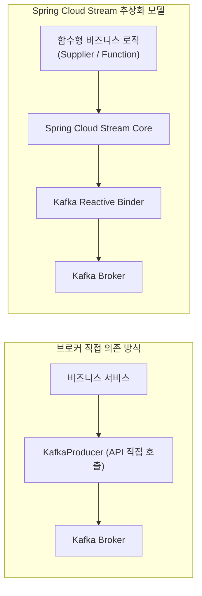
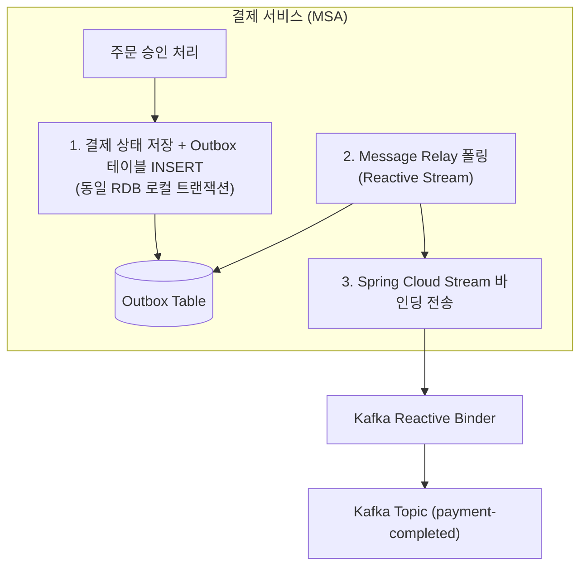

# Spring Cloud Stream 및 Kafka Reactive Binder 기반 이벤트 스트리밍 아키텍처

분산 시스템 및 마이크로서비스 아키텍처(MSA) 환경에서 서비스 간 비동기 통신과 이벤트 기반 아키텍처(EDA)를 구축하기 위해 메시지 브로커(Message Broker)의 활용은 필수적입니다. 그러나 특정 브로커 클라이언트 라이브러리에 직접 의존할 경우, 인프라 변경 시 비즈니스 로직의 전면 수정이 불가피하며 코드의 결합도가 급격히 증가합니다.

**Spring Cloud Stream은** 메시지 브로커와의 연결 및 통신을 **Binder** 추상화 계층 뒤로 격리하고, 표준 함수형 프로그래밍 모델(`Supplier`, `Function`, `Consumer`)을 통해 비즈니스 로직을 작성할 수 있도록 지원하는 프레임워크입니다. 여기에 **Kafka Reactive Binder를** 결합하면 Project Reactor 기반의 논블로킹 이벤트 파이프라인을 구축할 수 있습니다.

본 문서에서는 Spring Cloud Stream의 추상화 계층과 Kafka Reactive Binder의 동작 메커니즘을 분석하고, 결제 도메인에서 분산 데이터 정합성을 보장하기 위한 **트랜잭셔널 아웃박스(Transactional Outbox) 패턴** 및 **메시지 릴레이(Message Relay)** 실무 구현 방식을 상세히 기술합니다.

---

## 1. 기술적 배경 및 문제 제기 (기존 방식의 한계점)

메시지 브로커 클라이언트 라이브러리(`KafkaProducer`, `KafkaConsumer`)를 애플리케이션 계층에서 직접 호출할 때 직면하는 구조적 한계점은 다음과 같습니다.



### 1.1 강한 인프라 결합도(Tight Coupling)
비즈니스 로직 계층이 특정 메시지 브로커의 세부 구현 기술(직렬화, 프로듀서 API, 연결 프로퍼티)에 직접 종속되어 유지보수성이 저하됩니다.

### 1.2 인프라 교체 비용 증가
메시지 브로커를 Kafka에서 RabbitMQ, AWS SQS, Pulsar 등으로 변경하거나 멀티 클라우드로 전환할 때 프로듀서 및 컨슈머 코드를 전면 재작성해야 합니다.

### 1.3 듀얼 라이트(Dual Write) 문제로 인한 데이터 정합성 결함
로컬 데이터베이스에 상태를 저장하고 메시지 브로커로 이벤트를 발행하는 두 작업을 단일 트랜잭션으로 원자성을 보장할 수 없습니다. DB 저장은 성공했으나 브로커 장애로 이벤트 발행이 실패하면 서비스 간 데이터 불일치가 발생합니다.

---

## 2. 핵심 개념 설명

Spring Cloud Stream의 추상화 계층과 Outbox 패턴의 핵심 메커니즘은 다음과 같습니다.



### 2.1 함수형 바인딩 모델 (Functional Binding Model)
Spring Cloud Stream은 Java/Kotlin의 표준 함수형 인터페이스를 메시징 파이프라인의 엔드포인트로 인식합니다.
- `Supplier<Flux<T>>`: 데이터 생산자 (Producer / Source)
- `Function<Flux<T>, Flux<R>>`: 데이터 프로세서 (Processor / Stream Transformation)
- `Consumer<Flux<T>>`: 데이터 소비자 (Consumer / Sink)

### 2.2 트랜잭셔널 아웃박스(Transactional Outbox) 패턴
비즈니스 데이터 변경과 이벤트 발행 대기 데이터를 **단일 RDB 트랜잭션** 내부에서 Outbox 테이블에 함께 원자적으로 커밋합니다. 이후 별도의 비동기 릴레이(Relay) 프로세스가 Outbox 레코드를 읽어 Kafka로 발행하고 상태를 갱신함으로써 분산 환경의 메시지 발행을 최소 1회(At-Least-Once) 보장합니다.

---

## 3. 코드 구현 및 라인별 상세 분석

Spring Cloud Stream과 Kafka Reactive Binder를 결합한 Outbox 이벤트 릴레이 구현 코드는 다음과 같습니다.

### 3.1 함수형 바인딩 설정 (`application.yml`)

```yaml
spring:
  cloud:
    function:
      definition: paymentEventSupplier;paymentEventConsumer # 바인딩할 함수형 빈 선언
    stream:
      bindings:
        paymentEventSupplier-out-0: # Supplier 출력 채널 바인딩
          destination: payment-completed-topic
          content-type: application/json
        paymentEventConsumer-in-0: # Consumer 입력 채널 바인딩
          destination: payment-completed-topic
          group: notification-service-group
          content-type: application/json
      kafka:
        binder:
          brokers: localhost:9092
```

---

### 3.2 Reactive Outbox Message Relay 구현 (`PaymentOutboxRelay.kt`)

```kotlin
package com.example.payment.infrastructure.messaging

import com.example.payment.domain.OutboxEvent
import com.example.payment.infrastructure.repository.OutboxR2dbcRepository
import org.slf4j.LoggerFactory
import org.springframework.context.annotation.Bean
import org.springframework.context.annotation.Configuration
import reactor.core.publisher.Flux
import java.time.Duration
import java.util.function.Supplier

/**
 * Spring Cloud Stream 기반 Outbox 이벤트 릴레이 발행 구성 클래스
 */
@Configuration
class PaymentOutboxRelay(
    private val outboxR2dbcRepository: OutboxR2dbcRepository
) {

    private val log = LoggerFactory.getLogger(PaymentOutboxRelay::class.java)

    /**
     * Outbox 테이블을 주기적으로 폴링하여 미발행 이벤트를 Kafka 토픽으로 방출하는 Supplier 빈
     */
    @Bean
    fun paymentEventSupplier(): Supplier<Flux<OutboxEvent>> {
        return Supplier {
            // 500ms 주기로 R2DBC Outbox 테이블을 논블로킹 조회합니다.
            Flux.interval(Duration.ofMillis(500))
                .flatMap {
                    outboxR2dbcRepository.findUnpublishedEventsLimit(100)
                }
                .concatMap { event ->
                    // Kafka 전송 성공 후 Outbox 레코드 상태를 'PUBLISHED'로 갱신합니다.
                    outboxR2dbcRepository.markAsPublished(event.id)
                        .thenReturn(event)
                }
                .doOnNext { event ->
                    log.info("Kafka 바인더로 Outbox 이벤트 방출 완료 - eventId: {}", event.id)
                }
        }
    }
}
```

- **코드 분석 및 효율성**:
  - `Flux.interval`과 `concatMap` 연산자를 활용하여 데이터베이스의 Outbox 레코드들을 순차적이고 안전하게 리액티브 스트림으로 변환합니다.
  - Spring Cloud Stream이 반환된 `Flux<OutboxEvent>`를 감지하여 Kafka Reactive Binder를 통해 백프레셔(Backpressure)를 유지하며 토픽으로 안전하게 스트리밍합니다.

---

### 3.3 스트림 이벤트 수신 Consumer 구현 (`PaymentNotificationConsumer.kt`)

```kotlin
package com.example.notification.infrastructure.messaging

import com.example.payment.domain.OutboxEvent
import org.slf4j.LoggerFactory
import org.springframework.context.annotation.Bean
import org.springframework.context.annotation.Configuration
import reactor.core.publisher.Flux
import java.util.function.Consumer

/**
 * 결제 완료 스트림 이벤트 수신 및 알림 처리 컨슈머
 */
@Configuration
class PaymentNotificationConsumer {

    private val log = LoggerFactory.getLogger(PaymentNotificationConsumer::class.java)

    @Bean
    fun paymentEventConsumer(): Consumer<Flux<OutboxEvent>> {
        return Consumer { eventFlux ->
            eventFlux
                .doOnNext { event ->
                    log.info("결제 완료 이벤트 수신 및 후속 알림 발송 처리 - orderId: {}", event.orderId)
                }
                .onErrorContinue { throwable, obj ->
                    log.error("스트림 이벤트 처리 중 예외 발생 - 건너뛰고 스트림을 유지합니다. cause: {}", throwable.getMessage())
                }
                .subscribe()
        }
    }
}
```

- **코드 분석 및 효율성**:
  - `Consumer<Flux<OutboxEvent>>` 선언만으로 Kafka 컨슈머 스레드 관리와 역직렬화가 자동으로 수행됩니다.
  - `onErrorContinue`를 적용하여 단일 이벤트 파싱 실패 시 전체 스트림이 중단되지 않고 다음 메시지를 지속적으로 처리하도록 안정성을 확보합니다.

---

## 4. 실무 적용 시 고려해야 할 점 (주의사항 및 예외 처리)

### 4.1 Outbox 테이블 적재량 관리 (Retention Policy)
발행이 완료된(`PUBLISHED`) Outbox 레코드가 데이터베이스에 무한정 누적되면 테이블 크기 증가로 인해 인덱스 성능이 저하됩니다.
- 일정 주기(예: 3일)가 지난 발행 완료 레코드를 영구 삭제하거나 별도의 콜드 스토리지로 이관하는 정기 파티셔닝 배치 작업을 운영해야 합니다.

### 4.2 중복 이벤트 수신에 대비한 멱등성(Idempotent Consumer) 확보
네트워크 장애로 인해 Outbox 상태 갱신 전 서버가 다운되면 동일한 이벤트가 Kafka로 재발행될 수 있습니다. 컨슈머 측에서는 수신한 `eventId`를 기반으로 중복 처리 여부를 확인해야 합니다.

### 4.3 멀티 바인더(Multi-Binder) 환경 격리
단일 애플리케이션에서 Kafka와 RabbitMQ를 동시에 연동해야 하는 경우, 바인더 간 클래스 충돌 방지를 위해 명시적인 바인더 이름(`binder: kafka`, `binder: rabbit`)을 바인딩 설정에 지정해야 합니다.

---

## 5. 결론 (해당 기술의 기대효과 요약)

Spring Cloud Stream과 Kafka Reactive Binder의 결합은 이벤트 기반 마이크로서비스 아키텍처의 생산성과 안정성을 극대화합니다.

1. **브로커 종속성 제거**: 애플리케이션 코드를 특정 메시징 벤더 API로부터 격리하여 인프라 교체 및 멀티 클라우드 전환에 유연하게 대응합니다.
2. **분산 데이터 일관성 완벽 보장**: Transactional Outbox 패턴을 리액티브 파이프라인으로 매끄럽게 연결하여 메시지 유실과 듀얼 라이트 문제를 원천 해결합니다.
3. **리액티브 스트리밍을 통한 높은 처리량 확보**: Project Reactor의 비동기 논블로킹 파이프라인 위에서 백프레셔를 제어하며 대규모 이벤트를 안정적으로 소화합니다.
