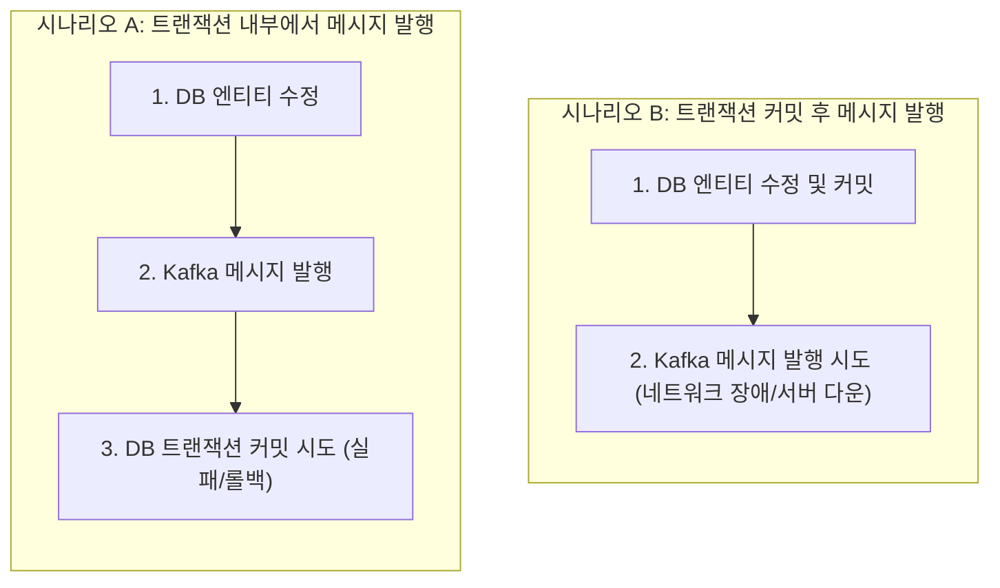
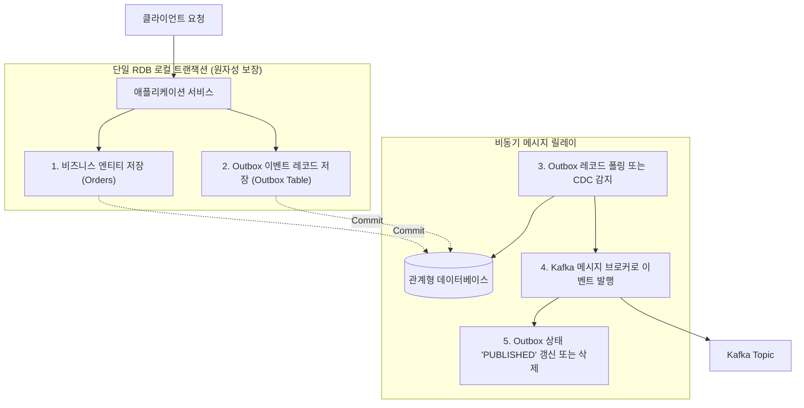

# Transactional Outbox 패턴을 활용한 분산 이벤트 발행 및 데이터 정합성 보장

분산 시스템 및 이벤트 기반 마이크로서비스 아키텍처(EDA) 환경에서는 데이터베이스의 상태 변경과 이에 따른 비즈니스 이벤트를 외부 메시지 브로커(Kafka, RabbitMQ 등)로 발행하는 작업이 빈번하게 발생합니다. 이 과정에서 데이터베이스 트랜잭션 커밋과 메시지 브로커 전송이라는 두 개의 이종 저장소 간 분산 쓰기 작업이 수반됩니다.

네트워크 장애나 프로세스 비정상 종료 상황에서 두 작업의 원자성(Atomicity)을 보장하지 못할 경우, 데이터베이스에는 결제나 주문이 완료되었으나 알림이나 배송 이벤트가 발행되지 않거나, 반대로 DB 롤백이 발생했음에도 이벤트가 이미 외부로 전송되는 심각한 데이터 불일치 문제가 발생합니다.

**Transactional Outbox 패턴은** 단일 관계형 데이터베이스(RDB)의 로컬 트랜잭션 경계 내에서 비즈니스 데이터와 이벤트 메시지를 원자적으로 함께 저장하고, 별도의 릴레이 프로세스를 통해 메시지 브로커로 안전하게 전달하는 분산 아키텍처 설계 패턴입니다.

본 문서에서는 이중 쓰기(Dual Write) 문제의 본질을 분석하고, Transactional Outbox 패턴의 동작 원리와 폴링 기반 메시지 릴레이의 실무 구현 방식을 상세히 기술합니다.

---

## 1. 기술적 배경 및 문제 제기 (기존 방식의 한계점)

전통적인 애플리케이션에서 비즈니스 로직 처리와 메시지 발행을 결합할 때 시도되는 대표적인 안티 패턴과 한계점은 다음과 같습니다.



### 1.1 이중 쓰기(Dual Write) 문제와 2PC(Two-Phase Commit)의 한계
데이터베이스와 메시지 브로커는 서로 다른 분산 시스템 리소스입니다. 과거에는 분산 트랜잭션 처리를 위해 XA 기반 2PC 프로토콜을 사용하였으나, 다음과 같은 치명적인 한계로 인해 현대 클라우드 네이티브 환경에서는 적합하지 않습니다.
- **성능 저하 및 병목**: 모든 참가 노드가 커밋 준비를 마칠 때까지 데이터베이스 락(Lock)을 유지하므로 레이턴시가 급증하고 처리량이 저하됩니다.
- **클라우드 인프라 지원 부재**: Apache Kafka, AWS SQS 등 대다수의 현대 메시지 브로커는 XA 분산 트랜잭션을 지원하지 않습니다.
- **단일 장애점(SPOO)**: 트랜잭션 코디네이터 노드 장애 시 전체 시스템 블로킹이 발생합니다.

### 1.2 트랜잭션 내부 발행의 결함 (Phantom Event)
`@Transactional` 메서드 내부에서 DB 변경 후 Kafka Producer를 호출하는 경우, 메시지 발행은 성공하였으나 직후 DB 커밋 단계에서 데드락이나 제약조건 위반으로 트랜잭션이 롤백될 수 있습니다. 이 경우 실제로는 생성되지 않은 주문이나 결제에 대한 이벤트가 컨슈머로 전파되는 유령 이벤트(Phantom Event) 문제가 발생합니다.

### 1.3 커밋 후 발행의 결함 (Message Loss)
DB 커밋이 완료된 직후(`TransactionSynchronization.afterCommit()`) 메시지를 발행하는 방식은 유령 이벤트는 방지할 수 있습니다. 그러나 커밋 직후 네트워크 순단이 발생하거나 애플리케이션 서버가 강제 종료(OOM, 배포 등)되면 DB 상태는 갱신되었으나 메시지는 영구히 유실되는 데이터 누락이 발생합니다.

---

## 2. 핵심 개념 설명

Transactional Outbox 패턴은 분산 시스템 간 원자성 보장의 한계를 **동일한 RDB의 로컬 ACID 트랜잭션**으로 우회하여 해결합니다.



### 2.1 아웃박스 패턴의 동작 메커니즘
1. **원자적 동시 저장**: 주문 생성 등 비즈니스 로직을 수행할 때, 발생한 도메인 이벤트를 직렬화하여 동일한 데이터베이스 내의 `outbox` 테이블에 함께 `INSERT`합니다. 단일 DB 트랜잭션이므로 둘 중 하나만 성공하는 일은 발생하지 않습니다.
2. **비동기 메시지 릴레이(Message Relay)**: 별도의 백그라운드 워커가 `outbox` 테이블의 미발행 레코드를 읽어 Kafka로 전송합니다.
3. **상태 완료 처리**: 브로커로부터 전송 확인(ACK)을 수신하면 해당 Outbox 레코드를 `PUBLISHED` 상태로 갱신하거나 테이블에서 삭제합니다.

### 2.2 메시지 릴레이 구현 방식 비교

| 구분 | **폴링 퍼블리셔 (Polling Publisher)** | **트랜잭션 로그 테일링 (CDC / Debezium)** |
| :--- | :--- | :--- |
| **동작 방식** | 스케줄러가 주기적으로 DB 쿼리를 실행하여 미발행 레코드 조회 | DB의 Redo/Binlog/WAL 트랜잭션 로그를 직접 감지하여 스트리밍 |
| **추가 인프라** | 별도 인프라 불필요 (애플리케이션 스케줄러 활용) | Kafka Connect, Debezium 등 전용 CDC 인프라 구축 필요 |
| **DB 부하** | 주기적 `SELECT` 쿼리로 인한 인덱스 조회 부하 발생 | 로그 스트림을 비동기 파싱하므로 애플리케이션 쿼리 부하 없음 |
| **적합한 환경** | 초기 도입, 트래픽이 적정 수준인 서비스, 인프라 단순성 선호 | 초고 트래픽 환경, 준실시간(Sub-second) 초저지연 전송 요구 |

---

## 3. 코드 구현 및 라인별 상세 분석

Spring Boot 3 및 Spring Data JPA 환경에서 Polling Publisher 기반의 Transactional Outbox 패턴을 구현한 코드는 다음과 같습니다.

### 3.1 Outbox 엔티티 정의 (`OutboxEvent.java`)

```java
package com.example.outbox.domain;

import jakarta.persistence.*;
import java.time.LocalDateTime;

/**
 * 메시지 브로커로 발행할 이벤트 데이터를 임시 보관하는 Outbox 테이블 엔티티
 */
@Entity
@Table(
    name = "outbox_events",
    indexes = {
        // 미발행 이벤트 고속 조회를 위한 복합 인덱스 구성
        @Index(name = "idx_outbox_status_created", columnList = "status, createdAt")
    }
)
public class OutboxEvent {

    @Id
    @GeneratedValue(strategy = GenerationType.IDENTITY)
    private Long id;

    @Column(nullable = false, length = 100)
    private String aggregateType; // 도메인 애그리거트 종류 (예: ORDER, PAYMENT)

    @Column(nullable = false, length = 100)
    private String aggregateId;   // 대상 도메인 식별자

    @Column(nullable = false, length = 100)
    private String eventType;     // 이벤트 유형 (예: OrderCreatedEvent)

    @Lob
    @Column(nullable = false)
    private String payload;       // JSON 직렬화된 이벤트 본문

    @Enumerated(EnumType.STRING)
    @Column(nullable = false, length = 20)
    private OutboxStatus status;  // INIT, PUBLISHED, FAILED

    @Column(nullable = false)
    private int retryCount;       // 전송 재시도 횟수

    @Column(nullable = false, updatable = false)
    private LocalDateTime createdAt;

    private LocalDateTime publishedAt;

    protected OutboxEvent() {}

    public OutboxEvent(String aggregateType, String aggregateId, String eventType, String payload) {
        this.aggregateType = aggregateType;
        this.aggregateId = aggregateId;
        this.eventType = eventType;
        this.payload = payload;
        this.status = OutboxStatus.INIT;
        this.retryCount = 0;
        this.createdAt = LocalDateTime.now();
    }

    public void markAsPublished() {
        this.status = OutboxStatus.PUBLISHED;
        this.publishedAt = LocalDateTime.now();
    }

    public void incrementRetryCount() {
        this.retryCount++;
        if (this.retryCount >= 5) {
            this.status = OutboxStatus.FAILED;
        }
    }

    // Getter 메서드 생략
    public Long getId() { return id; }
    public String getAggregateId() { return aggregateId; }
    public String getEventType() { return eventType; }
    public String getPayload() { return payload; }
    public OutboxStatus getStatus() { return status; }
}
```

- **코드 분석 및 효율성**:
  - `(status, createdAt)` 복합 인덱스를 선언하여 폴링 워커가 `status = 'INIT'` 조건으로 미발행 레코드를 스캔할 때 Full Table Scan을 방지하고 인덱스 레인지 스캔으로 빠르게 데이터를 조회합니다.
  - 최대 재시도 횟수(`retryCount >= 5`) 초과 시 상태를 `FAILED`로 전이시켜 영구 에러 발생 시 무한 루프에 빠지는 문제를 차단합니다.

---

### 3.2 비즈니스 로직과 Outbox 동시 저장 서비스 (`OrderService.java`)

```java
package com.example.order.service;

import com.example.order.domain.Order;
import com.example.order.repository.OrderRepository;
import com.example.outbox.domain.OutboxEvent;
import com.example.outbox.repository.OutboxRepository;
import com.fasterxml.jackson.databind.ObjectMapper;
import org.springframework.stereotype.Service;
import org.springframework.transaction.annotation.Transactional;

/**
 * 주문 생성 및 Outbox 이벤트 원자적 저장 서비스
 */
@Service
public class OrderService {

    private final OrderRepository orderRepository;
    private final OutboxRepository outboxRepository;
    private final ObjectMapper objectMapper;

    public OrderService(
            OrderRepository orderRepository,
            OutboxRepository outboxRepository,
            ObjectMapper objectMapper
    ) {
        this.orderRepository = orderRepository;
        this.outboxRepository = outboxRepository;
        this.objectMapper = objectMapper;
    }

    @Transactional // 단일 RDB 트랜잭션 내에서 비즈니스 상태와 Outbox 이벤트를 함께 커밋합니다.
    public Long createOrder(Long userId, Long productId, long amount) {
        // 1. 비즈니스 도메인 엔티티 생성 및 저장
        Order order = new Order(userId, productId, amount);
        Order savedOrder = orderRepository.save(order);

        // 2. 도메인 이벤트 DTO 생성 및 JSON 직렬화
        OrderCreatedEvent event = new OrderCreatedEvent(
                savedOrder.getId(),
                savedOrder.getUserId(),
                savedOrder.getAmount()
        );

        try {
            String payloadJson = objectMapper.writeValueAsString(event);

            // 3. 동일 트랜잭션 내에서 Outbox 테이블에 이벤트 적재
            OutboxEvent outboxEvent = new OutboxEvent(
                    "ORDER",
                    String.valueOf(savedOrder.getId()),
                    "OrderCreatedEvent",
                    payloadJson
            );
            outboxRepository.save(outboxEvent);

        } catch (Exception e) {
            throw new IllegalStateException("Outbox 이벤트 직렬화 실패로 주문 트랜잭션을 롤백합니다.", e);
        }

        return savedOrder.getId();
    }
}
```

- **코드 분석 및 효율성**:
  - `Order` 엔티티와 `OutboxEvent` 엔티티 저장이 단일 `@Transactional` 메서드 안에서 수행됩니다.
  - 데이터베이스 커밋이 성공하면 주문 데이터와 Outbox 이벤트가 100% 동일하게 디스크에 영속화되며, 롤백 시 두 데이터가 함께 취소되므로 유령 이벤트나 데이터 유실 위험이 원천 제거됩니다.

---

### 3.3 폴링 기반 메시지 릴레이 구현 (`OutboxMessageRelay.java`)

```java
package com.example.outbox.relay;

import com.example.outbox.domain.OutboxEvent;
import com.example.outbox.repository.OutboxRepository;
import org.slf4j.Logger;
import org.slf4j.LoggerFactory;
import org.springframework.data.domain.PageRequest;
import org.springframework.kafka.core.KafkaTemplate;
import org.springframework.scheduling.annotation.Scheduled;
import org.springframework.stereotype.Component;
import org.springframework.transaction.annotation.Propagation;
import org.springframework.transaction.annotation.Transactional;

import java.util.List;

/**
 * Outbox 테이블을 주기적으로 폴링하여 메시지 브로커로 중계하는 릴레이 컴포넌트
 */
@Component
public class OutboxMessageRelay {

    private static final Logger log = LoggerFactory.getLogger(OutboxMessageRelay.class);
    private static final String TOPIC_NAME = "order-events";

    private final OutboxRepository outboxRepository;
    private final KafkaTemplate<String, String> kafkaTemplate;

    public OutboxMessageRelay(
            OutboxRepository outboxRepository,
            KafkaTemplate<String, String> kafkaTemplate
    ) {
        this.outboxRepository = outboxRepository;
        this.kafkaTemplate = kafkaTemplate;
    }

    /**
     * 500ms 주기로 미발행 이벤트를 배치 조회하여 Kafka로 전송합니다.
     */
    @Scheduled(fixedDelay = 500)
    public void publishPendingEvents() {
        // 한 번에 최대 100건씩 배치 조회하여 메모리 사용량을 제어합니다.
        List<OutboxEvent> pendingEvents = outboxRepository.findTop100ByStatusOrderByCreatedAtAsc(
                OutboxStatus.INIT,
                PageRequest.of(0, 100)
        );

        for (OutboxEvent event : pendingEvents) {
            publishSingleEvent(event);
        }
    }

    /**
     * 개별 이벤트 전송 및 상태 갱신을 독립 트랜잭션으로 격리 처리합니다.
     */
    @Transactional(propagation = Propagation.REQUIRES_NEW)
    public void publishSingleEvent(OutboxEvent event) {
        try {
            // 메시지 키로 aggregateId를 지정하여 파티션 내 순서를 보장합니다.
            kafkaTemplate.send(TOPIC_NAME, event.getAggregateId(), event.getPayload())
                    .whenComplete((result, throwable) -> {
                        if (throwable == null) {
                            event.markAsPublished();
                            outboxRepository.save(event);
                            log.info("Outbox 이벤트 전송 성공 - eventId: {}", event.getId());
                        } else {
                            event.incrementRetryCount();
                            outboxRepository.save(event);
                            log.error("Kafka 전송 실패 - eventId: {}, cause: {}", event.getId(), throwable.getMessage());
                        }
                    });
        } catch (Exception e) {
            event.incrementRetryCount();
            outboxRepository.save(event);
            log.error("릴레이 처리 중 예외 발생 - eventId: {}", event.getId(), e);
        }
    }
}
```

- **코드 분석 및 효율성**:
  - `PageRequest.of(0, 100)`을 적용하여 대량의 이벤트가 적재되어 있어도 고정된 청크 단위로 분할 처리하여 힙 메모리 부하를 방지합니다.
  - `kafkaTemplate.send()` 시 `aggregateId`를 파티션 키(Partition Key)로 사용하여 동일 주문에 대한 이벤트 순서(Ordering)가 동일 카프카 파티션 내에서 유지되도록 보장합니다.
  - `Propagation.REQUIRES_NEW`를 통해 특정 이벤트 1건의 전송 실패가 다른 이벤트의 상태 갱신에 영향을 주지 않도록 트랜잭션 범위를 격리합니다.

---

## 4. 실무 적용 시 고려해야 할 점 (주의사항 및 예외 처리)

### 4.1 At-Least-Once 전달 특성과 컨슈머 멱등성(Idempotency) 확보
Transactional Outbox 패턴은 메시지가 최소 1회 이상 브로커로 전달되는 것을 보장합니다. 그러나 메시지는 성공적으로 브로커에 발행되었으나 DB 상태를 `PUBLISHED`로 갱신하기 전에 릴레이 서버가 다운되면, 서버 재시작 시 동일 메시지가 중복 전송될 수 있습니다.
- 따라서 이벤트를 소비하는 컨슈머 측에서는 반드시 이벤트 ID 중복 검사 테이블 또는 Redis를 활용하여 **멱등적 소비(Idempotent Consumer)** 구조를 구현해야 합니다.

### 4.2 다중 릴레이 인스턴스 환경의 동시성 제어
애플리케이션 서버가 다중 인스턴스로 스케일 아웃(Scale-out)되면 여러 릴레이 워커가 동일한 `INIT` 레코드를 동시에 조회하여 중복 전송할 수 있습니다.
- 데이터베이스의 비관적 락(`SELECT ... FOR UPDATE SKIP LOCKED`)을 사용하여 이미 다른 워커가 선점한 레코드는 건너뛰고 다음 레코드를 잠금 조회하도록 쿼리를 최적화하거나, `ShedLock` 라이브러리를 도입해야 합니다.

### 4.3 Outbox 테이블 용량 관리 및 보관 주기(Retention) 정책
성공적으로 전송 완료된(`PUBLISHED`) 레코드가 테이블에 무기한 누적되면 인덱스 트리 깊이가 깊어지고 저장 공간이 낭비됩니다.
- Spring Batch 또는 데이터베이스 스케줄러 이벤트를 설정하여 생성된 지 3일 이상 경과한 `PUBLISHED` 레코드를 정기적으로 `DELETE`하거나 파티션 드롭(Partition Drop)을 수행해야 합니다.

---

## 5. 결론 (해당 기술의 기대효과 요약)

Transactional Outbox 패턴은 마이크로서비스 및 분산 아키텍처 환경에서 분산 트랜잭션의 무거운 오버헤드 없이 신뢰성 있는 비동기 이벤트 발행을 달성하는 기술 입니다.

1. **데이터 무손실 및 정합성 보장**: 단일 RDB 로컬 트랜잭션의 원자성을 활용하여 비즈니스 데이터 수정과 이벤트 발생 간의 불일치를 근본적으로 방지합니다.
2. **인프라 결합도 완화**: 메시지 브로커가 일시적인 장애나 점검 상태에 진입하더라도 메인 비즈니스 트랜잭션은 정상적으로 체결되며, 브로커 정상화 시 릴레이가 밀린 이벤트를 자동으로 재처리합니다.
3. **확장성 및 유지보수성 확보**: 2PC 방식 대비 락 점유 시간을 최소화하여 고성능 트랜잭션 처리량을 유지하면서도 안전한 이벤트 주도 아키텍처(EDA)를 구축할 수 있습니다.
