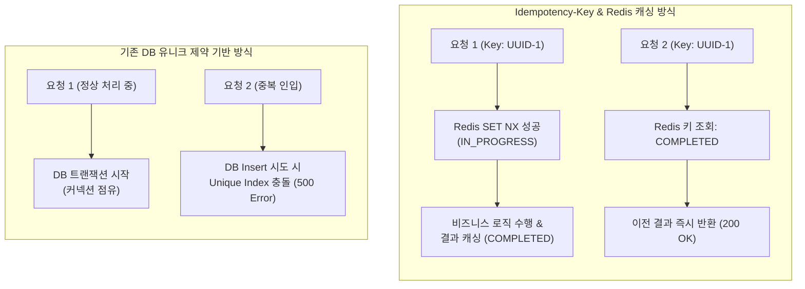
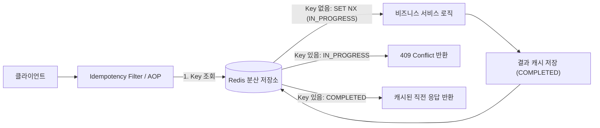

# Spring 환경에서 Idempotency Key를 활용한 중복 요청 방지 및 멱등성 보장

전자상거래 주문 및 금융 결제 시스템과 같은 핵심 비즈니스 도메인에서는 동일한 요청이 네트워크 지연, 클라이언트 재시도, 혹은 사용자의 중복 클릭(Double Submit)으로 인해 중복 실행되는 사고를 완벽히 차단해야 합니다. HTTP POST 메서드는 기본적으로 비멱등(Non-idempotent) 특성을 가지므로, 동일한 결제 요청이 두 번 이상 인입될 경우 중복 과금이나 재고 초과 차감과 같은 치명적인 데이터 정합성 결함으로 이어집니다.

**Idempotency-Key(멱등성 키) 메커니즘은** 클라이언트가 고유한 식별자를 HTTP 요청 헤더에 전달하고, 서버가 분산 캐시(Redis)를 기반으로 해당 키의 상태를 추적하여 단 한 번의 실행만을 보장하는 아키텍처 패턴입니다.

본 문서에서는 분산 환경에서 발생하는 중복 요청의 근본적인 문제점을 분석하고, Spring Boot와 Redis를 활용하여 멱등성 제어 AOP 시스템을 구축하는 방법을 기술합니다.

---

## 1. 기술적 배경 및 문제 제기 (기존 방식의 한계점)

클라이언트와 서버 간의 통신에서 네트워크 타임아웃이 발생하면, 클라이언트는 서버에서 실제 비즈니스 로직이 체결되었는지 여부를 알 수 없습니다. 이로 인해 자동 재시도 로직이 동작하면서 중복 요청이 서버로 인입됩니다.



### 1.1 데이터베이스 유니크 제약조건(Unique Constraint)의 한계
데이터베이스 수준에서 `order_id`나 `transaction_id` 컬럼에 유니크 인덱스를 설정하는 방식은 최후의 방어선으로 유효하지만 다음과 같은 구조적 한계를 가집니다.
- **불필요한 리소스 낭비**: 중복 요청임에도 불구하고 스프링 애플리케이션의 컨트롤러, 인터셉터, 비즈니스 서비스 계층을 통과하여 DB 커넥션 풀을 점유한 뒤에야 예외가 발생합니다.
- **상태 구분 불가능**: 첫 번째 요청이 아직 처리 중(`IN_PROGRESS`)인 상태에서 두 번째 요청이 들어올 경우, 트랜잭션 격리 수준에 따라 Phantom Read나 락 경합(Lock Contention)이 발생합니다.
- **클라이언트 에러 응답**: 첫 번째 요청이 정상 완료되었음에도 두 번째 재시도 요청은 `500 Internal Server Error`나 `DataIntegrityViolationException`을 반환받아 클라이언트 UX를 저하시킵니다.

### 1.2 단순 DB 락(Pessimistic Lock)의 확장성 병목
데이터베이스 행 락(Row Lock)을 이용한 방어는 트래픽이 집중되는 대규모 세일이나 프로모션 시점에 DB 커넥션 풀을 급격히 고갈시키며 전체 시스템의 처리량을 저하시킵니다.

---

## 2. 핵심 개념 설명

IETF 표준 드래프트(draft-ietf-httpapi-idempotency-key-header)에 명시된 멱등성 키의 핵심은 **상태 머신(State Machine)** 과 **응답 캐싱(Response Caching)** 입니다.



### 2.1 멱등성 키의 생명주기 및 상태 전이
- **`IN_PROGRESS` (처리 진행 중)**: 최초 요청 인입 시 Redis의 `SET key value NX EX` 명령을 사용하여 원자적으로 락을 획득합니다. 이 상태에서 동일한 키로 요청이 들어오면 `409 Conflict`를 반환하여 동시 실행을 차단합니다.
- **`COMPLETED` (처리 완료)**: 비즈니스 로직이 정상 종료되면 HTTP 상태 코드 및 응답 바디를 Redis에 저장하고 상태를 갱신합니다. 이후 인입되는 동일 키 요청에는 비즈니스 로직을 재실행하지 않고 직전 응답을 즉시 반환합니다.
- **`FAILED` (처리 실패 및 롤백)**: 비즈니스 로직에서 예상치 못한 런타임 예외가 발생한 경우, 락으로 점유한 키를 즉시 삭제(Evict)하여 클라이언트가 즉시 재시도할 수 있도록 허용합니다.

---

## 3. 코드 구현 및 라인별 상세 분석

> 전체 실행 가능한 프로젝트 소스코드는 [GitHub 저장소](https://github.com/yeondububub/blog-code/tree/main/spring/spring-idempotency-aop)에서 확인하실 수 있습니다.

컨트롤러 계층에 선언적으로 적용할 수 있는 어노테이션 기반 AOP 멱등성 프레임워크 구현 코드입니다.

### 3.1 `@Idempotent` 어노테이션 정의

```java
/**
 * 선언적 멱등성 보장을 위한 커스텀 어노테이션
 */
@Target(ElementType.METHOD)
@Retention(RetentionPolicy.RUNTIME)
public @interface Idempotent {

    // 멱등성 키 헤더 이름 (기본값: Idempotency-Key)
    String headerName() default "Idempotency-Key";

    // 캐시 만료 시간 (기본값: 120초)
    long ttl() default 120;

    // 만료 시간 단위 (기본값: SECONDS)
    TimeUnit timeUnit() default TimeUnit.SECONDS;
}
```

### 3.2 멱등성 응답 래퍼 객체 (IdempotencyRecord)

```java
public class IdempotencyRecord implements Serializable {

    private static final long serialVersionUID = 1L;

    public enum Status {
        IN_PROGRESS,
        COMPLETED
    }

    private Status status;
    private int statusCode;
    private Object responseBody;

    public IdempotencyRecord() {}

    public static IdempotencyRecord inProgress() {
        IdempotencyRecord record = new IdempotencyRecord();
        record.status = Status.IN_PROGRESS;
        return record;
    }

    public static IdempotencyRecord completed(int statusCode, Object responseBody) {
        IdempotencyRecord record = new IdempotencyRecord();
        record.status = Status.COMPLETED;
        record.statusCode = statusCode;
        record.responseBody = responseBody;
        return record;
    }

    // Getter 및 Setter 생략
}
```

### 3.3 AOP 기반 멱등성 검증 어스펙트 (IdempotencyAspect)

```java
@Aspect
@Component
public class IdempotencyAspect {

    private final RedisTemplate<String, Object> redisTemplate;
    private final ObjectMapper objectMapper;

    public IdempotencyAspect(RedisTemplate<String, Object> redisTemplate, ObjectMapper objectMapper) {
        this.redisTemplate = redisTemplate;
        this.objectMapper = objectMapper;
    }

    @Around("@annotation(idempotent)")
    public Object execute(ProceedingJoinPoint joinPoint, Idempotent idempotent) throws Throwable {
        HttpServletRequest request = getCurrentHttpRequest();
        String idempotencyKey = request.getHeader(idempotent.headerName());

        // 1. 헤더에 멱등성 키가 없는 경우 비즈니스 로직을 그대로 통과시킵니다.
        if (idempotencyKey == null || idempotencyKey.trim().isEmpty()) {
            return joinPoint.proceed();
        }

        String redisKey = "idempotency:" + idempotencyKey.trim();
        Duration ttlDuration = Duration.of(idempotent.ttl(), idempotent.timeUnit().toChronoUnit());

        // 2. Redis SET NX를 통해 원자적으로 IN_PROGRESS 상태를 선점합니다.
        IdempotencyRecord inProgressRecord = IdempotencyRecord.inProgress();
        Boolean isAcquired = redisTemplate.opsForValue().setIfAbsent(redisKey, inProgressRecord, ttlDuration);

        if (Boolean.FALSE.equals(isAcquired)) {
            // 키가 이미 존재하는 경우: 이전 요청의 상태를 확인합니다.
            Object existingValue = redisTemplate.opsForValue().get(redisKey);
            IdempotencyRecord record = objectMapper.convertValue(existingValue, IdempotencyRecord.class);

            if (record != null && record.getStatus() == IdempotencyRecord.Status.IN_PROGRESS) {
                // 현재 다른 스레드나 프로세스에서 처리 중인 경우 동시 요청 충돌을 알립니다.
                return ResponseEntity.status(HttpStatus.CONFLICT)
                        .body("해당 요청이 현재 처리 중입니다. 잠시 후 결과를 다시 확인하십시오.");
            }

            if (record != null && record.getStatus() == IdempotencyRecord.Status.COMPLETED) {
                // 이미 완료된 요청인 경우 직전 응답 객체를 즉시 반환하여 멱등성을 보장합니다.
                return ResponseEntity.status(record.getStatusCode()).body(record.getResponseBody());
            }
        }

        // 3. 비즈니스 로직 실행 및 결과 캐싱
        Object result;
        try {
            result = joinPoint.proceed();
        } catch (Throwable ex) {
            // 로직 실행 중 예외가 발생하면 락을 즉시 해제하여 클라이언트의 즉각적인 재시도를 허용합니다.
            redisTemplate.delete(redisKey);
            throw ex;
        }

        // 4. 정상 종료 시 응답 상태코드 및 본문을 Redis에 COMPLETED 상태로 갱신 적재합니다.
        int statusCode = HttpStatus.OK.value();
        Object responseBody = result;

        if (result instanceof ResponseEntity<?> responseEntity) {
            statusCode = responseEntity.getStatusCode().value();
            responseBody = responseEntity.getBody();
        }

        IdempotencyRecord completedRecord = IdempotencyRecord.completed(statusCode, responseBody);
        redisTemplate.opsForValue().set(redisKey, completedRecord, ttlDuration);

        return result;
    }

    private HttpServletRequest getCurrentHttpRequest() {
        ServletRequestAttributes attributes = (ServletRequestAttributes) RequestContextHolder.getRequestAttributes();
        if (attributes == null) {
            throw new IllegalStateException("HTTP 요청 컨텍스트를 찾을 수 없습니다.");
        }
        return attributes.getRequest();
    }
}
```

- **라인별 분석 및 성능 최적화 근거**:
  - **`setIfAbsent(key, inProgress, duration)`**: 단일 Redis 원자적 연산을 사용하여 분산 환경에서 별도의 무거운 분산 락(Redisson RLock) 없이도 완벽한 선점 제어를 구현합니다.
  - **`delete(redisKey)` 예외 롤백**: 일시적인 외부 PG사 장애나 DB 타임아웃 시 락을 즉시 소거하여 장애 복구 후 클라이언트가 불필요한 TTL 대기 없이 재요청을 보낼 수 있습니다.
  - **`ResponseEntity` 응답 구조 보존**: 원본 응답의 HTTP 상태 코드(`200 OK`, `201 Created` 등)를 그대로 캐싱하여 멱등 반환 시에도 클라이언트가 동일한 규격의 HTTP 응답을 수신하도록 보장합니다.

### 3.4 결제 컨트롤러 적용 예시

```java
@RestController
@RequestMapping("/api/v1/payments")
public class PaymentController {

    private final PaymentService paymentService;

    public PaymentController(PaymentService paymentService) {
        this.paymentService = paymentService;
    }

    @PostMapping
    @Idempotent(headerName = "Idempotency-Key", ttl = 300) // 5분 동안 동일 키 중복 요청 차단 및 결과 캐싱
    public ResponseEntity<PaymentResponse> processPayment(
            @RequestHeader(value = "Idempotency-Key", required = false) String idempotencyKey,
            @RequestBody PaymentRequest request) {

        PaymentResponse response = paymentService.charge(request);
        return ResponseEntity.ok(response);
    }
}
```

---

## 4. 실무 적용 시 고려해야 할 점 (주의사항 및 예외 처리)

### 4.1 페이로드 무결성 검증 (Payload Fingerprinting)
악의적인 사용자나 클라이언트 버그로 인해 **동일한 Idempotency-Key에 서로 다른 요청 바디(Body)가 전송되는 상황**을 방어해야 합니다.
- **해결 방안**: 요청 바디의 SHA-256 해시값을 생성하여 Redis 레코드에 `requestPayloadHash`로 함께 보관합니다. 후속 요청 인입 시 해시값이 불일치하면 `422 Unprocessable Entity`를 반환하여 키 오용을 차단합니다.

### 4.2 분산 락 만료 시간(TTL)과 롱 트랜잭션 간의 불일치
비즈니스 로직 수행 시간이 Redis TTL(예: 3초)보다 길어지면, 첫 번째 요청이 완료되기 전에 키가 만료되어 두 번째 요청이 `IN_PROGRESS`로 중복 진입할 수 있습니다.
- **해결 방안**: `IN_PROGRESS` 단계의 TTL은 충분한 안전 마진(예: 60초~120초)을 부여하고, 응답 캐싱 단계(`COMPLETED`)에서 도메인 요구사항에 맞는 비즈니스 TTL(예: 24시간)로 재설정합니다.

### 4.3 Redis 장애 시의 Fallback 정책
Redis 클러스터가 일시적인 네트워크 순단이나 장애 상태에 빠졌을 때의 동작 정책을 사전에 정의해야 합니다.
- **Fail-Open 전략**: 가용성을 최우선으로 하여 멱등성 검증을 건너뛰고 DB 비즈니스 로직을 바로 실행 (DB 유니크 제약으로 2차 방어).
- **Fail-Closed 전략**: 금융/결제 도메인과 같이 정합성이 절대적인 경우 `503 Service Unavailable`을 반환하고 트랜잭션을 중단.

---

## 5. 결론 (해당 기술의 기대효과 요약)

Idempotency-Key 기반 멱등성 제어 아키텍처는 마이크로서비스 및 분산 결제 환경에서 다음과 같은 엔지니어링 효과를 제공합니다.

1. **데이터 무결성 및 중복 결제 원천 차단**: 네트워크 재시도나 더블 클릭 상황에서도 결제/주문 로직의 단일 실행을 완벽히 보장합니다.
2. **백엔드 리소스 부하 경감**: 중복 요청을 컨트롤러 진입 전 분산 캐시 레이어에서 즉시 차단하여 고비용의 데이터베이스 트랜잭션 및 외부 PG사 API 호출을 방지합니다.
3. **표준화된 클라이언트 경험 제공**: 이미 완료된 요청에 대해 에러가 아닌 정상 캐시 응답을 즉시 반환함으로써 안정적인 API 생태계를 구축할 수 있습니다.
