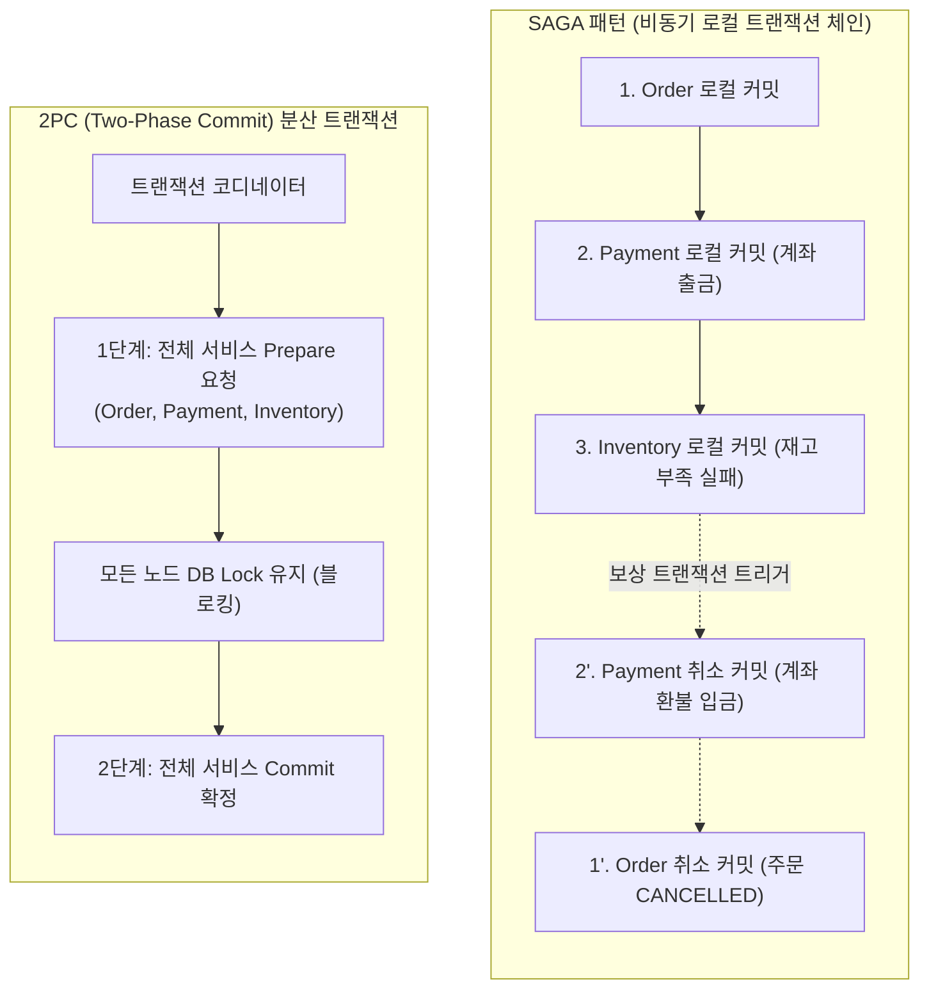
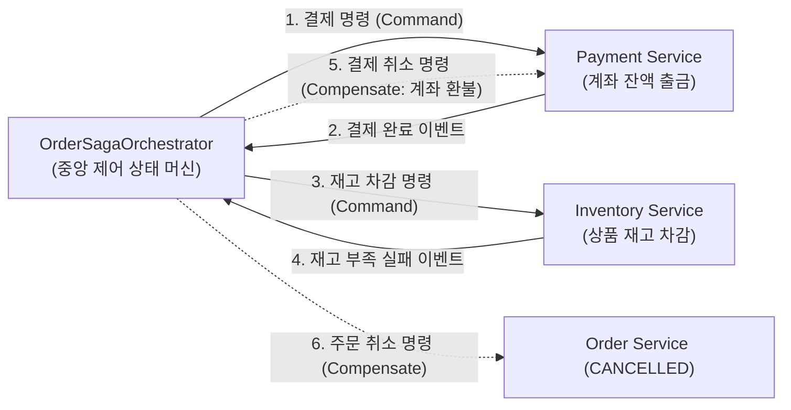

# SAGA 패턴을 활용한 분산 트랜잭션과 보상 트랜잭션 구현

마이크로서비스 아키텍처(MSA)에서는 서비스별로 독립된 데이터베이스를 보유하는 Database-per-Service 패턴이 일반적입니다. 이러한 분산 데이터 환경에서는 단일 데이터베이스의 로컬 ACID 트랜잭션을 적용할 수 없으므로, 여러 마이크로서비스에 걸쳐 실행되는 비즈니스 작업의 데이터 일관성을 유지하는 작업이 매우 복잡해집니다.

과거에 사용되던 2PC(Two-Phase Commit)나 XA 분산 트랜잭션은 모든 서비스 노드의 커밋 준비가 완료될 때까지 데이터베이스 락을 유지하므로 성능 저하와 가용성 결함을 유발합니다. 또한 Apache Kafka, AWS DynamoDB와 같은 클라우드 네이티브 인프라는 XA 트랜잭션을 지원하지 않습니다.

**SAGA 패턴은** 일련의 분산 로컬 트랜잭션을 순차적으로 실행하고, 중간 단계에서 실패가 발생할 경우 이전에 성공한 로컬 트랜잭션들을 역순으로 되돌리는 **보상 트랜잭션(Compensating Transaction)을** 실행하여 시스템의 최종 일관성(Eventual Consistency)을 달성하는 분산 아키텍처 설계 패턴입니다.

본 문서에서는 분산 환경에서 발생하는 트랜잭션 정합성 문제를 분석하고, Spring Boot, Spring Data JPA, Apache Kafka를 활용하여 실제 사용자 계좌 잔액 출금 및 환불 보상 트랜잭션을 처리하는 오케스트레이션 기반 SAGA 시스템 구축 방법을 기술합니다.

---

## 1. 기술적 배경 및 문제 제기 (기존 방식의 한계점)

전통적인 모놀리식 아키텍처에서는 주문, 결제, 재고 차감 로직을 단일 데이터베이스의 `@Transactional` 경계 내에서 원자적으로 처리하였습니다. 그러나 각 도메인이 독립된 마이크로서비스로 분리되면 다음과 같은 기술적 한계에 직면합니다.



### 1.1 2PC(Two-Phase Commit)의 성능 및 가용성 한계
- **동기식 블로킹 오버헤드**: 2PC는 모든 참여 서비스가 응답할 때까지 데이터베이스 락(Lock)을 유지하므로, 네트워크 레이턴시가 누적되어 전체 시스템의 처리량(Throughput)이 급격히 저하됩니다.
- **단일 장애점(SPOF)**: 트랜잭션 코디네이터 노드에 장애가 발생하면 참여 노드들은 락을 해제하지 못하고 대기 상태(In-doubt State)에 빠집니다.
- **클라우드 인프라 비호환성**: 현대 메시지 브로커(Kafka, RabbitMQ) 및 NoSQL 데이터베이스는 XA 프로토콜을 지원하지 않으므로 이기종 분산 시스템 간 2PC 구성이 불가능합니다.

### 1.2 부분 실패(Partial Failure)로 인한 데이터 불일치
비동기 메시징 환경에서 주문 서비스가 주문을 생성하고 결제 서비스가 고객의 계좌에서 돈을 인출했으나, 재고 서비스에서 재고 부족으로 예외가 발생하면 결제 출금만 발생하고 상품은 출고되지 않는 치명적인 금융/비즈니스 결함이 발생합니다.

---

## 2. 핵심 개념 설명

SAGA 패턴은 분산 비즈니스 프로세스를 여러 개의 로컬 트랜잭션($T_1, T_2, \dots, T_n$)으로 분할하고, 각 로컬 트랜잭션에 대응하는 보상 트랜잭션($C_1, C_2, \dots, C_{n-1}$)을 정의합니다.

- **정상 흐름**: $T_1 \rightarrow T_2 \rightarrow \dots \rightarrow T_n$ (전체 성공 시 트랜잭션 완료)
- **실패 및 롤백 흐름**: $T_1 \rightarrow T_2 \rightarrow T_3(\text{실패}) \rightarrow C_2 \rightarrow C_1$ (역순으로 보상 트랜잭션을 실행하여 원복)



### 2.1 코레오그래피(Choreography) vs 오케스트레이션(Orchestration)

| 비교 항목 | 코레오그래피 (Choreography) | 오케스트레이션 (Orchestration) |
| :--- | :--- | :--- |
| **제어 방식** | 중앙 제어자 없이 각 서비스가 이벤트를 구독하여 다음 작업 실행 | 전담 오케스트레이터가 워크플로우와 상태를 중앙에서 제어 |
| **서비스 결합도** | 낮음 (이벤트 기반 느슨한 결합) | 오케스트레이터에 대한 의존성 존재 |
| **복잡도** | 서비스 수가 증가하면 이벤트 순환 참조 및 흐름 파악 어려움 | 전체 트랜잭션 상태 및 롤백 흐름 추적이 명확함 |
| **적합한 환경** | 참여 서비스가 2~3개인 단순 비즈니스 흐름 | 참여 서비스가 많고 롤백 분기가 복잡한 금융/주문 도메인 |

---

## 3. 코드 구현 및 라인별 상세 분석

> 전체 실행 가능한 프로젝트 소스코드는 [GitHub 저장소](https://github.com/yeondububub/blog-code/tree/main/spring/spring-saga-orchestrator)에서 확인하실 수 있습니다.

본 구현은 **오케스트레이션 기반 SAGA 패턴**과 **Spring Data JPA**를 결합하여 실제 사용자 계좌 잔액 출금 및 환불, 재고 차감을 조율하고 SAGA 상태를 RDB에 영속화하는 예제입니다.

### 3.1 SAGA 상태 머신 JPA 엔티티 (OrderSagaState)

```java
@Entity
@Table(name = "saga_states")
public class OrderSagaState implements Serializable {

    private static final long serialVersionUID = 1L;

    public enum SagaStatus {
        STARTED,            // SAGA 시작
        PAYMENT_SUCCESS,    // 1단계 결제 승인 완료
        INVENTORY_SUCCESS,  // 2단계 재고 차감 완료
        COMPENSATING,       // 실패로 인한 역순 보상 트랜잭션 진행 중
        FAILED,             // 트랜잭션 최종 실패 및 롤백 완료
        COMPLETED           // 전체 분산 트랜잭션 정상 완료
    }

    @Id
    @Column(name = "saga_id", length = 50)
    private String sagaId;

    @Column(name = "order_id", nullable = false)
    private Long orderId;

    @Column(name = "user_id", nullable = false)
    private Long userId;

    @Column(name = "product_id", nullable = false)
    private Long productId;

    @Column(name = "quantity", nullable = false)
    private int quantity;

    @Column(name = "amount", nullable = false, precision = 15, scale = 2)
    private BigDecimal amount;

    @Enumerated(EnumType.STRING)
    @Column(name = "status", nullable = false, length = 30)
    private SagaStatus status;

    @Column(name = "message")
    private String message;

    @Column(name = "created_at", nullable = false)
    private LocalDateTime createdAt;

    @Column(name = "updated_at")
    private LocalDateTime updatedAt;

    protected OrderSagaState() {}

    public OrderSagaState(String sagaId, Long orderId, Long userId, Long productId, int quantity, BigDecimal amount) {
        this.sagaId = sagaId;
        this.orderId = orderId;
        this.userId = userId;
        this.productId = productId;
        this.quantity = quantity;
        this.amount = amount;
        this.status = SagaStatus.STARTED;
        this.createdAt = LocalDateTime.now();
        this.updatedAt = LocalDateTime.now();
    }

    public void updateStatus(SagaStatus status, String message) {
        this.status = status;
        this.message = message;
        this.updatedAt = LocalDateTime.now();
    }

    // Getter 및 Setter 생략
}
```

---

### 3.2 도메인 JPA 엔티티 및 리포지토리 설계

#### 1) SAGA 상태 리포지토리 (OrderSagaStateRepository)
오케스트레이터의 장애 복구 및 분산 서버 환경에서의 상태 공유를 위해 SAGA 상태를 DB에 영속화합니다.

```java
@Repository
public interface OrderSagaStateRepository extends JpaRepository<OrderSagaState, String> {
}
```

#### 2) 사용자 계좌 엔티티 (UserAccount)
실제 출금(`debit`) 및 환불 재입금(`credit`)을 처리하는 금융 도메인 엔티티입니다.

```java
@Entity
@Table(name = "user_accounts")
public class UserAccount {

    @Id
    @GeneratedValue(strategy = GenerationType.IDENTITY)
    private Long id;

    @Column(name = "user_id", nullable = false, unique = true)
    private Long userId;

    @Column(name = "account_number", nullable = false, length = 50)
    private String accountNumber;

    @Column(name = "balance", nullable = false, precision = 15, scale = 2)
    private BigDecimal balance;

    protected UserAccount() {}

    public UserAccount(Long userId, String accountNumber, BigDecimal balance) {
        this.userId = userId;
        this.accountNumber = accountNumber;
        this.balance = balance;
    }

    public boolean hasSufficientBalance(BigDecimal amount) {
        return this.balance != null && this.balance.compareTo(amount) >= 0;
    }

    // 출금 로직 (로컬 트랜잭션)
    public void debit(BigDecimal amount) {
        if (!hasSufficientBalance(amount)) {
            throw new IllegalStateException("계좌 잔액이 부족합니다. 현재 잔액: " + this.balance + ", 요청 금액: " + amount);
        }
        this.balance = this.balance.subtract(amount);
    }

    // 입금 및 환불 원복 로직 (보상 트랜잭션)
    public void credit(BigDecimal amount) {
        if (amount != null && amount.compareTo(BigDecimal.ZERO) > 0) {
            this.balance = this.balance.add(amount);
        }
    }

    // Getter 생략
}
```

#### 3) 재고 엔티티 (Inventory)
상품의 현재 재고 수량을 관리하고 차감 및 원복을 수행합니다.

```java
@Entity
@Table(name = "inventories")
public class Inventory {

    @Id
    @GeneratedValue(strategy = GenerationType.IDENTITY)
    private Long id;

    @Column(name = "product_id", nullable = false, unique = true)
    private Long productId;

    @Column(name = "product_name", nullable = false, length = 100)
    private String productName;

    @Column(name = "price", nullable = false, precision = 15, scale = 2)
    private BigDecimal price;

    @Column(name = "stock_quantity", nullable = false)
    private int stockQuantity;

    protected Inventory() {}

    public Inventory(Long productId, String productName, BigDecimal price, int stockQuantity) {
        this.productId = productId;
        this.productName = productName;
        this.price = price;
        this.stockQuantity = stockQuantity;
    }

    public boolean hasSufficientStock(int quantity) {
        return this.stockQuantity >= quantity;
    }

    public void decreaseStock(int quantity) {
        if (!hasSufficientStock(quantity)) {
            throw new IllegalStateException("재고가 부족합니다. 현재 재고: " + this.stockQuantity + ", 요청 수량: " + quantity);
        }
        this.stockQuantity -= quantity;
    }

    public void increaseStock(int quantity) {
        this.stockQuantity += quantity;
    }

    // Getter 생략
}
```

---

### 3.3 중앙 SAGA 오케스트레이터 (OrderSagaOrchestrator)

```java
@Component
public class OrderSagaOrchestrator {

    private final KafkaTemplate<String, Object> kafkaTemplate;
    private final OrderSagaStateRepository sagaStateRepository;

    public OrderSagaOrchestrator(KafkaTemplate<String, Object> kafkaTemplate,
                                 OrderSagaStateRepository sagaStateRepository) {
        this.kafkaTemplate = kafkaTemplate;
        this.sagaStateRepository = sagaStateRepository;
    }

    /**
     * SAGA 시작점: RDB 상태 저장 후 결제 명령 발행
     */
    @Transactional
    public void startSaga(OrderSagaState sagaState) {
        // 1. SAGA 상태를 RDB에 영속화
        sagaStateRepository.save(sagaState);
        
        // 2. 결제 서비스로 결제 명령(Command)을 발행합니다.
        kafkaTemplate.send("payment-commands", sagaState.getSagaId(), sagaState);
    }

    /**
     * 결제 처리 결과 수신
     */
    @Transactional
    @KafkaListener(topics = "payment-events", groupId = "saga-orchestrator-group")
    public void handlePaymentEvent(OrderSagaState event) {
        OrderSagaState state = sagaStateRepository.findById(event.getSagaId()).orElse(null);
        if (state == null) return;

        if (event.getStatus() == OrderSagaState.SagaStatus.PAYMENT_SUCCESS) {
            state.updateStatus(OrderSagaState.SagaStatus.PAYMENT_SUCCESS, event.getMessage());
            sagaStateRepository.save(state);

            // 2. 결제 성공 시 다음 단계인 재고 차감 명령을 발행합니다.
            kafkaTemplate.send("inventory-commands", state.getSagaId(), state);
        } else {
            // 결제 실패 시 즉시 주문 취소 보상 트랜잭션을 실행합니다.
            state.updateStatus(OrderSagaState.SagaStatus.FAILED, event.getMessage());
            sagaStateRepository.save(state);

            kafkaTemplate.send("order-cancel-commands", state.getSagaId(), state);
        }
    }

    /**
     * 재고 처리 결과 수신 및 보상 트랜잭션 조율
     */
    @Transactional
    @KafkaListener(topics = "inventory-events", groupId = "saga-orchestrator-group")
    public void handleInventoryEvent(OrderSagaState event) {
        OrderSagaState state = sagaStateRepository.findById(event.getSagaId()).orElse(null);
        if (state == null) return;

        if (event.getStatus() == OrderSagaState.SagaStatus.INVENTORY_SUCCESS) {
            // 3. 재고 차감까지 성공하면 전체 SAGA 트랜잭션을 완료 처리합니다.
            state.updateStatus(OrderSagaState.SagaStatus.COMPLETED, "주문 및 분산 트랜잭션 정상 완료");
            sagaStateRepository.save(state);

            kafkaTemplate.send("order-complete-commands", state.getSagaId(), state);
        } else {
            // 4. 재고 차감 실패 시 역순으로 결제 환불 및 주문 취소 보상 트랜잭션을 트리거합니다.
            state.updateStatus(OrderSagaState.SagaStatus.COMPENSATING, "재고 부족으로 인한 롤백: " + event.getMessage());
            sagaStateRepository.save(state);

            kafkaTemplate.send("payment-compensate-commands", state.getSagaId(), state);
            kafkaTemplate.send("order-cancel-commands", state.getSagaId(), state);
        }
    }

    @Transactional(readOnly = true)
    public OrderSagaState getSagaState(String sagaId) {
        return sagaStateRepository.findById(sagaId).orElse(null);
    }
}
```

---

### 3.4 결제 서비스 및 보상 트랜잭션 리스너 (PaymentService)

```java
@Service
public class PaymentService {

    private final KafkaTemplate<String, Object> kafkaTemplate;
    private final UserAccountRepository userAccountRepository;
    private final PaymentHistoryRepository paymentHistoryRepository;

    public PaymentService(KafkaTemplate<String, Object> kafkaTemplate,
                          UserAccountRepository userAccountRepository,
                          PaymentHistoryRepository paymentHistoryRepository) {
        this.kafkaTemplate = kafkaTemplate;
        this.userAccountRepository = userAccountRepository;
        this.paymentHistoryRepository = paymentHistoryRepository;
    }

    /**
     * 1. 정상 결제 로컬 트랜잭션 (실제 DB 계좌 출금 및 결제 이력 저장)
     */
    @Transactional
    @KafkaListener(topics = "payment-commands", groupId = "payment-service-group")
    public void processPayment(OrderSagaState command) {
        try {
            UserAccount account = userAccountRepository.findByUserId(command.getUserId())
                    .orElseThrow(() -> new IllegalArgumentException("사용자 계좌를 찾을 수 없습니다. userId: " + command.getUserId()));

            // 계좌 잔액 출금
            account.debit(command.getAmount());
            userAccountRepository.save(account);

            // 결제 이력 저장
            PaymentHistory paymentHistory = new PaymentHistory(command.getOrderId(), command.getUserId(), command.getAmount());
            paymentHistoryRepository.save(paymentHistory);

            command.setStatus(OrderSagaState.SagaStatus.PAYMENT_SUCCESS);
            command.setMessage("계좌 출금 및 결제 승인 완료 (남은 잔액: " + account.getBalance() + "원)");
        } catch (Exception ex) {
            command.setStatus(OrderSagaState.SagaStatus.FAILED);
            command.setMessage("결제 실패: " + ex.getMessage());
        }

        // 결과를 오케스트레이터 응답 토픽으로 전송합니다.
        kafkaTemplate.send("payment-events", command.getSagaId(), command);
    }

    /**
     * 2. 결제 취소 보상 트랜잭션 (Compensating Transaction: 계좌 잔액 환불 재입금)
     */
    @Transactional
    @KafkaListener(topics = "payment-compensate-commands", groupId = "payment-service-group")
    public void compensatePayment(OrderSagaState command) {
        Optional<PaymentHistory> historyOpt = paymentHistoryRepository.findByOrderId(command.getOrderId());
        if (historyOpt.isPresent()) {
            PaymentHistory history = historyOpt.get();
            if (history.getStatus() == PaymentHistory.PaymentStatus.APPROVED) {
                // 사용자 계좌로 환불 재입금
                userAccountRepository.findByUserId(history.getUserId()).ifPresent(account -> {
                    account.credit(history.getAmount());
                    userAccountRepository.save(account);
                });

                // 결제 이력 상태를 REFUNDED로 변경
                history.refund();
                paymentHistoryRepository.save(history);
            }
        }
    }
}
```

---

### 3.5 재고 서비스 및 로컬 트랜잭션 (InventoryService)

```java
@Service
public class InventoryService {

    private final KafkaTemplate<String, Object> kafkaTemplate;
    private final InventoryRepository inventoryRepository;

    public InventoryService(KafkaTemplate<String, Object> kafkaTemplate,
                            InventoryRepository inventoryRepository) {
        this.kafkaTemplate = kafkaTemplate;
        this.inventoryRepository = inventoryRepository;
    }

    /**
     * 재고 차감 로컬 트랜잭션 (실제 DB 재고 수량 차감)
     */
    @Transactional
    @KafkaListener(topics = "inventory-commands", groupId = "inventory-service-group")
    public void deductInventory(OrderSagaState command) {
        try {
            Inventory inventory = inventoryRepository.findByProductId(command.getProductId())
                    .orElseThrow(() -> new IllegalArgumentException("상품 재고 정보를 찾을 수 없습니다. productId: " + command.getProductId()));

            // 재고 수량 차감
            inventory.decreaseStock(command.getQuantity());
            inventoryRepository.save(inventory);

            command.setStatus(OrderSagaState.SagaStatus.INVENTORY_SUCCESS);
            command.setMessage("재고 차감 완료 (남은 재고: " + inventory.getStockQuantity() + "개)");
        } catch (Exception ex) {
            command.setStatus(OrderSagaState.SagaStatus.FAILED);
            command.setMessage("재고 부족 실패: " + ex.getMessage());
        }

        kafkaTemplate.send("inventory-events", command.getSagaId(), command);
    }
}
```

---

## 4. 적용 시 고려해야 할 점 (주의사항 및 예외 처리)

### 4.1 ACID 격리성(Isolation) 부재와 세만틱 락(Semantic Lock)

SAGA 패턴은 각 단계의 로컬 트랜잭션이 즉시 커밋되므로, 전체 프로세스가 완료되기 전의 중간 상태가 외부 조회 쿼리에 노출될 수 있습니다.
- **대응 방안**: 엔티티에 `PENDING` 상태 플래그를 도입(예: `OrderEntity.status = PENDING`)하여, SAGA가 완전히 완료되기 전까지는 해당 엔티티에 대한 다른 트랜잭션의 수정이나 중복 결제를 제한하는 **Semantic Lock을** 적용해야 합니다.

### 4.2 보상 트랜잭션의 절대적 성공 보장 (Idempotent Consumer)

보상 트랜잭션은 롤백할 대상이 없으므로 **반드시 성공해야 합니다**.
- 네트워크 장애로 인해 동일한 보상 명령이 중복 인입되더라도 중복 환불이 발생하지 않도록 `PaymentHistory`의 상태가 이미 `REFUNDED`인 경우 중복 환불을 차단하는 **컨슈머 멱등성(Idempotency)을** 필수로 구현해야 합니다.
- 시스템 장애로 보상 트랜잭션이 실패할 경우, 무한 재시도(Exponential Backoff) 및 Dead Letter Topic(DLT) 격리 후 운영자 알림 파이프라인을 구축해야 합니다.

### 4.3 피벗 트랜잭션(Pivot Transaction) 설계
SAGA 흐름에서 보상 불가능한 액션(예: 실제 이메일 발송, 외부 제휴사 API 확정)은 반드시 전체 비즈니스 흐름의 **가장 마지막 단계(피벗 이후)에** 배치해야 합니다.

---

## 5. 결론 (해당 기술의 기대효과 요약)

SAGA 패턴은 분산 마이크로서비스 환경에서 2PC 분산 트랜잭션의 성능 병목을 해결하는 핵심 아키텍처 패턴입니다.

1. **무손실 데이터 최종 일관성 확보**: 분산 노드 장애나 비즈니스 예외 발생 시 자동화된 보상 트랜잭션(계좌 환불 재입금, 주문 취소)을 통해 시스템 상태를 안전하게 원복합니다.
2. **서비스 독립성 및 확장성 극대화**: 동기식 락 대기 없이 서비스별 로컬 트랜잭션만 커밋하므로 대규모 트래픽 환경에서도 안정적인 처리량을 유지합니다.
3. **복원력(Resilience) 강화**: 일시적인 서비스 지연이나 장애가 전체 시스템 셧다운으로 전파되지 않고 비동기 큐를 통해 안전하게 격리됩니다.
