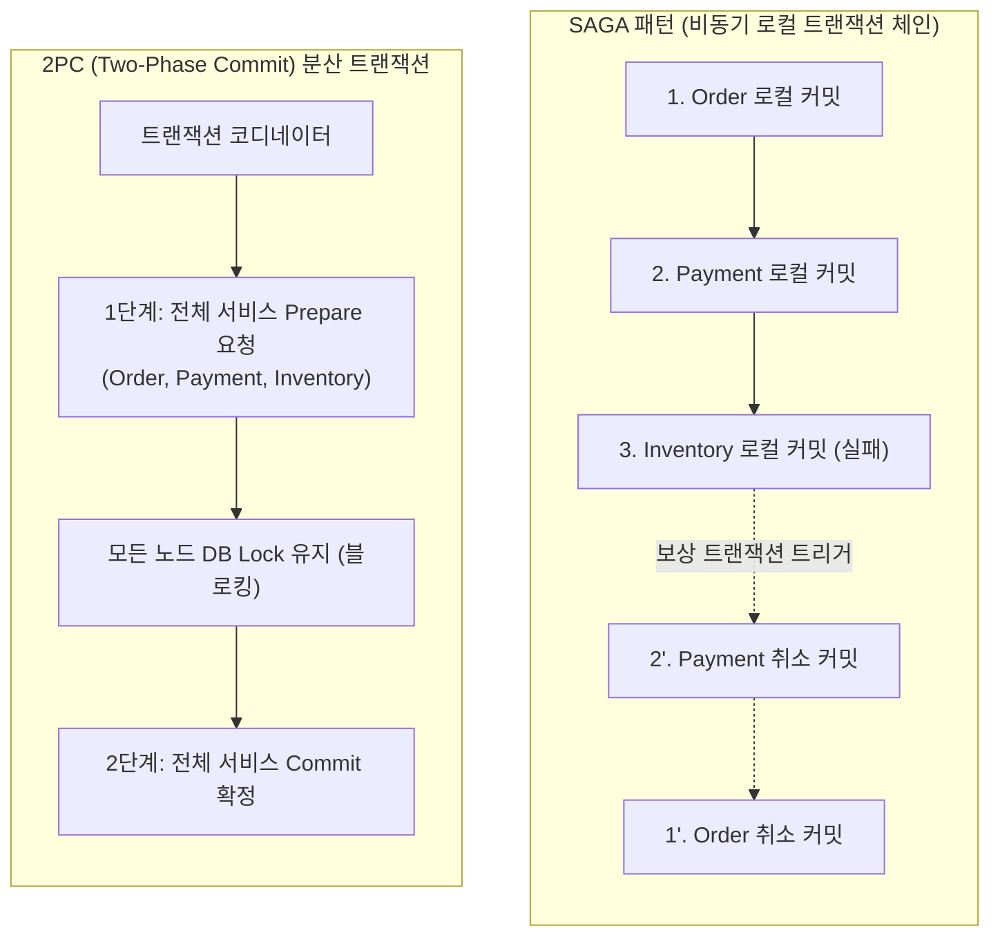
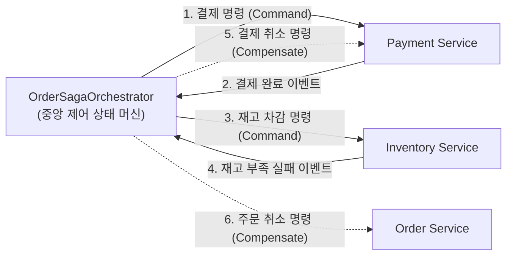

# SAGA 패턴을 활용한 분산 트랜잭션과 보상 트랜잭션 구현

마이크로서비스 아키텍처(MSA)에서는 서비스별로 독립된 데이터베이스를 보유하는 Database-per-Service 패턴이 일반적입니다. 이러한 분산 데이터 환경에서는 단일 데이터베이스의 로컬 ACID 트랜잭션을 적용할 수 없으므로, 여러 마이크로서비스에 걸쳐 실행되는 비즈니스 작업의 데이터 일관성을 유지하는 작업이 매우 복잡해집니다.

과거에 사용되던 2PC(Two-Phase Commit)나 XA 분산 트랜잭션은 모든 서비스 노드의 커밋 준비가 완료될 때까지 데이터베이스 락을 유지하므로 성능 저하와 가용성 결함을 유발합니다. 또한 Apache Kafka, AWS DynamoDB와 같은 클라우드 네이티브 인프라는 XA 트랜잭션을 지원하지 않습니다.

**SAGA 패턴은** 일련의 분산 로컬 트랜잭션을 순차적으로 실행하고, 중간 단계에서 실패가 발생할 경우 이전에 성공한 로컬 트랜잭션들을 역순으로 되돌리는 **보상 트랜잭션(Compensating Transaction)을** 실행하여 시스템의 최종 일관성(Eventual Consistency)을 달성하는 분산 아키텍처 설계 패턴입니다.

본 문서에서는 분산 환경에서 발생하는 트랜잭션 정합성 문제를 분석하고, Spring Boot와 Apache Kafka를 활용하여 오케스트레이션 기반 SAGA 패턴과 보상 트랜잭션을 구현하는 방법을 기술합니다.

---

## 1. 기술적 배경 및 문제 제기 (기존 방식의 한계점)

전통적인 모놀리식 아키텍처에서는 주문, 결제, 재고 차감 로직을 단일 데이터베이스의 `@Transactional` 경계 내에서 원자적으로 처리하였습니다. 그러나 각 도메인이 독립된 마이크로서비스로 분리되면 다음과 같은 기술적 한계에 직면합니다.

### 1.1 2PC(Two-Phase Commit)의 성능 및 가용성 한계
- **동기식 블로킹 오버헤드**: 2PC는 모든 참여 서비스가 응답할 때까지 데이터베이스 락(Lock)을 유지하므로, 네트워크 레이턴시가 누적되어 전체 시스템의 처리량(Throughput)이 급격히 저하됩니다.
- **단일 장애점(SPOF)**: 트랜잭션 코디네이터 노드에 장애가 발생하면 참여 노드들은 락을 해제하지 못하고 대기 상태(In-doubt State)에 빠집니다.
- **클라우드 인프라 비호환성**: 현대 메시지 브로커(Kafka, RabbitMQ) 및 NoSQL 데이터베이스는 XA 프로토콜을 지원하지 않으므로 이기종 분산 시스템 간 2PC 구성이 불가능합니다.

### 1.2 부분 실패(Partial Failure)로 인한 데이터 불일치
비동기 메시징 환경에서 주문 서비스가 주문을 생성하고 결제 서비스가 결제를 완료했으나, 재고 서비스에서 재고 부족으로 예외가 발생하면 결제 데이터만 남고 상품은 출고되지 않는 치명적인 비즈니스 결함이 발생합니다.

---

## 2. 핵심 개념 설명

SAGA 패턴은 분산 비즈니스 프로세스를 여러 개의 로컬 트랜잭션($T_1, T_2, \dots, T_n$)으로 분할하고, 각 로컬 트랜잭션에 대응하는 보상 트랜잭션($C_1, C_2, \dots, C_{n-1}$)을 정의합니다.

- **정상 흐름**: $T_1 \rightarrow T_2 \rightarrow \dots \rightarrow T_n$ (전체 성공 시 트랜잭션 완료)
- **실패 및 롤백 흐름**: $T_1 \rightarrow T_2 \rightarrow T_3(\text{실패}) \rightarrow C_2 \rightarrow C_1$ (역순으로 보상 트랜잭션을 실행하여 원복)

### 2.1 코레오그래피(Choreography) vs 오케스트레이션(Orchestration)

| 비교 항목 | 코레오그래피 (Choreography) | 오케스트레이션 (Orchestration) |
| :--- | :--- | :--- |
| **제어 방식** | 중앙 제어자 없이 각 서비스가 이벤트를 구독하여 다음 작업 실행 | 전담 오케스트레이터가 워크플로우와 상태를 중앙에서 제어 |
| **서비스 결합도** | 낮음 (이벤트 기반 느슨한 결합) | 오케스트레이터에 대한 의존성 존재 |
| **복잡도** | 서비스 수가 증가하면 이벤트 순환 참조 및 흐름 파악 어려움 | 전체 트랜잭션 상태 및 롤백 흐름 추적이 명확함 |
| **적합한 환경** | 참여 서비스가 2~3개인 단순 비즈니스 흐름 | 참여 서비스가 많고 롤백 분기가 복잡한 금융/주문 도메인 |

---

