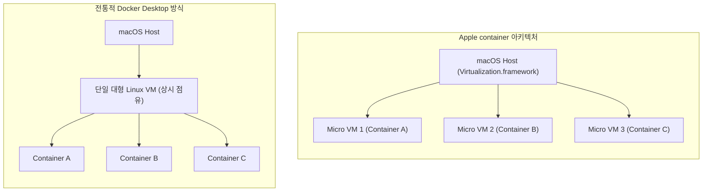

# macOS 환경에서의 경량 Linux 가상화: Apple container 아키텍처 및 활용 가이드

macOS 환경에서 로컬 개발 및 테스트를 위해 Linux 컨테이너를 실행하는 것은 중요한 워크플로우입니다. 그러나 전통적인 가상화 솔루션(Docker Desktop 등)은 macOS 상에 단일 거대 Linux 가상 머신(VM)을 상시 구동하고 그 내부에서 모든 컨테이너를 공유 실행하는 방식을 사용하여 높은 CPU 및 메모리 점유율, 과도한 배터리 소모, 컨테이너 간 보안 격리 취약 문제를 유발하였습니다.

Apple이 공식 공개한 오픈소스 도구인 **`apple/container`는** macOS 네이티브 시스템 가상화 프레임워크와 Apple Silicon 하드웨어 가속을 기반으로, 컨테이너마다 독립된 전용 초경량 VM(Dedicated Lightweight VM)을 실행하는 가상화 기술입니다.

본 문서에서는 Apple `container`의 내부 아키텍처 및 격리 메커니즘을 분석하고, 실무 개발 환경 구축을 위한 설치 및 핵심 CLI 제어 방식을 상세히 기술합니다.

---

## 1. 기술적 배경 및 문제 제기 (기존 방식의 한계점)

전통적인 macOS 컨테이너 구동 방식과 Apple 네이티브 컨테이너 방식의 아키텍처 비교는 다음과 같습니다.



### 1.1 대형 단일 VM의 상시 자원 점유 (Resource Overhead)
기존 솔루션은 컨테이너 구동 여부와 무관하게 수 기가바이트(GB)의 메모리와 복수의 CPU 코어를 Linux VM에 고정 할당하여 호스트 머신의 리소스를 지속적으로 낭비합니다.

### 1.2 컨테이너 간 하드웨어 격리 부재
단일 Linux 커널을 여러 컨테이너가 공유하므로, 특정 컨테이너에서 커널 패닉이나 취약점이 발생할 경우 동일 VM 내부의 모든 컨테이너가 영향을 받는 보안적 한계가 존재합니다.

### 1.3 호스트-게스트 간 파일 시스템 I/O 병목
macOS 파일 시스템과 Linux VM 간의 볼륨 마운트 시 가상화 계층의 변환 오버헤드로 인해 빌드 및 파일 I/O 속도가 급격히 저하됩니다.

---

## 2. 핵심 개념 설명

Apple `container`는 macOS 플랫폼에 최적화된 다음과 같은 핵심 엔지니어링 메커니즘을 가집니다.

### 2.1 컨테이너별 독립 가상 머신 (One VM per Container)
각 컨테이너마다 수십 밀리초(ms) 만에 부팅되는 초경량 마이크로 VM을 생성하여 하드웨어 가상화 레벨에서 컨테이너를 완벽히 격리합니다. 이를 통해 컨테이너 간 간섭을 원천 차단합니다.

### 2.2 macOS 네이티브 시스템 기술과의 직접 결합
- **`Virtualization.framework`**: Apple Silicon 하드웨어의 가상화 확장 기능을 직접 호출하여 CPU 명령 변환 오버헤드를 제로에 가깝게 유지합니다.
- **`launchd` 기반 On-Demand 구동**: 백그라운드에 무거운 데몬 프로세스를 상시 띄우지 않고, `container-apiserver`가 요청 시점에만 활성화되어 배터리 소모를 극소화합니다.

### 2.3 OCI(Open Container Initiative) 표준 준수
Docker Hub, GitHub Container Registry(ghcr.io) 등 기존 OCI 규격의 모든 컨테이너 이미지를 수정 없이 그대로 내려받아 실행할 수 있으며, 빌드된 결과물 또한 표준 호환성을 유지합니다.

---

## 3. 코드 구현 및 라인별 상세 분석

Apple `container` 도구를 시스템에 설치하고 컨테이너를 제어하는 실무 명령어와 분석은 다음과 같습니다.

### 3.1 서비스 데몬 활성화 및 상태 점검

```bash
# container 백그라운드 API 서버 활성화
sudo container system start

# API 서버 및 가상화 데몬 상태 확인
container system status
```

- **코드 분석 및 효율성**:
  - `container system start` 명령은 macOS의 `launchd` 서비스 데몬에 API 서버를 등록하여, 불필요한 백그라운드 폴링 없이 이벤트 기반으로 컨테이너 생명주기를 관리합니다.

---

### 3.2 OCI 컨테이너 라이프사이클 제어 스니펫

```bash
# 1. 표준 OCI 이미지 다운로드 (Alpine Linux)
container image pull alpine:latest

# 2. 독립 마이크로 VM 환경에서 백그라운드 Nginx 웹서버 실행 (포트 포워딩 8080:80)
container run -d \
  --name web-service \
  -p 8080:80 \
  nginx:alpine

# 3. 구동 중인 독립 마이크로 VM 컨테이너 목록 확인
container ls

# 4. 실행 중인 컨테이너 내부 쉘 명령 비동기 실행
container exec web-service ps aux

# 5. 리소스 정리를 위한 컨테이너 중지 및 전용 VM 파기
container stop web-service
container rm web-service
```

- **코드 분석 및 효율성**:
  - `container run` 실행 시 호스트의 `vmnet` 프레임워크가 가상 네트워크 인터페이스를 동적으로 생성하여 네이티브 속도의 네트워크 패킷 포워딩을 수행합니다.
  - `container rm` 호출 시 해당 컨테이너를 위해 할당되었던 마이크로 VM 인스턴스와 메모리가 즉시 호스트 OS로 완벽하게 반환됩니다.

---

### 3.3 로컬 Dockerfile 기반 OCI 이미지 빌드

```bash
# 현재 디렉터리의 Dockerfile을 파싱하여 OCI 규격의 이미지 빌드 수행
container build -t internal-api:1.0.0 .
```

- **코드 분석 및 효율성**:
  - 표준 Dockerfile 구문을 해석하여 레이어 캐싱을 적용한 고속 빌드를 수행하며, 생성된 이미지는 다른 클라우드 환경(Kubernetes, AWS ECR)으로 직접 푸시하여 재사용할 수 있습니다.

---

## 4. 실무 적용 시 고려해야 할 점 (주의사항 및 예외 처리)

### 4.1 Linux x86_64 아키텍처 에뮬레이션
Apple Silicon 환경에서 x86_64 전용 Linux 바이너리를 포함한 이미지를 구동할 경우 Rosetta 2 기반의 바이너리 변환 오버헤드가 발생할 수 있습니다.
- 프로덕션 배포 이미지 빌드 시 다중 아키텍처(`linux/arm64`, `linux/amd64`) 지원 여부를 사전에 검증해야 합니다.

### 4.2 대규모 동시 실행 시 파일 디스크립터 한계
수십 개 이상의 마이크로 VM을 동시에 기동할 경우 macOS 호스트의 파일 디스크립터(File Descriptor) 한계치에 도달할 수 있습니다.
- `launchctl limit maxfiles` 설정을 통해 동시 프로세스 제어 한계를 적절히 증설해야 합니다.

---

## 5. 결론

Apple `container`는 macOS 플랫폼의 하드웨어와 운영체제 소프트웨어의 결합력을 극대화하여 로컬 가상화 성능을 비약적으로 개선한 도구입니다.

1. **호스트 자원 효율 극대화**: 상시 구동 대형 VM을 제거하고 초경량 On-Demand 마이크로 VM 구조를 채택하여 메모리와 배터리 소모량을 대폭 절감합니다.
2. **하드웨어 수준의 보안 격리**: 컨테이너별 독립 VM 할당을 통해 개발 환경에서도 강력한 보안 경계를 확립합니다.
3. **표준 호환성 및 개발 생산성 증대**: OCI 표준 준수를 통해 기존 Docker 생태계와의 호환성을 유지하며 매끄러운 로컬 개발 환경을 제공합니다.
