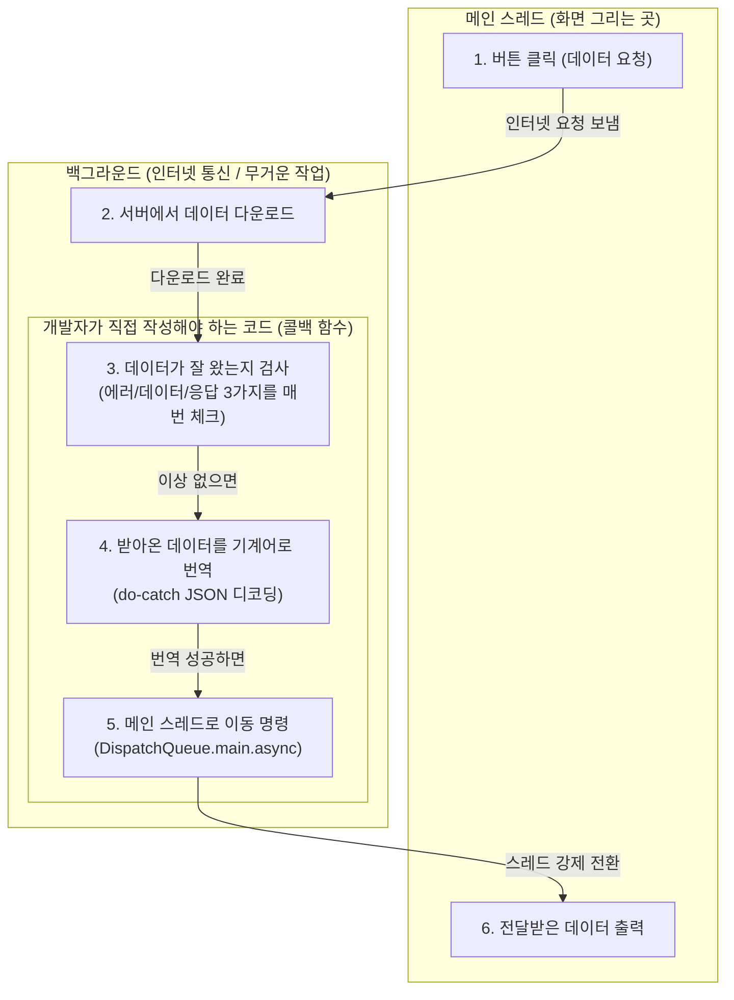
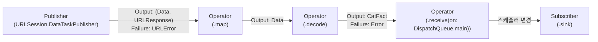

# Swift Combine 기본 구조 분석과 Completion Handler 비동기 처리의 선언형 전환

iOS 애플리케이션 개발에서 네트워크 통신과 비동기 데이터 처리는 가장 빈번하게 발생하는 작업입니다. Swift 5.1 및 iOS 13부터 도입된 Apple의 Combine 프레임워크는 시간에 따라 발생하는 값들을 처리하기 위한 선언형(Declarative) API를 제공합니다.

기존의 `URLSession` dataTask 기반 클로저 콜백 패턴은 코드의 복잡도를 높이고 에러 처리의 누락 가능성을 내포합니다. 본 문서에서는 기존 Completion Handler 방식의 구조적 한계를 분석하고, Combine 프레임워크의 `DataTaskPublisher`와 연산자 파이프라인을 활용하여 반응형 데이터 스트림으로 전환하는 과정을 기술합니다.

---

## 1. 기술적 배경 및 문제 제기 (기존 방식의 한계점)

전통적인 iOS 비동기 프로그래밍에서는 콜백 클로저(Completion Handler)를 활용하여 비동기 작업의 결과를 수신했습니다.



### 1.1 삼중 상태(Data, Response, Error)의 조합 복잡성
`URLSession.dataTask(with:completionHandler:)`는 `(Data?, URLResponse?, Error?)` 형태의 세 가지 옵셔널 파라미터를 반환합니다. 이론적으로 8가지 상태 조합이 발생할 수 있으며, 개발자가 각 옵셔널 값을 방어적으로 언래핑하고 검증하지 않으면 런타임 오류가 발생합니다.

### 1.2 콜백 지옥(Callback Hell)과 에러 전파 누락
네트워크 요청 후 디코딩, 추가 API 호출, DB 저장이 연속으로 이어질 경우 클로저의 깊이가 깊어집니다. 각 분기마다 `completion` 클로저를 명시적으로 호출하지 않고 `return`하는 실수가 발생하면, 호출부는 작업 완료 여부를 전달받지 못하고 대기 상태에 빠집니다.

### 1.3 스레드 전환 코드의 강한 결합
네트워크 작업은 백그라운드 스레드에서 수행되므로 UI 갱신을 위해서는 반드시 `DispatchQueue.main.async` 블록을 호출해야 합니다. 이 스레드 전환 코드가 비즈니스 로직 및 뷰 컨트롤러 전반에 산재하여 코드 응집도를 저해합니다.

---

## 2. 핵심 개념 설명

Apple 공식 문서에 정의된 Combine은 이벤트를 발행하는 `Publisher`, 이를 가공하는 `Operator`, 최종적으로 소비하는 `Subscriber`로 구성됩니다.



### 2.1 Combine 핵심 프로토콜 사양

#### Publisher 프로토콜
```swift
public protocol Publisher<Output, Failure> {
    associatedtype Output
    associatedtype Failure : Error
    
    func receive<S>(subscriber: S) where S : Subscriber, Self.Failure == S.Failure, Self.Output == S.Input
}
```
`Publisher`는 하나 이상의 `Subscriber` 인스턴스에 시간에 따른 값을 전달할 수 있는 타입을 정의합니다. `Output` 타입과 `Failure` 타입을 명시적으로 선언하여 컴파일 타임에 타입 정합성을 보장합니다.

#### Subscriber 프로토콜
```swift
public protocol Subscriber<Input, Failure> : CustomCombineIdentifierConvertible {
    associatedtype Input
    associatedtype Failure : Error
    
    func receive(subscription: Subscription)
    func receive(_ input: Self.Input) -> Subscribers.Demand
    func receive(completion: Subscribers.Completion<Self.Failure>)
}
```
`Subscriber`는 `Publisher`로부터 요소를 수신하며, `Subscribers.Completion` 열거형을 통해 작업의 정상 종료(`.finished`) 또는 실패(`.failure(Error)`)를 단일 채널로 전달받습니다.

### 2.2 파이프라인 구성 연산자 메커니즘
- **`URLSession.DataTaskPublisher`**: 네트워크 요청을 수행하고 `(data: Data, response: URLResponse)`를 발행하는 Publisher입니다.
- **`map(_:)`**: 스트림으로 방출된 업스트림의 출력을 다른 형태로 변환합니다.
- **`decode(type:decoder:)`**: `TopLevelDecoder`를 사용하여 바이트 데이터를 지정된 `Decodable` 모델로 변환합니다. 이 과정에서 파이프라인의 `Failure` 타입은 `Error`로 확장됩니다.
- **`receive(on:options:)`**: 다운스트림 연산자 및 구독자가 이벤트를 수신할 스케줄러(Scheduler)를 지정합니다.
- **`eraseToAnyPublisher()`**: 복잡하게 중첩된 제네릭 타입을 `AnyPublisher<Output, Failure>` 타입으로 지우기(Type Erasure)하여 인터페이스를 단순화합니다.

---

## 3. 코드 구현 및 라인별 상세 분석

### 3.1 기존 Completion Handler 방식 구현

```swift
import Foundation

// 데이터 수신 모델 정의
struct CatFact: Decodable {
    let fact: String
    let length: Int
}

// Completion Handler 기반 네트워크 함수 정의
func fetchCatFact(completion: @escaping (Result<CatFact, Error>) -> Void) {
    guard let url = URL(string: "https://catfact.ninja/fact") else {
        return
    }

    // 1. DataTask 인스턴스 생성
    let task = URLSession.shared.dataTask(with: url) { data, response, error in
        // 2. 네트워크 에러 우선 검증
        if let error = error {
            completion(.failure(error))
            return
        }

        // 3. 데이터 수신 여부 검증
        guard let data = data else {
            let unknownError = NSError(domain: "NetworkError", code: -1, userInfo: [NSLocalizedDescriptionKey: "데이터를 수신하지 못했습니다."])
            completion(.failure(unknownError))
            return
        }

        // 4. JSON 디코딩 시도
        do {
            let decoder = JSONDecoder()
            let catFact = try decoder.decode(CatFact.self, from: data)
            completion(.success(catFact))
        } catch {
            completion(.failure(error))
        }
    }
    
    // 5. 작업 실행 시작
    task.resume()
}

// 6. 함수 호출 및 메인 스레드 전환 처리
fetchCatFact { result in
    DispatchQueue.main.async {
        switch result {
        case .success(let catFact):
            print("데이터 수신 완료: \(catFact.fact)")
        case .failure(let error):
            print("에러 발생: \(error.localizedDescription)")
        }
    }
}
```

#### 코드 분석
- **20~39번 라인**: `data`, `response`, `error` 각각의 상태를 if-let 및 guard-let으로 직접 확인해야 하며, 각 분기마다 `completion` 호출 및 `return` 처리를 누락하지 않아야 합니다.
- **45~54번 라인**: 결과를 받는 호출부에서 UI 작업을 수행하기 위해 `DispatchQueue.main.async`를 호출해야 합니다.

---

### 3.2 Combine 기반 데이터 스트림 파이프라인 구현

```swift
import Foundation
import Combine

// 1. Decodable 채택 모델 정의
struct CatFact: Decodable {
    let fact: String
    let length: Int
}

// 2. AnyPublisher를 반환하는 네트워크 서비스 함수 정의
func fetchCatFactPublisher() -> AnyPublisher<CatFact, Error> {
    let url = URL(string: "https://catfact.ninja/fact")!

    return URLSession.shared.dataTaskPublisher(for: url)
        // 3. (Data, URLResponse) 튜플에서 Data 추출
        .map { tuple -> Data in
            return tuple.data
        }
        // 4. Data를 CatFact 타입으로 디코딩
        .decode(type: CatFact.self, decoder: JSONDecoder())
        // 5. 다운스트림 이벤트 수신 스레드를 Main으로 전환
        .receive(on: DispatchQueue.main)
        // 6. 구체 제네릭 타입을 AnyPublisher로 추상화
        .eraseToAnyPublisher()
}

// 7. 구독(Subscription) 인스턴스 보관 변수
var cancellables = Set<AnyCancellable>()

// 8. 파이프라인 구독 및 소비
fetchCatFactPublisher()
    .sink { completion in
        // 완료 및 에러 처리 분기
        switch completion {
        case .finished:
            print("스트림 정상 완료")
        case .failure(let error):
            print("스트림 에러 종료: \(error.localizedDescription)")
        }
    } receiveValue: { catFact in
        // 정상 데이터 수신 및 UI 반영 (메인 스레드 보장)
        print("Fact 수신: \(catFact.fact), 길이: \(catFact.length)")
    }
    .store(in: &cancellables)
```

#### 라인별 상세 분석
- **15번 라인 (`dataTaskPublisher(for:)`)**: `URLSession`의 Combine 확장 메서드로, `(data: Data, response: URLResponse)`를 방출하고 실패 시 `URLError`를 방출하는 Publisher를 생성합니다.
- **17~19번 라인 (`map`)**: 네트워크 응답 메타데이터를 제외하고 순수 페이로드인 `Data`만을 다음 파이프라인으로 전달합니다.
- **21번 라인 (`decode`)**: `JSONDecoder`를 내부적으로 실행하여 `CatFact` 인스턴스로 파싱합니다. 파싱 실패 시 `DecodingError`를 발생시키며 즉시 `.failure` 스트림으로 전환됩니다.
- **23번 라인 (`receive(on:)`)**: 이 연산자 이후로 호출되는 모든 연산자와 최종 `Subscriber`(`sink`)의 클로저 실행을 `DispatchQueue.main`에서 실행하도록 보장합니다.
- **25번 라인 (`eraseToAnyPublisher()`)**: `Publishers.ReceiveOn<Publishers.Decode<Publishers.Map<URLSession.DataTaskPublisher, Data>, CatFact, JSONDecoder>, DispatchQueue>`와 같은 복잡한 제네릭 타입을 숨기고 `AnyPublisher<CatFact, Error>`로 외부 인터페이스를 단일화합니다.
- **32~44번 라인 (`sink`)**: `Subscribers.Sink` 인스턴스를 생성하여 파이프라인에 연결합니다. `receiveCompletion`은 정상 종료와 에러를 처리하고, `receiveValue`는 성공적으로 가공된 결과값만을 전달받습니다.
- **45번 라인 (`store(in:)`)**: `sink`가 반환하는 `AnyCancellable` 토큰을 보관합니다. 이 참조가 해제되면 파이프라인 구독이 즉시 취소됩니다.

---

## 4. 적용 시 고려해야 할 점 (주의사항 및 예외 처리)

### 4.1 AnyCancellable의 생명주기 제어
`sink` 메서드가 반환하는 `AnyCancellable` 객체는 참조를 유지하지 않으면 함수 종료 시점에 즉시 해제(deinit)되며 구독이 취소됩니다. 비동기 응답을 정상 수신하기 위해서는 클래스 필드나 상위 스코프의 `Set<AnyCancellable>` 컬렉션에 반드시 보관해야 합니다.

### 4.2 Decode 연산자에 의한 Failure 타입 확장
`URLSession.DataTaskPublisher`의 원본 `Failure` 타입은 `URLError`입니다. 그러나 `.decode()` 연산자를 거치면 디코딩 과정에서 발생하는 `DecodingError`까지 포함해야 하므로 `Failure` 타입이 Swift 표준 `Error` 프로토콜로 일반화됩니다. 정밀한 에러 처리가 필요한 경우 `mapError` 연산자를 활용하여 커스텀 에러 열거형으로 매핑해야 합니다.

```swift
.mapError { error -> CustomNetworkError in
    if let urlError = error as? URLError {
        return CustomNetworkError.transportError(urlError)
    } else if let decodingError = error as? DecodingError {
        return CustomNetworkError.parsingError(decodingError)
    }
    return CustomNetworkError.unknown(error)
}
```

### 4.3 에러 발생 시 스트림 조기 종료
Combine 스트림은 한 번 `.failure` 이벤트가 방출되면 파이프라인 전체가 즉시 종료되며 이후의 추가 이벤트를 방출하지 않습니다. 지속적으로 이벤트를 처리해야 하는 스트림(예: UI 텍스트 필드 입력)에서는 `catch`나 `replaceError` 연산자를 배치하여 에러를 안전하게 복구해야 합니다.

---

## 5. 결론 (해당 기술의 기대효과 요약)

Combine을 활용한 비동기 데이터 처리 방식은 다음과 같은 이점을 제공합니다.

1. **선언형 데이터 흐름 구축**: 비동기 데이터 변환, 디코딩, 스레드 전환 로직이 단일 체인 형태로 연결되어 코드의 가독성과 추적성이 향상됩니다.
2. **타입 안전성 보장**: Output과 Failure가 컴파일 시점에 검증되어 옵셔널 언래핑 누락에 의한 런타임 에러를 방지합니다.
3. **일관된 리소스 생명주기 관리**: `AnyCancellable`을 통해 비동기 작업의 취소 메커니즘이 표준화되어 불필요한 네트워크 리소스 낭비와 메모리 누수를 억제합니다.
