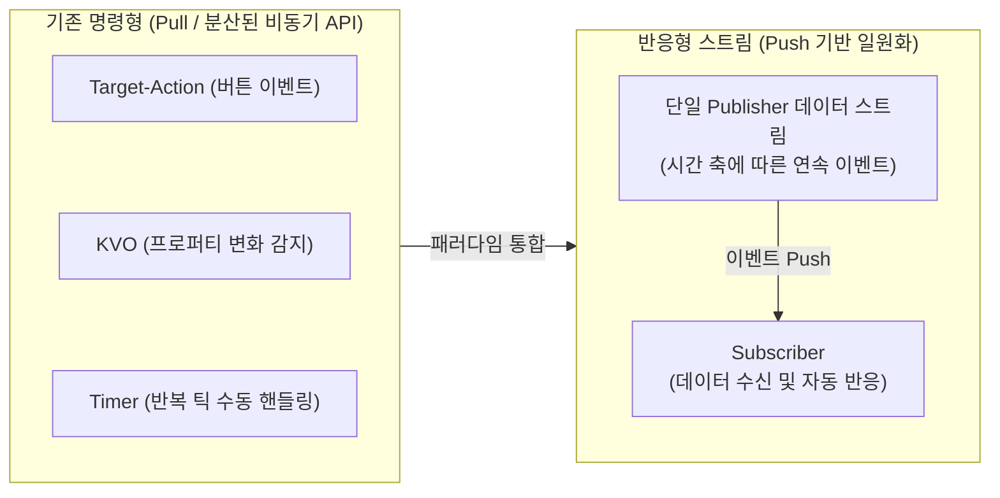
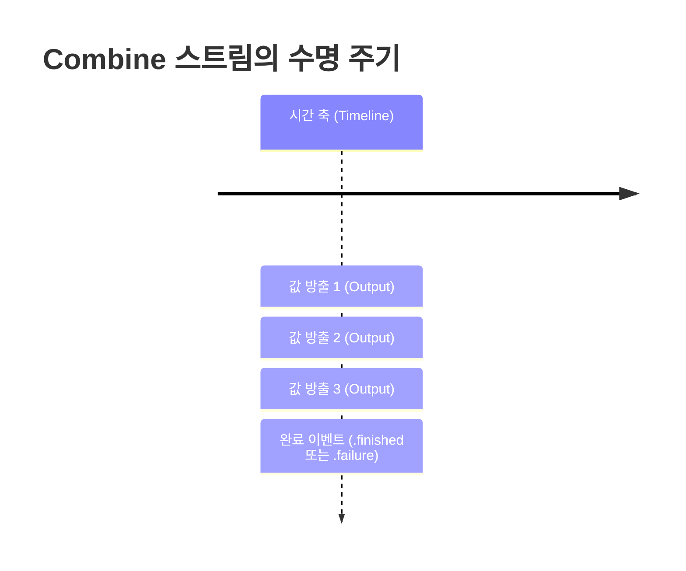

# Reactive Programming의 개념과 Combine 데이터 스트림 구조

iOS 애플리케이션에서는 사용자 터치, 네트워크 응답, 타이머 틱, 센서 데이터 등 다양한 비동기 이벤트가 지속적으로 발생합니다. 이러한 비동기 이벤트를 다루기 위해 기존에는 Delegate 패턴, NotificationCenter, KVO(Key-Value Observing), Target-Action, Completion Handler 등 서로 다른 패러다임의 API가 혼재되어 사용되었습니다.

Combine 프레임워크는 이러한 파편화된 비동기 인터페이스를 **반응형 프로그래밍(Reactive Programming)** 기반의 일관된 데이터 스트림(Data Stream)으로 통합합니다. 

본 문서에서는 Reactive Programming의 정의와 시간 축에 따른 데이터 스트림의 본질을 살펴보고, Combine의 `Output` 및 `Failure` 타입 시스템과 `TimerPublisher`의 동작 구조를 분석합니다.

---

## 1. 기술적 배경 및 문제 제기 (기존 방식의 한계점)

전통적인 명령형(Imperative) 프로그래밍 방식에서는 데이터를 필요로 하는 소비자(Consumer)가 능동적으로 상태를 조회하거나(Pull 방식), 이벤트 발생 시점에 콜백 메서드를 수동으로 호출하여 UI를 동기화했습니다.



### 1.1 비동기 이벤트 처리 인터페이스의 파편화
각기 다른 비동기 기술마다 에러 처리 방식, 데이터 전달 시그니처, 스레드 제어 규칙이 상이했습니다. 동일한 데이터 흐름 내에서 타이머와 네트워크 응답, 사용자 입력을 결합할 경우 복잡한 중첩 콜백과 상태 변수(State Flags)가 불가피하게 증가했습니다.

### 1.2 시간 축(Timeline) 추적의 어려움
기존 `Timer` 객체(`Timer.scheduledTimer`)는 타깃-액션이나 클로저 기반으로 동작하며, 발생한 시간 데이터를 함수형 연산자(변환, 필터링, 지연 등)와 직접 연결할 수 없었습니다. 따라서 시간 경과에 따른 데이터의 흐름을 선언적으로 제어하기 어려웠습니다.

---

## 2. 핵심 개념 설명

### 2.1 Reactive Programming의 정의
Reactive Programming은 **비동기 데이터 스트림(Asynchronous Data Stream)** 과 **변화의 전파(Propagation of Change)** 를 중심으로 설계된 선언형 프로그래밍 패러다임입니다.
- **Push 기반 데이터 전달**: 데이터 소스(Publisher)가 새로운 값을 방출할 때마다 구독자(Subscriber)에게 자동으로 전달됩니다.
- **선언적 파이프라인**: 데이터가 생성된 시점부터 소비되는 시점까지의 변환, 조합, 필터링 과정을 단일 체인으로 구성합니다.

### 2.2 Stream의 구조
Stream은 시간의 흐름에 따라 연속적으로 방출되는 일련의 이벤트 시퀀스입니다. Combine 스트림은 다음 세 가지 이벤트 중 하나를 방출합니다.



1. **값 방출 (Value Event)**: 0개 이상의 `Output` 데이터를 지속적으로 방출합니다.
2. **정상 완료 (Completion Finished)**: 더 이상 방출할 데이터가 없음을 알리고 스트림을 종료합니다.
3. **에러 완료 (Completion Failure)**: 에러(`Failure`)가 발생하여 스트림이 즉시 중단됩니다.

### 2.3 Output과 Failure 타입 시스템
Combine의 모든 `Publisher`는 두 개의 연관 타입(Associated Type)을 필수로 선언합니다.

```swift
public protocol Publisher<Output, Failure> {
    associatedtype Output
    associatedtype Failure : Error
    // ...
}
```

- **`Output`**: 스트림에서 방출하는 값의 구체적인 타입입니다.
- **`Failure`**: 스트림에서 발생할 수 있는 에러의 타입입니다. 에러가 절대 발생하지 않는 무결한 스트림인 경우 Swift의 빈 열거형 타입인 **`Never`** 를 지정합니다.
- `Failure`가 `Never`로 지정된 Publisher는 실패하지 않음이 컴파일 타임에 보장되므로, `.sink(receiveValue:)`와 같이 에러 처리 블록을 생략한 간결한 구독이 가능합니다.

### 2.4 ConnectablePublisher와 autoconnect
- **`ConnectablePublisher`**: `Subscriber`가 연결되더라도 즉시 데이터를 방출하지 않고, 명시적으로 `connect()` 메서드가 호출될 때 비로소 값 방출을 시작하는 Publisher입니다.
- **`autoconnect()`**: 다운스트림 Subscriber가 구독을 체결하는 즉시 자동으로 상위 Publisher의 `connect()`를 트리거하여 스트림을 개시하도록 래핑하는 연산자입니다.

---

## 3. 코드 구현 및 라인별 상세 분석

### 3.1 Timer.publish와 autoconnect를 활용한 스트림 구현

```swift
import Foundation
import Combine

// 1. 1초 간격으로 Date를 방출하는 TimerPublisher 생성 및 자동 연결
let timerPublisher = Timer.publish(every: 1.0, on: .main, in: .common)
    .autoconnect()

// 2. 구독자(Subscriber) 연결 및 데이터 변환 파이프라인 구성
var cancellable: AnyCancellable?

cancellable = timerPublisher
    // 3. Date 타입을 포맷팅된 문자열 스트림으로 변환
    .map { date -> String in
        let formatter = DateFormatter()
        formatter.dateFormat = "HH:mm:ss.SSS"
        return formatter.string(from: date)
    }
    // 4. Failure가 Never이므로 receiveValue만 선언하여 데이터 소비
    .sink { formattedDate in
        print("현재 시각: \(formattedDate)")
    }
```

#### 라인별 상세 분석
- **5~6번 라인 (`Timer.publish`)**:
  - `every: 1.0`: 1초 주기로 이벤트를 생성합니다.
  - `on: .main`: 메인 스레드의 RunLoop에서 타이머를 실행합니다.
  - `in: .common`: `.common` 런루프 모드를 지정하여 사용자가 스크롤 등의 UI 상호작용을 수행하는 동안에도 타이머 이벤트가 차단되지 않도록 보장합니다.
  - `autoconnect()`: `Timer.TimerPublisher`는 `ConnectablePublisher`이므로, `autoconnect()`를 체이닝하여 `sink`가 호출되는 즉시 타이머가 작동하도록 설정합니다.
- **12~17번 라인 (`map`)**:
  - 업스트림에서 방출된 `Date` 인스턴스를 받아 `DateFormatter`를 통해 `String`으로 변환합니다.
  - 파이프라인의 `Output` 타입이 `Date`에서 `String`으로 변경됩니다.
- **19~21번 라인 (`sink`)**:
  - `TimerPublisher`의 `Failure` 타입은 `Never`이므로, 별도의 `receiveCompletion` 분기 없이 `receiveValue` 클로저만 전달받아 UI 출력 로직을 수행합니다.

---

### 3.2 ConnectablePublisher의 수동 제어 방식 비교

```swift
import Foundation
import Combine

// 1. autoconnect 없이 순수 ConnectablePublisher로 생성
let manualTimerPublisher = Timer.publish(every: 1.0, on: .main, in: .common)

var cancellables = Set<AnyCancellable>()

// 2. 구독을 먼저 등록 (이 시점에는 타이머 이벤트가 방출되지 않음)
manualTimerPublisher
    .sink { date in
        print("수동 타이머 틱: \(date)")
    }
    .store(in: &cancellables)

print("구독 등록 완료. 타이머 대기 중...")

// 3. 비즈니스 로직에 따라 원하는 시점에 명시적으로 스트림 개시
let connection = manualTimerPublisher.connect()

// 4. 타이머 중지가 필요한 경우 connection을 cancel 처리
// connection.cancel()
```

#### 코드 분석
- `autoconnect()`를 사용하지 않으면 구독자(`sink`)가 등록되어도 이벤트가 흐르지 않습니다.
- `manualTimerPublisher.connect()`가 호출되는 순간부터 내부 타이머가 기동되어 `Date` 값을 푸시합니다. 다수의 구독자가 모두 준비된 후 동시에 이벤트를 수신해야 하는 시나리오에 적합합니다.

---

## 4. 적용 시 고려해야 할 점 (주의사항 및 예외 처리)

### 4.1 RunLoop Mode 설정의 중요성
`Timer.publish` 사용 시 RunLoop 모드를 `.default`로 설정하면, 사용자가 `UIScrollView`나 `UITableView`를 드래그하는 동안 런루프 모드가 `UITrackingRunLoopMode`로 전환되어 타이머 이벤트 전달이 일시 정지됩니다. 화면 상호작용과 무관하게 일정한 주기로 이벤트를 수신해야 하는 경우 반드시 `.common` 모드를 지정해야 합니다.

### 4.2 Failure: Never와 에러 처리 연산자 호환성
`Failure`가 `Never`인 스트림에 에러를 던질 수 있는 연산자(예: `tryMap`)를 체이닝하면, 스트림의 `Failure` 타입이 Swift 표준 `Error`로 승격됩니다. 이 경우 `.sink(receiveValue:)` 단일 클로저 형태를 사용할 수 없으며, 반드시 `receiveCompletion` 클로저를 함께 구현하거나 `replaceError` 등을 통해 에러를 처리해야 합니다.

```swift
// Failure가 Never에서 Error로 변경되는 예시
timerPublisher
    .tryMap { date -> String in
        // 특정 조건에서 에러 발생 시
        if date.timeIntervalSince1970.truncatingRemainder(dividingBy: 2) == 0 {
            throw CustomTimerError.invalidTick
        }
        return "\(date)"
    }
    .sink { completion in
        // Failure가 Error이므로 completion 처리 필수
        if case .failure(let error) = completion {
            print("에러 발생: \(error)")
        }
    } receiveValue: { value in
        print("정상 값: \(value)")
    }
    .store(in: &cancellables)
```

### 4.3 리소스 해제와 스트림 생명주기 관리
`TimerPublisher`는 무한히 값을 방출하는 스트림입니다. 뷰 컨트롤러나 ViewModel이 해제될 때 구독 객체(`AnyCancellable`)가 해제되지 않으면 백그라운드에서 타이머가 영구적으로 동작하여 메모리 및 CPU 자원을 낭비합니다. 반드시 `Set<AnyCancellable>`에 보관하여 인스턴스 소멸 시 자동으로 `cancel()`되도록 설계해야 합니다.

---

## 5. 결론

Reactive Programming 패러다임과 Combine 데이터 스트림 모델은 다음과 같은 구조적 이점을 제공합니다.

1. **비동기 인터페이스의 표준화**: 파편화되어 있던 이벤트 처리 방식을 `Publisher-Subscriber` 단일 규격으로 일원화합니다.
2. **시간 축 데이터의 선언적 가공**: 연속적으로 발생하는 데이터를 함수형 연산자 체인을 통해 직관적으로 변환 및 제어할 수 있습니다.
3. **엄격한 타입 안전성**: `Output`과 `Failure` 타입을 컴파일 타임에 강제하여 에러 발생 가능성을 명확히 인지하고 사전에 방어할 수 있습니다.
