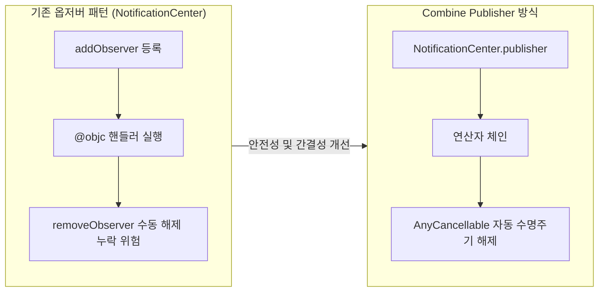
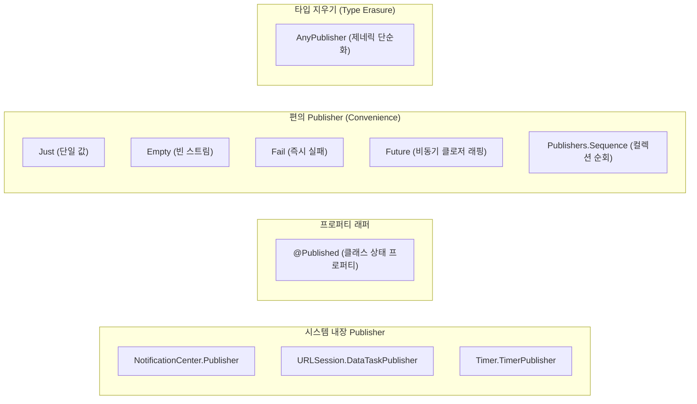

# Combine Publisher

Combine의 `Publisher`는 시간에 따라 값을 방출하는 생산자 역할을 수행합니다. 애플리케이션의 요구사항에 따라 시스템 이벤트(NotificationCenter), 상태 변경(@Published), 단일 정적 값(Just), 에러 방출(Fail), 콜백 기반 비동기 작업 래핑(Future) 등 다양한 형태의 Publisher가 사용됩니다.

본 문서에서는 주요 Publisher의 동작 메커니즘과 편의 Publisher의 특징을 분석하고, 복잡한 제네릭 체인을 은닉하는 `AnyPublisher` 및 `eraseToAnyPublisher()`의 필요성과 적용 방법을 기술합니다.

---

## 1. 기술적 배경 및 문제 제기 (기존 방식의 한계점)

iOS 프레임워크 전반에서 사용되던 기존 이벤트 처리 방식은 수동 메모리 관리와 타입 불투명성의 문제를 동반했습니다.



### 1.1 NotificationCenter의 수동 수명 주기 관리
전통적인 `NotificationCenter.default.addObserver`는 옵저버 등록 후 `deinit` 또는 `viewWillDisappear`에서 `removeObserver`를 수동으로 호출해야 했습니다. 해제를 누락할 경우 댕글링 포인터(Dangling Pointer)나 불필요한 이벤트 중복 수신이 발생했습니다.

### 1.2 비동기 인터페이스의 타입 복잡성
연산자를 체이닝할수록 반환 타입이 `Publishers.Map<Publishers.Filter<NotificationCenter.Publisher, ...>, ...>`와 같이 기하급수적으로 길어집니다. 이는 모듈 간의 인터페이스 경계를 노출시키고, 함수의 반환 타입을 지정할 때 유지보수성을 저하시킵니다.

---

## 2. 핵심 개념 설명

### 2.1 주요 Publisher 분류



### 2.2 @Published 프로퍼티 래퍼
- 클래스의 프로퍼티에 선언하여 해당 변수의 값이 변경될 때마다 이벤트를 방출합니다.
- `$` 접두사(Projected Value)를 통해 내부 `Published.Publisher`에 접근할 수 있습니다.
- 값이 할당되는 `willSet` 시점에 이벤트를 방출하므로, 구독자가 값을 전달받는 순간에는 인스턴스의 프로퍼티가 아직 갱신되기 직전 상태입니다.

### 2.3 편의 Publisher (Convenience Publishers)
- **`Just`**: 단일 값을 즉시 방출하고 `.finished`로 정상 종료하는 Publisher입니다. `Failure` 타입은 `Never`로 고정됩니다.
- **`Empty`**: 어떤 값도 방출하지 않는 Publisher입니다. `completeImmediately` 파라미터(기본값 `true`)에 따라 즉시 종료되거나 대기 상태를 유지합니다.
- **`Fail`**: 값을 방출하지 않고 초기화 시점에 지정된 `Error` 인스턴스와 함께 즉시 `.failure`로 종료됩니다.
- **`Future`**: 단일 비동기 작업을 수행하고 그 결과를 `Promise` 클로저를 통해 성공(`Result.success`) 또는 실패(`Result.failure`)로 방출하는 클래스 기반 Publisher입니다.

### 2.4 AnyPublisher와 eraseToAnyPublisher()
`AnyPublisher`는 `Publisher` 프로토콜을 준수하는 타입 소거(Type Erasure) 구조체입니다. 연산자 체이닝으로 인해 깊게 중첩된 제네릭 타입을 래핑하여, 외부에는 오직 `AnyPublisher<Output, Failure>`라는 단순화된 단일 인터페이스만을 노출합니다.

---

## 3. 코드 구현 및 라인별 상세 분석

### 3.1 NotificationCenter.Publisher 구현

```swift
import UIKit
import Combine

class OrientationViewController: UIViewController {
    
    // 1. 구독 토큰 보관 컬렉션
    private var cancellables = Set<AnyCancellable>()

    override func viewDidLoad() {
        super.viewDidLoad()
        setupOrientationObserver()
    }

    private func setupOrientationObserver() {
        // 2. NotificationCenter의 Publisher 생성
        NotificationCenter.default.publisher(for: UIDevice.orientationDidChangeNotification)
            // 3. Notification 객체에서 UIDeviceOrientation 데이터 추출
            .compactMap { _ in UIDevice.current.orientation }
            // 4. 메인 스레드 전달 보장
            .receive(on: DispatchQueue.main)
            // 5. 구독 및 처리
            .sink { orientation in
                switch orientation {
                case .portrait:
                    print("세로 모드")
                case .landscapeLeft, .landscapeRight:
                    print("가로 모드")
                default:
                    print("기타 방향")
                }
            }
            // 6. Set에 저장하여 뷰 컨트롤러 해제 시 자동 구독 취소
            .store(in: &cancellables)
    }
}
```

#### 코드 분석
- **16번 라인**: `NotificationCenter.default.publisher(for:)` 메서드로 알림을 스트림으로 변환합니다. `Failure` 타입은 `Never`입니다.
- **18번 라인**: `compactMap`을 통해 불필요한 알림 페이로드를 제거하고 현재 디바이스의 방향 값만 추출합니다.
- **33번 라인**: `store(in: &cancellables)`에 의해 `OrientationViewController`가 메모리에서 해제될 때 `AnyCancellable`이 소멸되며 자동으로 옵저버가 제거됩니다.

---

### 3.2 @Published 프로퍼티 래퍼 구현

```swift
import Foundation
import Combine

class UserViewModel {
    // 1. @Published 프로퍼티 정의 (클래스 내부에서만 선언 가능)
    @Published var score: Int = 0
}

let viewModel = UserViewModel()
var cancellables = Set<AnyCancellable>()

// 2. $score(Projected Value)를 통해 Publisher 구독
viewModel.$score
    .sink { newScore in
        print("점수 변경 감지: \(newScore)")
    }
    .store(in: &cancellables)

// 3. 값 변경 (이벤트 발생)
viewModel.score = 10
viewModel.score = 25
```

#### 코드 분석
- **7번 라인**: `@Published`를 선언하면 컴파일러가 해당 변수의 변경 이벤트를 발행하는 `Published.Publisher`를 생성합니다.
- **14번 라인**: `viewModel.$score`로 접근하여 `score`가 변경될 때마다 최신 값을 구독자에게 전달합니다. 초기화 시점의 기본값(`0`)도 첫 번째 이벤트로 즉시 방출됩니다.

---

### 3.3 편의 Publisher (Just, Empty, Fail, Future) 구현

```swift
import Foundation
import Combine

// 1. Sequence Publisher: 컬렉션 요소들을 순차 방출 후 종료
[1, 2, 3].publisher
    .sink { print("Sequence 값: \($0)") }

// 2. Just: 단일 값 방출 후 즉시 완료
Just("정적 텍스트")
    .sink { print("Just 값: \($0)") }

// 3. Empty: 아무 값도 방출하지 않고 정상 종료
Empty<Int, Never>()
    .sink(
        receiveCompletion: { print("Empty 완료 상태: \($0)") },
        receiveValue: { _ in }
    )

// 4. Fail: 값 없이 즉시 커스텀 에러 방출
enum NetworkError: Error {
    case invalidURL
}

Fail<Data, NetworkError>(error: .invalidURL)
    .sink(
        receiveCompletion: { completion in
            if case .failure(let error) = completion {
                print("Fail 에러 수신: \(error)")
            }
        },
        receiveValue: { _ in }
    )

// 5. Future: 클로저 기반 비동기 API를 Combine 스트림으로 래핑
func fetchUserData() -> Future<Data, Error> {
    return Future { promise in
        let url = URL(string: "https://api.example.com/user")!
        URLSession.shared.dataTask(with: url) { data, _, error in
            if let error = error {
                promise(.failure(error))
            } else if let data = data {
                promise(.success(data))
            }
        }.resume()
    }
}
```

---

### 3.4 AnyPublisher와 eraseToAnyPublisher()를 활용한 인터페이스 추상화

```swift
import Foundation
import Combine

struct NetworkService {
    
    // 1. 구체적인 연산자 타입을 숨기고 AnyPublisher 인터페이스로 노출
    func request(url: URL?) -> AnyPublisher<Data, URLError> {
        // 2. 유효하지 않은 URL일 경우 Fail Publisher 반환
        guard let validURL = url else {
            return Fail(error: URLError(.badURL))
                .eraseToAnyPublisher()
        }

        // 3. DataTaskPublisher 체이닝 후 타입 소거
        return URLSession.shared.dataTaskPublisher(for: validURL)
            .map(\.data)
            .eraseToAnyPublisher()
    }
}

let service = NetworkService()
var cancellables = Set<AnyCancellable>()

service.request(url: URL(string: "https://example.com"))
    .sink(
        receiveCompletion: { print("종료 상태: \($0)") },
        receiveValue: { print("데이터 크기: \($0.count) bytes") }
    )
    .store(in: &cancellables)
```

#### 라인별 상세 분석
- **7번 라인**: 함수의 반환 타입으로 구체 타입 대신 `AnyPublisher<Data, URLError>`를 선언합니다.
- **10~11번 라인**: `Fail` Publisher 인스턴스를 생성한 뒤 `.eraseToAnyPublisher()`를 호출하여 `AnyPublisher<Data, URLError>` 형태로 변환합니다.
- **15~17번 라인**: `Publishers.Map<URLSession.DataTaskPublisher, Data>` 타입을 동일하게 `.eraseToAnyPublisher()`로 래핑하여 일치시킵니다. 분기마다 서로 다른 구체 Publisher를 사용하더라도 반환 타입을 일원화할 수 있습니다.

---

## 4. 적용 시 고려해야 할 점 (주의사항 및 예외 처리)

### 4.1 @Published의 이벤트 방출 시점 (willSet)
`@Published` 프로퍼티 래퍼는 `didSet`이 아닌 `willSet` 시점에 이벤트를 방출합니다. 따라서 `sink` 클로저 내부에서 `viewModel.score`와 같이 객체의 프로퍼티를 직접 참조할 경우, 갱신되기 이전의 구값이 조회됩니다. 전달된 클로저 인자(파라미터)를 직접 사용해야 합니다.

### 4.2 Future의 즉시 실행(Eager Execution) 특성
일반적인 Publisher는 구독자(`sink`)가 등록될 때 비로소 작업을 시작하는 지연 실행(Lazy Execution) 방식을 따릅니다. 그러나 `Future`는 **인스턴스가 생성되는 즉시 내부 클로저가 실행**됩니다. 또한 한 번 생성된 `Future`는 결과를 메모리에 캐싱하므로, 다수의 구독자가 붙어도 비동기 작업을 재실행하지 않고 동일한 결과를 공유합니다.

### 4.3 AnyPublisher 타입 소거의 성능 트레이드오프
`eraseToAnyPublisher()`는 내부적으로 힙 메모리에 래퍼 객체를 할당하고 가상 디스패치(Virtual Dispatch)를 수행합니다. 극도로 빈번한 이벤트 루프 내부에서는 미세한 오버헤드가 발생할 수 있으므로, 모듈의 Public API 경계에서 주로 적용하고 내부 체이닝 구간에서는 불필요한 연속 호출을 지양해야 합니다.

---

## 5. 결론

Combine의 Publisher 생태계와 `AnyPublisher`를 활용하면 다음과 같은 아키텍처적 이점을 얻을 수 있습니다.

1. **이벤트 소스의 일관된 모델링**: 시스템 알림, 상태 프로퍼티, 네트워크 요청을 통일된 `Publisher` 규격으로 통합 관리합니다.
2. **모듈 캡슐화 및 결합도 감소**: `eraseToAnyPublisher()`를 통해 복잡한 내부 구현 타입을 은닉하고, 호출부에는 명확한 `Output`과 `Failure`만을 제공합니다.
3. **안전한 생명주기 제어**: `AnyCancellable`을 통해 비동기 작업의 등록과 취소를 메모리 수명주기와 자동으로 동기화합니다.
