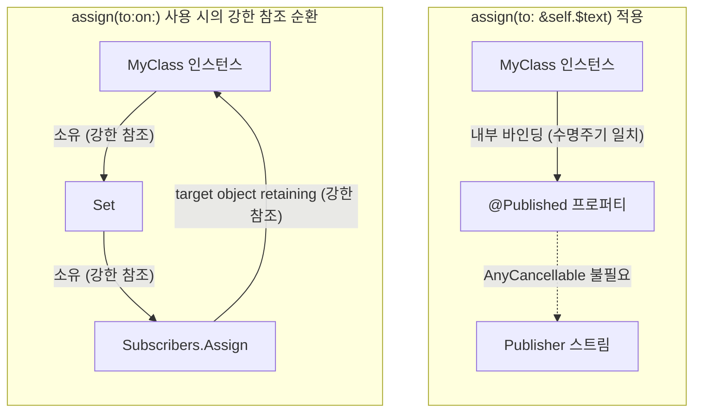

# Combine Subscriber와 메모리 관리(sink, assign, 순환 참조)

Combine 파이프라인의 종단점인 `Subscriber`는 `Publisher`가 방출한 데이터를 최종적으로 소비하고 비즈니스 로직이나 UI에 바인딩하는 역할을 수행합니다. 대표적인 Subscriber 생성 연산자로 `sink`와 `assign`이 사용됩니다.

데이터를 뷰나 모델의 프로퍼티에 바인딩하는 과정에서 부적절한 참조가 발생하면 인스턴스가 메모리에서 해제되지 않는 강한 참조 순환(Strong Reference Cycle)이 발생합니다. 본 문서에서는 `Subscriber`의 라이프사이클과 `sink` 및 `assign`의 종류를 살펴보고, 메모리 누수를 방지하는 바인딩 기법을 분석합니다.

---

## 1. 기술적 배경 및 문제 제기 (기존 방식의 한계점)

클래스 내부에서 Combine 스트림을 구독하고 결과를 해당 클래스의 프로퍼티에 할당할 때, 메모리 관리 규칙을 정확히 이해하지 못하면 심각한 메모리 누수로 이어집니다.



### 1.1 `assign(to:on:)`의 강한 참조(Retain) 특성
Apple 공식 문서에 명시된 바와 같이, `assign(to:on:)` 연산자는 스트림이 완료되거나 취소될 때까지 대상 객체(`object`)를 **강하게 유지(retaining the target object)** 합니다. 만약 대상 객체가 `AnyCancellable`을 자신의 프로퍼티로 들고 있다면, `인스턴스 -> AnyCancellable -> Subscriber -> 인스턴스`로 이어지는 삼각 참조 순환이 형성되어 객체가 영구히 `deinit`되지 않습니다.

### 1.2 `sink` 클로저 내 self 캡처 누락
`sink`를 사용할 때 클로저 내부에서 `self.property = value`와 같이 명시적인 `self` 캡처 리스트(`[weak self]`)를 지정하지 않으면, 클로저가 `self`를 강하게 캡처하여 동일한 순환 참조 문제가 발생합니다.

---

## 2. 핵심 개념 설명

### 2.1 Subscriber 프로토콜 사양

```swift
public protocol Subscriber<Input, Failure> : CustomCombineIdentifierConvertible {
    associatedtype Input
    associatedtype Failure : Error
    
    func receive(subscription: Subscription)
    func receive(_ input: Self.Input) -> Subscribers.Demand
    func receive(completion: Subscribers.Completion<Self.Failure>)
}
```

- **`receive(subscription:)`**: Publisher와 구독이 연결되었을 때 최초 1회 호출되며, `Subscription.request(_:)`를 통해 요청할 데이터 개수(`Demand`)를 전달합니다.
- **`receive(_:) -> Demand`**: Publisher가 방출한 새 데이터(`Input`)를 수신하고, 추가로 수신할 데이터 개수를 반환합니다.
- **`receive(completion:)`**: 스트림의 종료 이벤트(`.finished` 또는 `.failure`)를 수신합니다.

### 2.2 `sink`의 오버로딩 구조
- **`sink(receiveCompletion:receiveValue:)`**: 스트림의 `Failure`가 `Error`인 경우 사용되며, 완료/실패 처리 클로저와 값 수신 클로저를 모두 제공합니다.
- **`sink(receiveValue:)`**: 스트림의 `Failure`가 `Never`인 경우에만 제공되는 축약형 연산자입니다.

### 2.3 `assign`의 종류와 동작 차이

| 구분 | `assign(to:on:)` | `assign(to:)` (iOS 14+) |
| :--- | :--- | :--- |
| **선언 시그니처** | `assign(to:on:)` | `assign(to: inout Published.Publisher)` |
| **반환 타입** | `AnyCancellable` | `Void` (반환값 없음) |
| **참조 방식** | Target 객체를 강하게 유지 (Strong Retain) | `@Published` 수명주기에 구독을 자동 편입 |
| **순환 참조 위험** | `self` 지정 시 강한 참조 순환 발생 | 순환 참조 원천 차단 |
| **저장 필요성** | `store(in: &cancellables)` 필수 | `store(in:)` 불필요 |

---

## 3. 코드 구현 및 라인별 상세 분석

### 3.1 `assign(to:on:)`으로 인한 순환 참조 문제 재현

```swift
import Foundation
import Combine

class LeakViewModel {
    @Published var timestamp: String = "" {
        didSet {
            print("값 변경: \(timestamp)")
        }
    }
    
    private var cancellables = Set<AnyCancellable>()
    
    init() {
        Timer.publish(every: 1.0, on: .main, in: .common)
            .autoconnect()
            .map { date in
                let formatter = DateFormatter()
                formatter.dateFormat = "HH:mm:ss"
                return formatter.string(from: date)
            }
            // 문제 발생 지점: self를 강하게 참조하여 AnyCancellable과 순환 참조 형성
            .assign(to: \.timestamp, on: self)
            .store(in: &cancellables)
    }
    
    deinit {
        print("LeakViewModel 메모리 해제 완료")
    }
}

func testLeak() {
    _ = LeakViewModel()
    print("testLeak 함수 종료")
}

testLeak()
// 출력 결과:
// testLeak 함수 종료
// (deinit이 호출되지 않으며 타이머가 백그라운드에서 계속 동작)
```

#### 코드 분석
- **21~22번 라인**: `assign(to: \.timestamp, on: self)`는 `self`를 강하게 유지합니다. 이 `assign`의 결과인 `AnyCancellable`을 `self.cancellables`에 저장하므로 상호 참조가 발생하여 `testLeak()` 스코프가 끝나도 `deinit`이 실행되지 않습니다.

---

### 3.2 `sink`와 `[weak self]`를 활용한 순환 참조 해결

```swift
import Foundation
import Combine

class SafeSinkViewModel {
    @Published var timestamp: String = ""
    private var cancellables = Set<AnyCancellable>()
    
    init() {
        Timer.publish(every: 1.0, on: .main, in: .common)
            .autoconnect()
            .map { date -> String in
                let formatter = DateFormatter()
                formatter.dateFormat = "HH:mm:ss"
                return formatter.string(from: date)
            }
            // weak self를 명시적으로 선언하여 강한 참조 차단
            .sink { [weak self] formattedDate in
                self?.timestamp = formattedDate
            }
            .store(in: &cancellables)
    }
    
    deinit {
        print("SafeSinkViewModel 메모리 해제 완료")
    }
}

func testSafeSink() {
    _ = SafeSinkViewModel()
    print("testSafeSink 함수 종료")
}

testSafeSink()
// 출력 결과:
// testSafeSink 함수 종료
// SafeSinkViewModel 메모리 해제 완료
```

#### 코드 분석
- **16~18번 라인**: `sink` 클로저 내부에서 `[weak self]` 캡처 리스트를 선언하여 `self`에 대한 약한 참조를 유지합니다. 인스턴스가 스코프를 벗어나면 즉시 `deinit`이 호출되고 `cancellables`가 해제되면서 타이머가 정상 종료됩니다.

---

### 3.3 `assign(to:)` 인아웃 바인딩을 활용한 모던 구현 (iOS 14+)

```swift
import Foundation
import Combine

class ModernViewModel {
    @Published var timestamp: String = "" {
        didSet {
            print("시간 갱신: \(timestamp)")
        }
    }
    
    // Set<AnyCancellable> 프로퍼티 불필요
    
    init() {
        Timer.publish(every: 1.0, on: .main, in: .common)
            .autoconnect()
            .map { date -> String in
                let formatter = DateFormatter()
                formatter.dateFormat = "HH:mm:ss"
                return formatter.string(from: date)
            }
            // inout 바인딩을 통해 @Published 프로퍼티에 직접 연결
            .assign(to: &$timestamp)
    }
    
    deinit {
        print("ModernViewModel 메모리 해제 완료")
    }
}

func testModern() {
    _ = ModernViewModel()
    print("testModern 함수 종료")
}

testModern()
// 출력 결과:
// testModern 함수 종료
// ModernViewModel 메모리 해제 완료
```

#### 라인별 상세 분석
- **20번 라인 (`assign(to: &$timestamp)`)**:
  - `@Published` 프로퍼티 래퍼의 `inout` 파라미터(`&$timestamp`)를 전달합니다.
  - 이 메서드는 `AnyCancellable`을 반환하지 않고(`Void`), 구독의 라이프사이클을 `@Published` 프로퍼티 래퍼 내부로 귀속시킵니다.
  - 별도의 `cancellables` 컬렉션을 유지할 필요가 없으며, `self`를 강하게 유지하지 않으므로 강한 참조 순환이 원천적으로 발생하지 않습니다.
  - `ModernViewModel` 인스턴스가 소멸하면 `@Published` 프로퍼티가 소멸하면서 내부 구독도 자동으로 취소됩니다.

---

## 4. 적용 시 고려해야 할 점 (주의사항 및 예외 처리)

### 4.1 Failure 타입이 `Never`인 스트림 제약
`assign(to:on:)`과 `assign(to:)` 연산자는 모두 업스트림의 `Failure` 타입이 **`Never`** 일 때만 컴파일이 허용됩니다. 네트워크 요청(`URLSession.DataTaskPublisher`)과 같이 `Error`가 발생할 수 있는 스트림에 바인딩할 경우, 반드시 `replaceError(with:)`나 `catch` 연산자를 배치하여 에러를 기본값으로 대체해야 합니다.

```swift
URLSession.shared.dataTaskPublisher(for: url)
    .map(\.data)
    .decode(type: MyModel.self, decoder: JSONDecoder())
    // Failure 타입을 Never로 변환해야 assign 사용 가능
    .replaceError(with: MyModel.defaultValue)
    .receive(on: DispatchQueue.main)
    .assign(to: &$model)
```

### 4.2 UI 바인딩 시 스레드 정합성
`assign(to:)` 연산자는 업스트림의 스케줄러를 그대로 이어받습니다. 백그라운드 스레드에서 생성된 데이터가 `@Published` 프로퍼티에 바인딩되어 SwiftUI 뷰나 UIKit UI를 갱신하는 경우, 반드시 `.receive(on: DispatchQueue.main)` 연산자를 `assign` 직전에 배치해야 메인 스레드 위반 런타임 경고를 방지할 수 있습니다.

---

## 5. 결론

Combine의 `Subscriber`는 데이터 스트림의 최종 소비 계층으로서 메모리 관리와 밀접하게 연계되어 있습니다.

1. **`assign(to:on:)` 사용 지양**: `self`를 대상으로 하는 `assign(to:on:)`은 강한 참조 순환을 유발하므로 사용을 지양해야 합니다.
2. **`assign(to:)` 인아웃 바인딩 우선 적용**: iOS 14 이상 환경에서 `@Published` 프로퍼티와 연계할 때는 `assign(to: &$property)`를 사용하여 코드량을 줄이고 메모리 누수를 원천 차단합니다.
3. **`sink` 사용 시 `[weak self]` 준수**: 복잡한 조건 분기나 다중 프로퍼티 할당이 필요한 경우 `sink`를 사용하되, 캡처 리스트(`[weak self]`)를 필수적으로 명시하여 인스턴스 생명주기를 안전하게 보장합니다.
