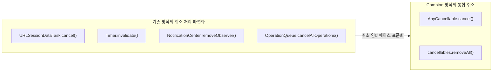

# Combine Subscription의 수명주기 관리와 취소 메커니즘

Combine 파이프라인에서 Publisher와 Subscriber가 연결되는 순간, 두 객체 사이에는 `Subscription` 프로토콜을 준수하는 중간 객체가 생성됩니다. 이 `Subscription` 인스턴스는 데이터의 흐름을 제어하고 파이프라인의 생명주기를 관리하는 핵심 계층입니다.

`sink`와 `assign`이 반환하는 `AnyCancellable` 토큰을 적절히 보관하지 않으면 구독이 즉시 취소되어 비동기 응답을 수신하지 못합니다. 반대로 해제를 누락하면 뷰가 화면에서 사라진 이후에도 백그라운드 타이머와 네트워크 요청이 계속 동작하여 메모리와 CPU 자원을 낭비합니다. 본 문서에서는 `Subscription`을 저장해야 하는 이유와 취소해야 하는 이유를 코드로 분석합니다.

---

## 1. 기술적 배경 및 문제 제기 (기존 방식의 한계점)

기존 `URLSession.dataTask`나 `Timer` 기반의 비동기 작업에서는 취소 처리를 위해 각 객체의 전용 메서드(`task.cancel()`, `timer.invalidate()`)를 수동으로 호출해야 했습니다.



### 1.1 비동기 작업별로 파편화된 취소 인터페이스
각기 다른 비동기 API는 취소 방법도 달랐습니다. 뷰 컨트롤러가 하나의 화면에서 타이머, 네트워크 요청, 알림 옵저버를 동시에 관리할 경우, 화면이 사라지는 시점에 개별 취소 메서드를 모두 수동으로 호출해야 했습니다. 취소 코드의 누락은 곧바로 댕글링 참조(Dangling Reference)와 리소스 낭비로 이어집니다.

### 1.2 동기(Synchronous) Publisher와 비동기(Asynchronous) Publisher의 동작 차이
Combine에서 모든 Publisher가 동일하게 `AnyCancellable` 저장을 요구하는 것은 아닙니다. `[1, 2, 3].publisher`와 같이 이미 메모리에 존재하는 컬렉션을 즉시 방출하는 동기 Publisher는 `sink` 호출과 동시에 모든 값을 방출하고 완료되므로, 구독 토큰을 별도 변수에 보관하지 않아도 값 손실 없이 동작합니다. 반면 네트워크 요청이나 타이머처럼 **응답을 기다려야 하는 비동기 Publisher는 구독 토큰이 해제되는 즉시 파이프라인이 취소**됩니다.

---

## 2. 핵심 개념 설명

### 2.1 Subscription 프로토콜 사양

```swift
public protocol Subscription : Cancellable, CustomCombineIdentifierConvertible {
    func request(_ demand: Subscribers.Demand)
}
```

- `Subscription`은 `Cancellable` 프로토콜을 상속하므로 `cancel()` 메서드를 가집니다.
- `request(_:)` 메서드를 통해 Subscriber가 수신을 원하는 데이터의 개수(`Demand`)를 Publisher에게 전달합니다.
- `sink`와 `assign`이 내부적으로 이 프로토콜을 구현한 구독 객체를 생성하며, 그 결과를 `AnyCancellable` 타입으로 래핑하여 반환합니다.

### 2.2 AnyCancellable의 역할

```swift
final public class AnyCancellable : Cancellable, Hashable, Equatable {
    public func cancel()
}
```

- `AnyCancellable`은 `deinit` 시 자동으로 `cancel()`을 호출하는 클래스입니다.
- 이 인스턴스가 메모리에서 해제되면 연결된 Subscription이 취소되고 파이프라인 전체가 종료됩니다.
- 따라서 비동기 파이프라인을 지속적으로 유지하려면 `AnyCancellable` 인스턴스를 해당 클래스 인스턴스의 수명주기와 동일한 프로퍼티에 보관해야 합니다.

### 2.3 저장 방식 비교

| 저장 방식 | 용도 | 특징 |
| :--- | :--- | :--- |
| `var cancellable: AnyCancellable?` | 단일 구독 관리 | 개별적으로 저장, 재할당 시 기존 구독 자동 취소 |
| `var cancellables = Set<AnyCancellable>()` | 다중 구독 일괄 관리 | `.store(in: &cancellables)`로 추가, `.removeAll()`로 일괄 취소 |

---

## 3. 코드 구현 및 라인별 상세 분석

### 3.1 동기 Publisher와 비동기 Publisher의 구독 토큰 필요 여부 비교

```swift
import Foundation
import Combine

// 1. 동기 Publisher: 즉시 실행되므로 구독 토큰 보관 불필요
[1, 2, 3].publisher
    .sink { number in
        print("동기 값: \(number)")
    }
// 출력 결과:
// 동기 값: 1
// 동기 값: 2
// 동기 값: 3

// 2. 비동기 Publisher: 응답 대기 중 토큰이 해제되면 즉시 취소됨
// 아래 코드는 네트워크 응답을 수신하지 못함
let url = URL(string: "https://www.example.com")!
URLSession.shared.dataTaskPublisher(for: url)
    .sink { _ in } receiveValue: { data in
        print("수신 완료: \(data.count) bytes")  // 절대 출력되지 않음
    }
// sink가 반환한 AnyCancellable이 즉시 해제되어 요청이 취소됨

// 3. 비동기 Publisher: 구독 토큰을 보관해야 정상 수신
var cancellable: AnyCancellable?

cancellable = URLSession.shared.dataTaskPublisher(for: url)
    .sink { _ in } receiveValue: { data in
        print("수신 완료: \(data.count) bytes")  // 정상 출력
    }
```

#### 코드 분석
- **5~8번 라인**: 컬렉션 Publisher는 `sink` 호출 시점에 동기적으로 모든 값을 방출하고 `.finished`로 완료됩니다. 반환된 `AnyCancellable`을 저장하지 않아도 데이터 손실이 없습니다.
- **14~19번 라인**: 비동기 Publisher는 백그라운드 스레드에서 응답을 기다립니다. `sink` 결과를 저장하지 않으면 해당 라인을 벗어나는 순간 `AnyCancellable`이 해제되고 요청이 즉시 취소됩니다.
- **22~27번 라인**: `AnyCancellable`을 외부 스코프의 변수에 저장하여 네트워크 응답이 도착할 때까지 구독이 유지됩니다.

---

### 3.2 클래스 내부에서 다중 구독을 `Set<AnyCancellable>`로 관리하는 패턴

```swift
import Foundation
import Combine

class NetworkManager {
    // 1. 다수의 구독을 일괄 보관하는 컬렉션 프로퍼티
    var cancellables: Set<AnyCancellable> = []

    init() {
        print("NetworkManager 초기화")
        let url = URL(string: "https://www.example.com")!

        // 2. 첫 번째 구독: .store(in:)으로 cancellables에 추가
        URLSession.shared.dataTaskPublisher(for: url)
            .print("publisher_1")  // 디버깅용: 이벤트 로그 출력
            .map { (data: Data, response: URLResponse) in data }
            .sink(
                receiveCompletion: { _ in },
                receiveValue: { data in print("응답 1: \(data.count) bytes") }
            )
            .store(in: &cancellables)

        // 3. 두 번째 구독: 동일한 컬렉션에 추가
        URLSession.shared.dataTaskPublisher(for: url)
            .print("publisher_2")
            .map { (data: Data, response: URLResponse) in data }
            .sink(
                receiveCompletion: { _ in },
                receiveValue: { data in print("응답 2: \(data.count) bytes") }
            )
            .store(in: &cancellables)
    }

    deinit {
        // 4. 인스턴스 해제 시 cancellables가 소멸하며 모든 구독 자동 취소
        print("NetworkManager 해제 - 모든 구독 자동 취소")
    }
}

var manager: NetworkManager? = NetworkManager()
manager = nil
// 출력 결과:
// NetworkManager 해제 - 모든 구독 자동 취소
// publisher_1: receive cancel
// publisher_2: receive cancel
```

#### 라인별 상세 분석
- **7번 라인**: `Set<AnyCancellable>` 타입을 클래스 프로퍼티로 선언합니다. `Set`을 사용하면 `AnyCancellable`이 `Hashable`을 채택하므로 중복 없이 관리됩니다.
- **15번 라인 (`.print("publisher_1")`)**: Combine의 디버깅 연산자로, Publisher에서 발생하는 모든 이벤트(`receive subscription`, `request`, `receive value`, `receive cancel`, `receive finished`)를 콘솔에 출력합니다.
- **21번 라인 (`.store(in: &cancellables)`)**: `AnyCancellable`을 `cancellables` Set에 추가합니다. `inout` 파라미터(`&`)를 사용하여 Set을 직접 수정합니다.
- **39~41번 라인**: `manager = nil`로 인해 `NetworkManager` 인스턴스가 `deinit`되면 `cancellables` 프로퍼티가 소멸하고, Set 내의 모든 `AnyCancellable`이 `cancel()`을 자동 호출합니다.

---

### 3.3 View 생명주기와 구독 취소를 연동하는 패턴

```swift
import UIKit
import Combine

class TimerViewController: UIViewController {
    var cancellables: Set<AnyCancellable> = []

    override func viewDidLoad() {
        super.viewDidLoad()
        print("TimerViewController 로드 완료")
    }

    override func viewWillAppear(_ animated: Bool) {
        super.viewWillAppear(animated)

        // 1. 뷰가 화면에 등장할 때 타이머 구독 시작
        Timer.publish(every: 1.0, on: .main, in: .common)
            .autoconnect()
            .sink { date in
                let formatter = DateFormatter()
                formatter.dateFormat = "HH:mm:ss"
                let timeString = formatter.string(from: date)
                print("현재 시각: \(timeString)")
            }
            .store(in: &cancellables)
    }

    override func viewWillDisappear(_ animated: Bool) {
        super.viewWillDisappear(animated)

        // 2. 뷰가 화면에서 사라질 때 모든 구독 명시적 취소
        cancellables.removeAll()
    }

    deinit {
        print("TimerViewController 해제 완료")
    }
}
```

#### 코드 분석
- **13~23번 라인**: `viewWillAppear`에서 구독을 시작하고 `cancellables`에 저장합니다. 사용자가 해당 화면으로 이동할 때마다 타이머가 새로 시작됩니다.
- **28번 라인 (`cancellables.removeAll()`)**: `viewWillDisappear` 시점에 Set의 모든 항목을 제거합니다. 각 `AnyCancellable`이 소멸하면서 `cancel()`이 호출되고 타이머 이벤트 수신이 중단됩니다.
- `cancellable.cancel()`을 반복 호출하는 방식 대신 `removeAll()`을 사용하면 Set 내 모든 구독을 한 번에 일괄 취소할 수 있습니다.

---

### 3.4 Subscription을 직접 취소(`cancel()`)하는 패턴

```swift
import Foundation
import Combine

var cancellable: AnyCancellable?
let url = URL(string: "https://www.example.com")!

cancellable = URLSession.shared.dataTaskPublisher(for: url)
    .map(\.data)
    .sink(
        receiveCompletion: { completion in
            print("완료: \(completion)")
        },
        receiveValue: { data in
            print("데이터 수신: \(data.count) bytes")
        }
    )

// 비즈니스 로직에 따라 특정 시점에 명시적으로 구독 취소
DispatchQueue.main.asyncAfter(deadline: .now() + 3.0) {
    cancellable?.cancel()
    print("구독 수동 취소 완료")
}
```

#### 코드 분석
- **17번 라인 (`cancellable?.cancel()`)**: `cancel()`을 직접 호출하면 Subscription에 취소 신호가 전파됩니다. 공식 문서에 따르면 `cancel()`은 할당된 리소스를 해제하고 타이머, 네트워크 접근, 디스크 I/O 등의 부수 효과를 중단합니다.
- `cancel()` 호출 후에는 `receiveCompletion` 클로저가 호출되지 않습니다. Completion 이벤트(`.finished` 또는 `.failure`)는 Publisher 측에서 방출하는 신호이므로, 구독자 측의 수동 취소와는 별개입니다.

---

## 4. 적용 시 고려해야 할 점 (주의사항 및 예외 처리)

### 4.1 지연(delay) 연산자를 사용하는 동기 Publisher는 토큰 보관 필요
동기 Publisher라도 `delay(for:scheduler:)` 연산자를 체이닝하면 비동기적으로 전환됩니다. 이 경우 지연 시간 동안 구독이 유지되어야 하므로 반드시 `AnyCancellable`을 보관해야 합니다.

```swift
var cancellable: AnyCancellable?

// delay 연산자를 체이닝하면 비동기로 전환되므로 토큰 저장 필수
cancellable = [1, 2, 3].publisher
    .delay(for: .seconds(1), scheduler: DispatchQueue.main)
    .sink { number in
        print("지연 후 수신: \(number)")
    }
```

### 4.2 `viewWillAppear`에서 구독 시작 시 중복 구독 방지
`viewWillAppear`에서 구독을 시작하면 뷰가 재등장할 때마다 새로운 구독이 `cancellables`에 추가됩니다. 동일한 타이머가 중복으로 실행되지 않도록 구독 시작 전에 `cancellables.removeAll()`을 먼저 호출하거나, `viewDidLoad`에서 단 1회만 구독하는 설계를 우선적으로 검토해야 합니다.

### 4.3 구독 취소 후 재사용 불가
`cancel()`이 호출된 `AnyCancellable`은 재활성화할 수 없습니다. 동일한 파이프라인을 다시 실행하려면 Publisher에 새로운 Subscriber를 연결하여 `AnyCancellable`을 새로 생성해야 합니다.

---

## 5. 결론

Combine의 `Subscription` 수명주기를 정확히 이해하는 것은 메모리 누수와 잔존 비동기 작업을 방지하기 위한 기본 조건입니다.

1. **비동기 Publisher는 반드시 `AnyCancellable` 보관**: 구독 토큰이 해제되면 진행 중인 작업이 즉시 취소됩니다.
2. **`Set<AnyCancellable>`을 통한 다중 구독 일괄 관리**: `.store(in: &cancellables)`와 `removeAll()`을 조합하여 뷰 생명주기에 정확히 연동합니다.
3. **인스턴스 소멸 시 자동 취소 활용**: 클래스 프로퍼티에 `cancellables`를 보관하면 `deinit` 시점에 별도 코드 없이 모든 구독이 자동으로 해제됩니다.
